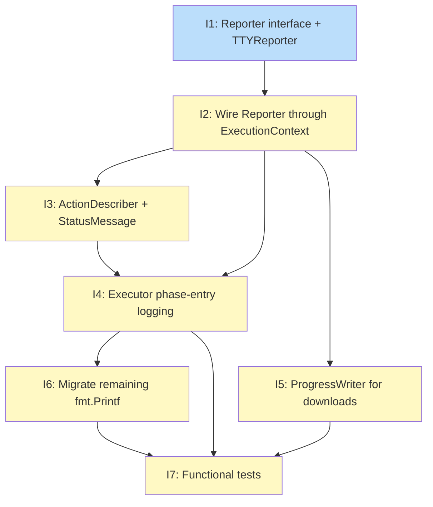

# PLAN: Install UX

## Status

Draft

## Scope Summary

Replace all `fmt.Printf()` progress output in the tsuku CLI with a `Reporter` interface wired through `ExecutionContext`, producing a TTY-aware spinner during interactive installs and structured per-phase log lines in CI. Unifies step output and download progress into one channel and eliminates the separate `progress.Writer` widget.

## Decomposition Strategy

**Horizontal decomposition.** The design is a sequential migration across 6 well-defined phases. Each phase produces a stable layer that the next depends on: Reporter types first, then ExecutionContext wiring, then action descriptions, then phase-entry logging, then download unification, then remaining migration. The `NoopReporter` default ensures partially-migrated code compiles and runs correctly throughout — no big-bang cutover. A walking skeleton would require stub Reporter calls in all 43 action files upfront, adding churn without structural benefit.

## Issue Outlines

### Issue 1: feat(progress): add Reporter interface, TTYReporter, and NoopReporter

**Goal**: Define the `Reporter` interface and create `TTYReporter` (goroutine-backed spinner with braille frames) and `NoopReporter` (all methods no-op) in `internal/progress/`.

**Acceptance Criteria**

- [ ] `Reporter` interface defined in `internal/progress/reporter.go` with methods: `Status(msg string)`, `Log(format string, args ...any)`, `Warn(format string, args ...any)`, `DeferWarn(format string, args ...any)`, `FlushDeferred()`, `Stop()`
- [ ] Interface comment states that callers must not pass values from `internal/secrets/` to any Reporter method, and must use `reporter.Log("%s", value)` not `reporter.Log(value)` for non-literal format strings
- [ ] `NoopReporter` struct implements all interface methods as no-ops; zero-value is usable without initialization
- [ ] `NewTTYReporter(w io.Writer) Reporter` auto-detects whether `w` is a TTY via `term.IsTerminal`; all output written to `w`
- [ ] On TTY: `Status()` starts a background goroutine (lazily on first call) that advances a braille spinner frame every 100ms using `\r\033[K<frame> <msg>` overwrites
- [ ] On non-TTY: `Status()` is a no-op; `Log()` and `Warn()` emit plain lines to `w`
- [ ] `Log()` and `Warn()` stop the spinner goroutine and clear the current line before printing the permanent line; output resumes on next `Status()` call
- [ ] `Stop()` terminates the background goroutine (if running) and clears the spinner line; idempotent — safe to call when no goroutine is running or after a previous `Stop()` call
- [ ] `DeferWarn()` appends to a queue; `FlushDeferred()` prints all queued warnings in order then clears the queue
- [ ] `SanitizeDisplayString(s string) string` defined in `internal/progress/`: strips all ANSI/VT100 sequences — CSI `\x1b\[[\x30-\x3F]*[\x20-\x2F]*[A-Za-z]`, OSC `\x1b\][^\x07]*?(\x07|\x1b\\)`, and bare `\x1b` not matched by the above
- [ ] `TTYReporter.Status()`, `Log()`, `Warn()`, and `DeferWarn()` apply `SanitizeDisplayString` to all string inputs
- [ ] `reporter_test.go` covers: TTY vs non-TTY behavior (via fake non-TTY writer), goroutine lifecycle (verify goroutine exits after `Stop()` using a sync mechanism), `Stop()` idempotency (call twice, no panic or deadlock), `DeferWarn`/`FlushDeferred` ordering and queue clearing, ANSI sanitization (CSI cursor-movement, OSC title, `\x1b[?25l` hide-cursor sequences all stripped)

**Dependencies**: None

---

### Issue 2: feat(actions): wire Reporter through ExecutionContext

**Goal**: Add a `Reporter progress.Reporter` field to `ExecutionContext` in `internal/actions/action.go` and wire `NewTTYReporter(os.Stderr)` in all install orchestration paths, including the dependency install path.

**Acceptance Criteria**

- [ ] `ExecutionContext` in `internal/actions/action.go` has a `Reporter progress.Reporter` field; field type is the interface (not a concrete struct)
- [ ] Zero-value of `Reporter` field resolves to `NoopReporter{}` behavior — code that doesn't set the field must not panic
- [ ] `cmd/tsuku/install_deps.go` constructs `reporter := progress.NewTTYReporter(os.Stderr)` before calling install orchestration
- [ ] `defer reporter.Stop()` is called immediately after reporter construction in `install_deps.go`
- [ ] The reporter is assigned to `ExecutionContext.Reporter` before the context is passed to `executor.ExecutePlan`
- [ ] `installSingleDependency` in `executor.go` (~line 736) propagates the same reporter instance to its own `ExecutionContext` construction — not a new `NewTTYReporter` call, the same reporter from the outer context
- [ ] No existing action tests are broken; the `NoopReporter` default means behavior is unchanged before migration
- [ ] `go test ./internal/actions/... ./internal/executor/... ./cmd/tsuku/...` passes

**Dependencies**: Blocked by Issue 1

---

### Issue 3: feat(actions): add ActionDescriber interface and StatusMessage implementations

**Goal**: Define the optional `ActionDescriber` interface in `internal/actions/` and implement `StatusMessage()` on the ten highest-frequency action types; update the executor type-assertion callsite to produce semantic step descriptions.

**Acceptance Criteria**

- [ ] `ActionDescriber` interface defined in `internal/actions/`: `StatusMessage(params map[string]interface{}) string`
- [ ] `download_file` implements `StatusMessage`: returns `"Downloading <basename(url)>"` with file size if available in params
- [ ] `extract` implements `StatusMessage`: returns `"Extracting <archive>"`
- [ ] `install_binaries` implements `StatusMessage`: returns `"Installing <binaries>"` with binary names from params
- [ ] `configure_make`, `cargo_build`, `go_build` implement `StatusMessage`: return `"Building <tool> <version>"`
- [ ] `cargo_install`, `npm_install`, `pipx_install`, `gem_install` implement `StatusMessage`: return `"<pm> install <package>"`
- [ ] Executor callsite in `executor.go` performs type assertion: falls back to `step.Action` when interface not implemented or `StatusMessage` returns `""`
- [ ] Executor calls `ctx.Reporter.Status(msg)` with the resolved description before executing each step
- [ ] Tests cover: type assertion succeeds for all 10 implemented actions, fallback to action name for a non-implementing action, empty-string return triggers fallback
- [ ] `go test ./internal/actions/... ./internal/executor/...` passes

**Dependencies**: Blocked by Issue 2

---

### Issue 4: feat(executor): replace fmt.Printf step output with Reporter phase-entry logging

**Goal**: Replace `fmt.Printf` step headers and progress announcements in `executor.go` and `install_deps.go` with `reporter.Log()` (permanent phase-entry lines) and `reporter.Status()` (transient step detail); remove `formatActionDescription()`.

**Acceptance Criteria**

- [ ] `executor.go`: `fmt.Printf` step headers replaced with `ctx.Reporter.Status(actionDescription)` where `actionDescription` comes from `ActionDescriber` type assertion or falls back to action name
- [ ] `install_deps.go`: `reporter.Log()` calls emitted at each phase transition — Downloading (with size if known), Extracting, Building (for build recipes), Installing, Verifying, and the final `"<tool> <version> installed"` success line
- [ ] Phase-entry calls use `reporter.Log()` (visible on both TTY and non-TTY); step-internal detail uses `reporter.Status()` (no-op on non-TTY)
- [ ] `formatActionDescription()` removed from `executor.go`
- [ ] Warnings and errors use `reporter.Warn()` and remain visible in all modes
- [ ] A non-TTY install of a simple binary tool produces 3–5 Log lines total (download, extract if applicable, install, success)
- [ ] `go test ./internal/executor/... ./cmd/tsuku/...` passes

**Dependencies**: Blocked by Issue 2, Issue 3

---

### Issue 5: feat(progress): replace progress.Writer with ProgressWriter for download progress

**Goal**: Add `ProgressWriter` to `internal/progress/` and replace `progress.NewWriter` calls in `download_file.go` and `download.go` with the Reporter-based byte-counting path; delete `progress.Writer`.

**Acceptance Criteria**

- [ ] `ProgressWriter` defined in `internal/progress/progress_writer.go`: fields `w io.Writer`, `total int64` (0 if Content-Length unknown), `written int64`, `callback func(written, total int64)`
- [ ] `ProgressWriter.Write(p []byte)` increments `written` by `len(p)`, calls `callback(written, total)`, delegates to `w`
- [ ] `ProgressWriter.Reset()` sets `written = 0`; called before each retry attempt in `doDownloadFileHTTP`
- [ ] Progress callback formats: `"Downloading <name> (<transferred> / <total>, <pct>%)"` when `total > 0`; `"Downloading <name> (<transferred>...)"` when `total == 0`; no byte counter string at all when file < 100 KB
- [ ] Byte counter calls `reporter.Status()` (transient on TTY, no-op on non-TTY)
- [ ] Non-TTY path: `reporter.Log()` called once at download start (with size if known) and once at completion
- [ ] `download_file.go`: `progress.NewWriter` replaced with `ProgressWriter` + reporter callback; `ProgressWriter.Reset()` called before each retry in the retry loop
- [ ] `download.go`: same migration applied
- [ ] `internal/progress/progress.go` deleted after all callsites are migrated
- [ ] Tests cover: Content-Length present → percentage format, Content-Length absent → bytes-only format, file < 100 KB → no byte counter in Status call, `Reset()` clears `written` to 0 between simulated retries
- [ ] `go test ./internal/progress/... ./internal/actions/...` passes

**Dependencies**: Blocked by Issue 2

---

### Issue 6: feat(actions): migrate remaining fmt.Printf calls to Reporter

**Goal**: Migrate all remaining `fmt.Printf` / `fmt.Println` progress output in `internal/actions/` to `ctx.Reporter.Log()` or `ctx.Reporter.Status()`, applying the security checklist to every migrated call.

**Acceptance Criteria**

- [ ] All `fmt.Printf` / `fmt.Println` progress output in `internal/actions/` migrated to `ctx.Reporter.Log()` (permanent output) or `ctx.Reporter.Status()` (transient step detail)
- [ ] Context-free helpers that emit progress output receive an explicit reporter or `ExecutionContext` parameter; function signatures updated accordingly
- [ ] `"Debug:"` printf statements in `configure_make.go` removed (not migrated)
- [ ] `TSUKU_DEBUG` env var in `cargo_build.go` preserved; its conditional printf block updated to use `ctx.Reporter.Log()` with an explanatory comment
- [ ] Security checklist applied to every migrated call: no recipe-sourced string used as a format argument (`reporter.Log("%s", toolName)` required, not `reporter.Log(toolName)`); no values from `internal/secrets/` formatted (such calls removed, not migrated)
- [ ] After migration: `grep -r "fmt\.Printf\|fmt\.Println" internal/actions/` produces no unreviewed progress-output lines; any remaining uses are non-progress with an inline comment explaining why
- [ ] `go test ./internal/actions/...` passes
- [ ] `go vet ./internal/actions/...` passes

**Dependencies**: Blocked by Issue 2, Issue 4

---

### Issue 7: test(install): add functional tests for install Reporter output

**Goal**: Add functional tests that verify end-to-end Reporter output for both non-TTY and TTY install paths, confirming correct phase-entry log sequences, `Stop()` lifecycle, and retry-safe progress behavior.

**Acceptance Criteria**

- [ ] A `TestReporter` type implements `Reporter` and records all `Log()` and `Warn()` calls as formatted strings in a `Logs []string` slice; records `Status()` calls separately in `Statuses []string`; exposes `StopCalled bool`
- [ ] Non-TTY install test: run a minimal test recipe through the install orchestration with `TestReporter`; verify `Logs` contains the download start line, install line, and final success line; verify no Status-only strings appear in `Logs`
- [ ] Non-TTY build recipe test: run a recipe with a mocked build action through orchestration; verify `Logs` includes a "Building \<tool\>" line at build start and a completion line — confirms CI feedback goal without a real compile
- [ ] `StopCalled` is `true` after each install invocation — verifies `defer reporter.Stop()` in the orchestration path
- [ ] Retry progress test: simulate a download retry via `ProgressWriter`; verify the percentage string in `Statuses` never exceeds 100% — confirms `Reset()` is called correctly
- [ ] No `fmt.Printf` or `fmt.Println` output escapes to `os.Stdout` or `os.Stderr` during tests; verified by capturing `os.Stderr` in the test and asserting it is empty
- [ ] Tests live in a test file under `internal/executor/` or `cmd/tsuku/` (e.g., `install_output_test.go`)
- [ ] `go test ./internal/executor/... ./cmd/tsuku/...` passes

**Dependencies**: Blocked by Issue 4, Issue 5, Issue 6

---

## Dependency Graph

**Legend**: Green = done, Blue = ready, Yellow = blocked, Purple = needs-design, Orange = tracks-design/tracks-plan

## Implementation Sequence

**Critical path**: I1 → I2 → I3 → I4 → I6 → I7 (6 issues deep)

**Recommended order**:

1. **I1** — no dependencies; all other work gates on this
2. **I2** — gates everything else; complete before any action-level work starts
3. **I3 and I5 in parallel** — both depend only on I2; I3 adds ActionDescriber descriptions, I5 adds ProgressWriter; independent work
4. **I4** — unblocks once I2 and I3 are done; replaces the executor's fmt.Printf calls with reporter calls using ActionDescriber output
5. **I6** — starts after I2 and I4; migrates remaining action files; I5 can complete in parallel during this phase
6. **I7** — all three blockers (I4, I5, I6) must be complete; validates the integrated system

**Parallelization note**: In a single-PR workflow, these are sequential commits rather than truly parallel work. The parallel opportunities listed above describe the order in which commits can be safely merged into the branch — I3 and I5 can be committed in either order after I2 since they touch non-overlapping files.
