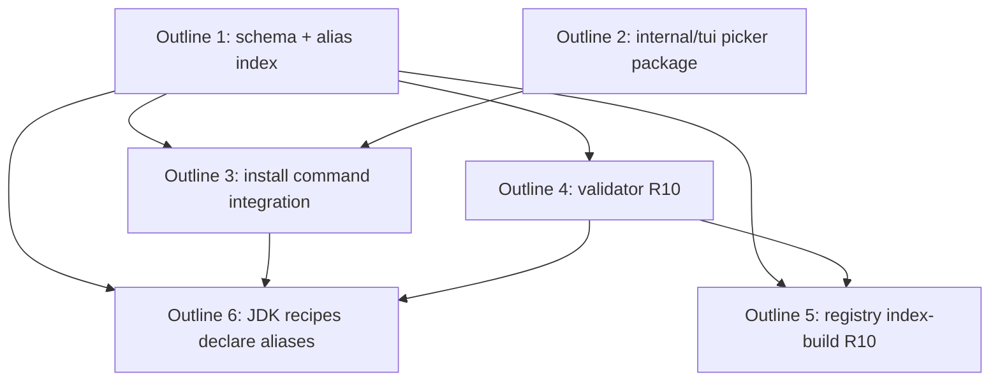

## Status

Draft

## Scope Summary

Implements the multi-satisfier alias picker per `DESIGN-multi-satisfier-picker.md` and `PRD-multi-satisfier-picker.md`. Adds the `aliases` schema key, the `aliasIndex` loader structure, the `internal/tui` picker package, the install command's four-arm resolution switch with the hidden `--pick` test flag, the validator + registry index-build R10 enforcement, and the `aliases = ["java"]` declaration on the four PR #2362 OpenJDK recipes.

## Decomposition Strategy

**Horizontal.** Each design phase delivers a clean layer with a meaningful CI-green checkpoint:

- The schema/index layer (Issue 1) is the prerequisite for everything else — nothing references the alias index until it exists.
- The picker package (Issue 2) is independent library code with no consumers yet — can land in parallel with Issue 1 once both interfaces are agreed.
- The install command integration (Issue 3) is the first user-visible behavior change and depends on Issues 1 and 2.
- Validator R10 (Issue 4) and the index-build hook (Issue 5) build on Issue 1.
- Recipe declarations (Issue 6) require all of the above to be useful.

The design's interfaces are stable and well-defined (loader API, picker API, install switch shape), so horizontal makes sense — there's no integration risk that warrants a walking skeleton.

## Issue Outlines

Single-PR execution: each outline below describes a discrete commit (or small commit cluster) within the same branch. The PR ships when all six are complete and CI is green.

### Outline 1: schema + alias index (no behavior change)

**Goal:** introduce the `aliases` schema key and the `aliasIndex` data structure on the loader so multiple recipes can declare the same alias and the loader can enumerate them. No CLI behavior change after this commit.

**Files:**
- `internal/recipe/types.go` — no struct change (existing `Satisfies map[string][]string` already accepts arbitrary keys); add a comment documenting the `aliases` convention.
- `internal/recipe/validator.go` — extend `validateSatisfies` to accept `aliases` as a non-ecosystem key (any non-empty string list).
- `internal/recipe/loader.go` — add `aliasIndex map[string][]string` field, `aliasOnce sync.Once`, extend `buildSatisfiesIndex` to populate it, and add public methods `LookupAllSatisfiers(alias string) ([]string, bool)` and `HasMultiSatisfier(alias string) bool`.
- `internal/recipe/loader_test.go` — coverage for: alias index built lazily, multiple recipes claiming same alias, `LookupAllSatisfiers` returns sorted alphabetical list, `HasMultiSatisfier` returns true only for ≥2 satisfiers.
- `internal/recipe/validator_test.go` — coverage for: `aliases = ["java"]` validates; `aliases = []` rejected; `aliases = [""]` rejected (empty entry).

**Acceptance criteria** (from PRD):
- [ ] R1, R2 satisfied — schema accepts `aliases`, index supports many-to-one lookup.
- [ ] PRD AC2 — synthetic recipe with `aliases = ["test-alias"]` validates with `tsuku validate --strict`.
- [ ] All existing recipes continue to validate (PRD AC16 — verified by the existing CI workflow on the PR).
- [ ] Existing 1:1 ecosystem-keyed satisfies entries (`homebrew`, `npm`, etc.) keep their current behavior — confirmed by existing satisfies tests still passing.

**Dependencies:** none. This is the foundation for outlines 3, 4, 5.

### Outline 2: `internal/tui` picker package

**Goal:** new `internal/tui` package with the arrow-driven single-select picker built on `golang.org/x/term` plus hand-rolled ANSI. Library code, no consumer yet.

**Files:**
- `internal/tui/picker.go` (new) — `Choice{Name, Description}` struct; `Pick(prompt string, choices []Choice) (int, error)`; `IsAvailable() bool`; `ErrCancelled = errors.New("picker: cancelled")`. Internal seams to inject stdin/stderr for tests.
- `internal/tui/sanitize.go` (new) — strip control bytes < 0x20 (except tab/newline) from rendered text. Mirrors `internal/progress/sanitize.go`.
- `internal/tui/picker_test.go` (new) — coverage with mocked stdin/stderr: arrow up/down moves cursor, Enter returns the index, Ctrl-C returns `ErrCancelled`, sanitization strips ANSI escapes from descriptions.
- `internal/tui/sanitize_test.go` (new) — table-driven coverage for the sanitizer.

**Acceptance criteria** (from design):
- [ ] Picker renders to stderr (not stdout).
- [ ] Up/Down arrow keys move the cursor; Enter confirms; Ctrl-C returns `ErrCancelled`.
- [ ] Picker hides and restores the cursor on entry/exit.
- [ ] Picker restores terminal state via `defer term.Restore` even on panic.
- [ ] Recipe descriptions are sanitized — control bytes < 0x20 (except tab/newline) are stripped before rendering.
- [ ] Unit tests pass with mocked I/O — no PTY required for this outline's tests.
- [ ] Code stays under 250 lines (NF2).

**Dependencies:** none. Independent of Outline 1; can land in parallel.

### Outline 3: install command integration

**Goal:** wire the picker into `cmd/tsuku/install.go`'s resolution flow. Add the hidden `--pick <recipe>` flag for CI tests. After this outline, the user-visible behavior matches the PRD's truth-table cases A–E.

**Files:**
- `cmd/tsuku/install.go` — add `installPick` flag (hidden); replace the lines 305–312 two-branch (`recipe found` / `try discovery`) with the four-arm switch from the design (direct found / `case 0` discovery / `case 1` rewrite-toolName / `case 2+` resolveMultiSatisfier); new helpers `resolveMultiSatisfier(alias, candidates) (string, error)` and `handleAmbiguousAliasError(alias, candidates, err)` parallel to existing `handleAmbiguousInstallError`.
- `cmd/tsuku/install_test.go` (or new `install_alias_test.go`) — coverage for AC1, AC2, AC3, AC5, AC6, AC7, AC8 (all the non-PTY install-path tests using fixtures that declare `aliases = [...]`).
- `test/functional/multi_satisfier_picker.feature` (or a Go test in `test/functional/`) — single PTY-gated integration test covering AC9 (real key input + Enter) and AC10 (Ctrl-C → `Cancelled.`/exit 130). Linux only.

**Acceptance criteria** (from PRD, cases A/B/C):
- [ ] PRD AC1 — `tsuku install openjdk` unchanged behavior.
- [ ] PRD AC2 — direct-name + multi-satisfier collision: direct wins.
- [ ] PRD AC3 — single-satisfier alias auto-resolves with no picker.
- [ ] PRD AC4 — `tsuku install java -y` exits 10 with the candidate list, all four recipes alphabetical, `--from <recipe-name>` per line.
- [ ] PRD AC5 — same when stdout is piped (no TTY).
- [ ] PRD AC6 — `--json -y` emits the structured payload.
- [ ] PRD AC7 — `--from temurin` selects without picker.
- [ ] PRD AC8 — hidden `--pick temurin` flag selects without picker render.
- [ ] PRD AC9 — PTY harness exercises arrow + Enter happy path.
- [ ] PRD AC10 — PTY harness exercises Ctrl-C cancel path.
- [ ] PRD AC11 — fallthrough to discovery when no satisfier exists.

**Dependencies:** Outlines 1 (alias index) and 2 (picker package).

### Outline 4: validator R10 enforcement

**Goal:** `tsuku validate --strict` rejects recipes whose `runtime_dependencies` list contains an alias mapping to ≥2 satisfiers. Recipe authors catch the issue before opening a PR.

**Files:**
- `internal/recipe/validator.go` — new function `validateRuntimeDepsNotMultiSatisfier(r *Recipe, loader *Loader, result *ValidationResult)` that walks the recipe's `runtime_dependencies`, calls `loader.LookupAllSatisfiers(dep)` for each, and reports an error per dep with ≥2 satisfiers naming the alias and every satisfying recipe.
- `internal/recipe/validator_test.go` — coverage for AC14: synthetic recipe with multi-satisfier alias as dep fails validation; single-satisfier deps pass; non-alias deps (direct recipe names) pass.
- Wire the new validator into the `validateRecipe` entry point that `tsuku validate --strict` calls.

**Acceptance criteria:**
- [ ] PRD AC14 — synthetic test fixture validates as expected.
- [ ] Error message contains the alias name and every satisfying recipe name (sorted, for stable output).
- [ ] Existing `runtime_dependencies` references that are direct recipe names continue to validate.

**Dependencies:** Outline 1 (the alias index is what the new validator queries).

### Outline 5: registry index-build hook

**Goal:** the same R10 check runs at registry-ingestion time, catching the cross-recipe race where author A's recipe was valid yesterday and author D adds a new satisfier today.

**Files:**
- `internal/registry/cache_manager.go` (or whichever entry point owns recipe ingestion — locate during implementation; design names `cache_manager.go` as the likely site) — call the same `validateRuntimeDepsNotMultiSatisfier` on every ingested recipe; fail the index build with a clear error if any recipe is invalidated by the ingestion's resulting alias index.
- `internal/registry/cache_manager_test.go` (or new file) — coverage for AC15: registry-fixture path that fails on the same multi-satisfier-dep scenario.

**Acceptance criteria:**
- [ ] PRD AC15 — registry-ingestion-time check fails when the same scenario as AC14 is composed across recipe files in a fixture registry.
- [ ] Error message identifies both the dependent recipe and the ingestion that triggered the new multi-satisfier state.

**Dependencies:** Outlines 1 (alias index) and 4 (validator function reused by index-build).

### Outline 6: declare `aliases = ["java"]` on the four JDK recipes

**Goal:** make `tsuku install java` actually do the new thing for the milestone's headline use case.

**Files:**
- `recipes/o/openjdk.toml` — extend `[metadata.satisfies]` with `aliases = ["java"]`.
- `recipes/t/temurin.toml` — same.
- `recipes/c/corretto.toml` — same.
- `recipes/m/microsoft-openjdk.toml` — same.

**Acceptance criteria:**
- [ ] PRD R12 — all four recipes declare `aliases = ["java"]`.
- [ ] PRD AC4 — `tsuku install java -y` lists all four recipes alphabetically.
- [ ] PRD AC16 — `tsuku validate --strict` over the registry stays clean.
- [ ] PRD AC17 — sandbox + integration workflows pass on every supported family.

**Dependencies:** Outlines 1, 3, 4 (the schema must accept `aliases`, the install command must consume the alias index, and the validator must accept the JDK recipes' updated declarations).

## Dependency Graph

## Implementation Sequence

**Critical path:** O1 → O3 → O6.

Suggested working order within the single PR:

1. **O1** (schema + index) — prerequisite for O3, O4, O5, O6.
2. **O2** (picker package) — can be written in parallel with O1; standalone library.
3. **O4** (validator R10) — needs O1; small focused commit.
4. **O3** (install command integration) — needs O1 + O2; the largest commit, contains the user-visible behavior change.
5. **O5** (registry index-build hook) — needs O1 + O4; thin wrapper invoking the validator function from a new caller.
6. **O6** (JDK recipes) — needs O1, O3, O4 to be in place so the recipes validate AND `tsuku install java` actually delivers the expected UX.

Parallelization note: O1 and O2 have no shared files and can be drafted simultaneously (different commits in the same branch). Everything from O3 onward depends on O1.
