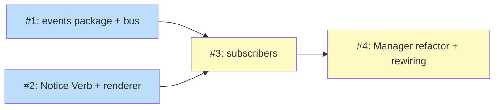

# PLAN: Notices Install Event Bus

## Status

Draft

## Scope Summary

Implement the install lifecycle event bus, both subscribers
(`internal/notices`, `internal/telemetry`), and refactor
`install.Manager` to publish from its lifecycle methods. Replace direct
`notices.WriteNotice` and `tc.SendUpdateOutcome` calls across the
codebase with bus publications. Lands in one PR.

## Decomposition Strategy

**Horizontal.** Refactor of existing code with a clear prerequisite
chain (foundation → subscribers → publishers). The design's three
implementation phases map cleanly onto a layer-by-layer plan; not
enough cross-layer integration risk to justify a walking-skeleton
vertical slice.

Four issues. Issues 1 and 2 are independent foundations (can be worked
in parallel). Issue 3 builds the subscribers on top of both. Issue 4
is the single-commit cutover where direct writes are replaced and the
bus comes online — per the design, this must be one commit.

## Issue Outlines

### Issue 1: feat(installevents): add event types and bus

**Goal**: Land the new `internal/installevents` package with the eight
event types (`Installed`, `Updated`, `RolledBack`, `Removed`,
`InstallFailed`, `UpdateFailed`, `RollbackFailed`, `RemoveFailed`),
the `Source` enum, and a `Bus` type that delivers events synchronously
to registered subscribers.

**Acceptance Criteria**:
- [ ] New package `internal/installevents/` exists with `events.go`,
  `bus.go`, `bus_test.go`.
- [ ] `Source` enum: `SourceManual`, `SourceAuto`, `SourceProjectAuto`.
  Code comment on the type reinforces the non-PII contract.
- [ ] Eight event types, each implementing an unexported
  `isInstallEvent()` (sealing). `GetSource()` accessor returns the
  event's Source uniformly.
- [ ] `Bus.NewBus(cfg *config.Config)` constructs a bus whose
  diagnostic logger writes to `$TSUKU_HOME/log/` (the existing trace
  file destination). `NewBusForTest(io.Writer)` for tests.
- [ ] `Bus.Subscribe(name string, sub Subscriber)` registers a named
  subscriber. `Subscribe` after the first `Publish` logs and ignores
  (or panics in debug builds).
- [ ] `Bus.Publish(event Event)` runs subscribers in deterministic
  registration order, each wrapped in `defer recover()`. Panics and
  returned errors are logged with the subscriber name; nothing
  propagates to the publisher.
- [ ] Re-entrant `Publish` from inside a Handle is queued and flushed
  after the current event completes (preserving causal order).
- [ ] Depth cap of 16 and pending-queue cap of 1024; events that would
  exceed either cap are dropped with a log line.
- [ ] Publishing an event with `Source == ""` logs a warning naming
  the publisher and discards the event (no default Source).
- [ ] `nil`-safe `Publish`: a nil `*Bus` receiver returns immediately
  with no effect.
- [ ] Tests cover: in-order delivery, panic recovery, re-entrant
  queue-and-flush, depth cap drop, queue-size cap drop, empty-Source
  drop, nil-safe Publish.
- [ ] `go test ./internal/installevents/...` passes; `go vet ./...`
  passes.

**Dependencies**: None

**Type**: code
**Files**: `internal/installevents/events.go`, `internal/installevents/bus.go`, `internal/installevents/bus_test.go`

---

### Issue 2: refactor(notices): add Verb field and verb-aware renderer

**Goal**: Extend the `Notice` schema with a `Verb` field and update
`internal/updates/notify.go` to format per-verb user-facing messages.
Backward-compatible: existing notice files (with empty `Verb`) keep
today's "X has been updated to Y" phrasing. Also harden
`RemoveNotice` with the same tool-name validation that `WriteNotice`
already performs.

**Acceptance Criteria**:
- [ ] `Notice` struct in `internal/notices/notices.go` has a new
  `Verb string` field with `json:"verb,omitempty"`.
- [ ] `internal/updates/notify.go` renderer selects message format
  based on `Notice.Verb`:
  - `install` → `"<Tool> has been installed (<AttemptedVersion>)"` for
    success, `"Install failed: <Tool> -> <AttemptedVersion>: <Error>"`
    for failure.
  - `update` → today's phrasing (`"<Tool> has been updated to <AttemptedVersion>"`,
    `"Update failed: ..."`).
  - `rollback` → `"<Tool> has been rolled back to <AttemptedVersion>"`,
    `"Rollback failed: ..."`.
  - `remove` → no success render (the Removed event removes the file);
    `"Remove failed: ..."` on failure.
  - Empty `Verb` → falls back to today's "updated to" / "Update failed"
    phrasing (backward compat).
- [ ] `notices.RemoveNotice` rejects tool names containing `/`, `\`,
  or equal to `..`, matching `WriteNotice`. Existing callers are
  unaffected (valid tool names continue to work).
- [ ] Tests added to `notify_test.go` covering each `Verb` value's
  success and failure rendering, including the empty-Verb backward-
  compatibility case.
- [ ] Tests added to `notices_test.go` covering the new
  `RemoveNotice` validation (rejects `..`, `/`, `\`).
- [ ] `go test ./internal/notices/... ./internal/updates/...` passes;
  `go vet ./...` passes.

**Dependencies**: None (parallel with Issue 1)

**Type**: code
**Files**: `internal/notices/notices.go`, `internal/notices/notices_test.go`, `internal/updates/notify.go`, `internal/updates/notify_test.go`

---

### Issue 3: feat(subscribers): add notices and telemetry subscribers

**Goal**: Add two `Subscriber` implementations — one in
`internal/notices`, one in `internal/telemetry` — that translate bus
events into file mutations and telemetry emissions respectively.
Neither has runtime effect until wired in Issue 4, so this issue is
pure addition.

**Acceptance Criteria**:
- [ ] New file `internal/notices/subscriber.go` defines
  `type Subscriber struct{ dir string }` with `NewSubscriber(dir string)`
  and `Handle(event installevents.Event)`.
- [ ] `Subscriber.Handle` reacts to each of the 8 events per the
  design's reaction table:
  - Success events (`Installed`, `Updated`, `RolledBack`) →
    `WriteNotice` with the appropriate `Verb`, `AttemptedVersion`,
    and `Shown: false`.
  - `Removed` → `RemoveNotice(Tool)`.
  - Failure events → `WriteNotice` with `Verb`, sanitized `Error`,
    `ConsecutiveFailures` incremented from the prior notice, and
    `Shown: false`.
- [ ] `sanitizeError(err) string` helper replaces `\n` and `\r` with
  ` / ` and truncates to 512 bytes with a `…` suffix.
- [ ] Subscriber locality: each `Handle` touches only the notice file
  for `event.Tool`; this is asserted by a test.
- [ ] Sanitization is asserted by a test: no `Notice.Error` written
  by the subscriber contains a newline; long inputs are truncated.
- [ ] `ConsecutiveFailures` increment is asserted by a test: two
  consecutive `*Failed` events for the same tool produce notices with
  `ConsecutiveFailures = 1, 2`.
- [ ] New file `internal/telemetry/subscriber.go` defines
  `type Subscriber struct{ client *Client }` with
  `NewSubscriber(c *Client)` and `Handle(event installevents.Event)`.
- [ ] `Subscriber.Handle` emits per the design's telemetry table:
  - `Installed` → `SendInstallOutcome(SuccessEvent)`
  - `Updated` → `SendUpdateOutcome(SuccessEvent)`
  - `RolledBack` → `SendRollbackOutcome(SuccessEvent)`
  - `Removed` (when `ActiveAfter == ""`) → `SendRemoveOutcome`
  - `InstallFailed` / `RollbackFailed` / `RemoveFailed` →
    corresponding `FailureEvent`
  - `UpdateFailed` → `UpdateOutcomeFailure`, plus
    `UpdateOutcomeRollback` when `ActiveAfter == FromVersion &&
    FromVersion != ""`.
- [ ] Every emitted telemetry event tags `trigger = string(Source)`.
- [ ] Auto-recovery detection (the `UpdateFailed` two-event emission)
  is asserted by a table-driven test.
- [ ] Nil-client telemetry subscriber is a no-op (`Handle` returns
  early); asserted by a test.
- [ ] `go test ./internal/notices/... ./internal/telemetry/...` passes;
  `go vet ./...` passes.

**Dependencies**: Blocked by Issue 1, Issue 2

**Type**: code
**Files**: `internal/notices/subscriber.go`, `internal/notices/subscriber_test.go`, `internal/telemetry/subscriber.go`, `internal/telemetry/subscriber_test.go`

---

### Issue 4: refactor(install): publish lifecycle events, rewire telemetry and notices

**Goal**: Land the cutover in a single commit. `install.Manager` gains
the bus and publishes from its lifecycle methods (including a new
`Manager.Rollback` and a moved auto-rollback inside `Manager.Install`).
Direct `notices.WriteNotice` and `tc.SendUpdateOutcome` calls across
the codebase are removed. `cmd/tsuku/events_wiring.go` constructs the
bus and registers both subscribers; both the foreground command and
the auto-apply subprocess wire it explicitly. Two end-to-end
acceptance tests gate the cutover.

**Acceptance Criteria**:

Manager refactor:
- [ ] `install.Manager` has a `bus *installevents.Bus` field and
  `install.WithEventBus(bus *installevents.Bus) Option`.
- [ ] `Manager.Install` accepts a `Source` value (via `InstallOpts.Source`
  for the options form, plus a `Source` parameter on the convenience
  form). On success when no prior `ActiveVersion` existed, publishes
  `Installed`. On success when a prior version existed, publishes
  `Updated`. On failure when a prior version existed, internally
  activates the prior version, then publishes `UpdateFailed` with
  `ActiveAfter` set to the post-recovery state. On failure with no
  prior version, publishes `InstallFailed`.
- [ ] New public method
  `Manager.Rollback(tool, toVersion string, src Source) error`.
  Activates the prior version, writes state, publishes `RolledBack`
  on success or `RollbackFailed` on failure.
- [ ] `Manager.RemoveVersion` and `Manager.RemoveAllVersions` accept
  a `Source` parameter and publish `Removed` (or `RemoveFailed`).
- [ ] Each `bus.Publish` call sits after the state-mutating write and
  carries a code comment naming the publish-after-state invariant.
- [ ] Per-method unit tests assert the publish-after-state ordering by
  reading state inside a synchronous test subscriber and asserting it
  matches the event payload.
- [ ] Tests assert nil-bus safety on the Manager (a Manager
  constructed without `WithEventBus` does not publish and does not
  crash).

Publisher rewiring:
- [ ] All direct `notices.WriteNotice` and `notices.RemoveNotice`
  calls in `internal/updates/apply.go`, `internal/updates/self.go`,
  `internal/updates/trigger.go`, `cmd/tsuku/update.go`,
  `cmd/tsuku/self_update.go`, and `cmd/tsuku/install_deps.go::clearAndRecordInstallSuccess`
  are removed. The Manager publishers now cover these notices.
  (`InboxReporter` warning notices remain — they're out of scope.)
- [ ] All direct `tc.SendUpdateOutcome` / equivalent calls in
  `internal/updates/apply.go` and the self-update path are removed.
  The telemetry subscriber now covers them.
- [ ] `internal/autoinstall/` calls `mgr.Install` with
  `Source: SourceProjectAuto`. The resulting events flow through
  both subscribers (new behavior).
- [ ] `internal/updates/CheckAndApplySelf` accepts a
  `*installevents.Bus` parameter and publishes `Updated{Tool: "tsuku"}`
  on success or `UpdateFailed{Tool: "tsuku"}` on failure.
- [ ] The `apply.go` auto-apply loop no longer orchestrates rollback;
  it calls `mgr.Install(..., SourceAuto)` and lets the manager handle
  recovery and event emission.

Bus wiring:
- [ ] New file `cmd/tsuku/events_wiring.go` exports
  `newEventBus(cfg *config.Config, tc *telemetry.Client) *installevents.Bus`
  that constructs the bus and subscribes both `notices.NewSubscriber`
  and (when telemetry is enabled) `telemetry.NewSubscriber`.
- [ ] The Cobra root command (or its setup hook) constructs the bus
  once and threads it into `install.NewManager` and
  `updates.CheckAndApplySelf`.
- [ ] `cmd/tsuku/cmd_apply_updates.go` (the auto-apply subprocess
  subcommand) independently calls `newEventBus` and threads the bus
  into its own `Manager`. Cobra `PersistentPreRun` inheritance is
  not relied upon.

Acceptance integration tests (non-negotiable):
- [ ] End-to-end test: seed `$TSUKU_HOME/state.json` so `niwa` is at
  `0.11.0`. Configure the cache to schedule a `niwa@0.11.1` update
  that will fail (e.g., bad checksum or unreachable download). Run
  the auto-apply subprocess. Assert:
  - The on-disk notice store contains exactly one notice for `niwa`,
    with `Verb: update`, an error message, and `ConsecutiveFailures: 1`.
  - The telemetry test client received exactly two events:
    `UpdateOutcomeFailure` and `UpdateOutcomeRollback`, both with
    `trigger: auto`.
  - State.json reflects `niwa` active at `0.11.0` (rollback worked).
- [ ] End-to-end test: in a directory with `.tsuku.toml` requiring
  `gh`, trigger the autoinstall flow (e.g., via `tsuku run`). Assert:
  - The on-disk notice store contains a notice for `gh` with
    `Verb: install`.
  - The telemetry test client received one `InstallOutcomeSuccess`
    event with `trigger: project-auto`.

Validation:
- [ ] `go build ./...` succeeds.
- [ ] `go vet ./...` passes.
- [ ] `go test ./...` passes (existing tests adapted where needed for
  the new event flow; the renderer behavior is unchanged so its tests
  pass without modification).

**Dependencies**: Blocked by Issue 1, Issue 3 (transitively Issue 2)

**Type**: code
**Files**: `internal/install/state.go`, `internal/install/manager.go`, `internal/install/update.go`, `internal/install/remove.go`, `internal/install/rollback.go`, `internal/updates/apply.go`, `internal/updates/self.go`, `internal/updates/trigger.go`, `internal/autoinstall/autoinstall.go`, `cmd/tsuku/events_wiring.go`, `cmd/tsuku/cmd_apply_updates.go`, `cmd/tsuku/install.go`, `cmd/tsuku/update.go`, `cmd/tsuku/remove.go`, `cmd/tsuku/rollback.go`, `cmd/tsuku/self_update.go`, `test/functional/notices_events_e2e_test.go`

## Dependency Graph

**Legend**: Blue = ready, Yellow = blocked.

## Implementation Sequence

**Critical path**: Issue 1 → Issue 3 → Issue 4 (or Issue 2 → Issue 3 → Issue 4 — they're the same length).

**Parallelization opportunity**: Issues 1 and 2 are independent and can
be developed in parallel as separate commits within the same PR.
Issues 3 and 4 are sequential because Issue 4 needs the subscribers
to register against.

**Suggested commit order within the PR**:

1. Commit A — Issue 1 (events package + bus)
2. Commit B — Issue 2 (Notice schema + renderer + RemoveNotice
   hardening)
3. Commit C — Issue 3 (both subscribers)
4. Commit D — Issue 4 (Manager refactor, publisher rewiring, bus
   wiring, acceptance tests) — single commit per the design

Commits A and B are reorderable; everything else is fixed.
