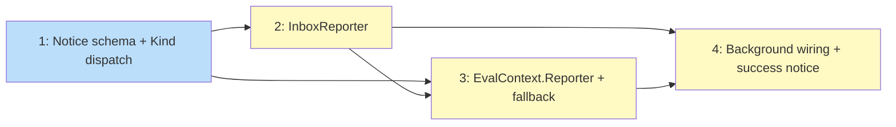

# PLAN: Notification Routing

## Status

Draft

## Scope Summary

Add `InboxReporter` — a new `progress.Reporter` that accumulates background auto-apply warnings in memory and writes a single notice to `$TSUKU_HOME/notices/` on `Stop()`. Includes version fallback detection in `GitHubArchiveAction.Decompose`, Kind-based lifecycle dispatch in `renderUnshownNotices`, and a missing success notice write in `MaybeAutoApply`.

## Decomposition Strategy

**Horizontal decomposition.** Four sequential issues matching the four implementation phases from the design. Each issue builds one layer fully before the next begins. Dependencies are strictly serial: schema before reporter, reporter before signal path, signal path before background wiring. The components have clear, stable interfaces between them and no integration uncertainty — `progress.Reporter` is already dependency-injected through the install stack, making the swap point predictable.

## Issue Outlines

### Issue 1: feat(notices): add Messages field and Kind-based lifecycle dispatch

**Goal**

Extend the `Notice` struct with a `Messages` field and formalize Kind-based lifecycle dispatch in `renderUnshownNotices`, laying the schema foundation that downstream issues depend on.

**Acceptance Criteria**

- [ ] `Notice` struct in `internal/notices/notices.go` has a `Messages []string` field with `json:"messages,omitempty"` tag
- [ ] `KindVersionFallback = "version_fallback"` constant is defined in `internal/notices/notices.go`
- [ ] `KindShellInitChange = "shell_init_change"` constant is defined in `internal/notices/notices.go`
- [ ] `renderUnshownNotices` in `internal/updates/notify.go` calls `notices.RemoveNotice` (not `notices.MarkShown`) after displaying any notice whose Kind is `KindVersionFallback` or `KindShellInitChange`
- [ ] Notices with `Kind == KindUpdateResult` (zero value) and `Kind == KindAutoApplyResult` continue to use the `Error != ""` convention for persistence vs. single-view (backward compatibility)
- [ ] `WriteNotice` in `internal/notices/notices.go` returns an error if `notice.Tool` contains `/`, `\`, or equals `..`
- [ ] Existing notice JSON files with no `kind` field deserialize with `Kind == ""` (zero value) and display correctly
- [ ] Existing notice JSON files with no `messages` field deserialize with `Messages == nil` without error
- [ ] Unit tests cover backward-compatible deserialization for both missing fields
- [ ] All existing tests pass without modification

**Dependencies**

None.

---

### Issue 2: feat(progress): add InboxReporter

**Goal**

Implement `InboxReporter` — a new `progress.Reporter` that accumulates `Warn` and `DeferWarn` calls in memory and writes a single `Notice` to disk on `Stop()`, with Kind escalation when a version fallback message is present.

**Acceptance Criteria**

- [ ] `InboxReporter` struct exists in `internal/progress/inbox_reporter.go` and satisfies the `progress.Reporter` interface
- [ ] `NewInboxReporter(toolName string, noticesDir string) *InboxReporter` constructor is exported
- [ ] `Status()` is a no-op (no terminal in the background path)
- [ ] `Log()` is a no-op (no log sink in the background path)
- [ ] `Warn()` formats the message, applies `progress.SanitizeDisplayString`, and appends the result to the immediate slice
- [ ] `DeferWarn()` formats the message, applies `progress.SanitizeDisplayString`, and appends the result to the deferred slice
- [ ] `FlushDeferred()` moves all deferred messages to the immediate slice in order; no disk write occurs
- [ ] `Stop()` returns early without writing if no messages have accumulated (both slices empty)
- [ ] `Stop()` with accumulated messages writes one `Notice` via `notices.WriteNotice` with `Messages` set to all accumulated messages (immediate first, then any remaining deferred)
- [ ] `Stop()` sets `Kind` to `notices.KindVersionFallback` if any accumulated message contains the `"version_fallback:"` prefix; otherwise sets `Kind` to `notices.KindAutoApplyResult`
- [ ] Messages are capped at 50 total; each message is truncated to 512 characters before accumulation
- [ ] The `InboxReporter` struct carries a code comment documenting the secrets-exclusion contract: callers must not pass values from `internal/secrets/` to `Warn` or `DeferWarn`
- [ ] All `InboxReporter` methods are safe for concurrent use (mutex-protected)
- [ ] Unit tests cover: multi-warn accumulation in correct order, `FlushDeferred` ordering (immediate then deferred), `Stop()` early-return when no messages present, Kind escalation when `"version_fallback:"` prefix appears in any message, Kind defaults to `KindAutoApplyResult` when no such prefix is present, message cap at 50, per-message truncation at 512 characters, ANSI sequences stripped before storage

**Dependencies**

Blocked by Issue 1 — requires `notices.Messages []string` on the `Notice` struct and the `KindVersionFallback` / `KindAutoApplyResult` constants.

---

### Issue 3: feat(executor,actions): add EvalContext.Reporter and version fallback in Decompose

**Goal**

Add a `Reporter` field to `EvalContext` and implement version fallback retry logic in `GitHubArchiveAction.Decompose` so that wildcard-pattern installs silently recover from missing release assets and signal the fallback via the reporter.

**Acceptance Criteria**

- [ ] `EvalContext` in `internal/executor/eval.go` has a `Reporter progress.Reporter` field
- [ ] `EvalContext.GetReporter()` returns `progress.NoopReporter{}` when `Reporter` is nil; never returns nil
- [ ] All existing callers of `GeneratePlan` and `Decompose` that do not set `EvalContext.Reporter` compile without changes and behave identically
- [ ] `GitHubArchiveAction.Decompose` in `internal/actions/composites.go`: when `FetchReleaseAssets` returns no matching asset for the resolved version and `asset_pattern` contains a wildcard, enters a fallback retry loop
- [ ] The fallback loop calls `ctx.Resolver.ListGitHubVersions` to retrieve preceding versions and iterates them in order, attempting `FetchReleaseAssets` for each until a matching asset is found
- [ ] On successful fallback, `Decompose` calls `ctx.GetReporter().Warn("version_fallback: installed %s instead of %s (no asset for %s)", fallback, requested, requested)` before returning
- [ ] On successful fallback, `Decompose` returns the fallback version's steps (not an error)
- [ ] If no fallback version has a matching asset, `Decompose` returns the original error (no behavior change from current)
- [ ] Static `asset_pattern` values (no wildcard character) are not affected: `Decompose` behavior for those patterns is unchanged
- [ ] Tests cover a synthetic scenario where version X has no matching asset but version X-1 does: fallback succeeds, returned steps correspond to X-1, and `Warn` fires with the `"version_fallback:"` prefix
- [ ] Tests verify that callers with `EvalContext.Reporter == nil` do not panic

**Dependencies**

Blocked by Issues 1, 2 — requires `KindVersionFallback` constant (Issue 1) and `progress.NoopReporter{}` (Issue 2).

---

### Issue 4: feat(updates): wire InboxReporter into background path and add success notice

**Goal**

Wire `InboxReporter` into the background auto-apply path, write a success notice on the success branch, and migrate `warnShellInitChanges` to use `reporter.Warn()`.

**Acceptance Criteria**

- [ ] `cmd/tsuku/cmd_apply_updates.go` constructs an `InboxReporter` (via `progress.NewInboxReporter`) instead of `ttyReporter` for the background install path
- [ ] The `InboxReporter` is passed to `runInstallWithExternalReporter` as the external reporter
- [ ] The `InboxReporter` is also set as `EvalContext.Reporter` inside plan generation so that `Decompose` fallback `Warn()` calls are captured
- [ ] `InboxReporter.Stop()` is deferred via the existing `runInstallWithTelemetry` pattern, ensuring it runs after `apply.go`'s success-notice write
- [ ] `internal/updates/apply.go`: `MaybeAutoApply` writes a success notice (`Kind=KindAutoApplyResult`, `Error=""`) on the success branch immediately after `RemoveNotice`
- [ ] Success-only path (no warnings): `apply.go` success notice is preserved on disk after the install; `InboxReporter.Stop()` returns early without overwriting it
- [ ] Warning path (e.g., version fallback): `InboxReporter.Stop()` overwrites the success notice with a richer notice that includes `Messages` and the escalated `Kind`
- [ ] `cmd/tsuku/update.go`: `warnShellInitChanges` uses `reporter.Warn(...)` instead of `fmt.Fprintf(os.Stderr, ...)`
- [ ] Integration test: end-to-end background apply path (success case) produces a `KindAutoApplyResult` notice on disk with `Error=""` and no `Messages`
- [ ] Integration test: end-to-end background apply path (warning case, e.g., version fallback) produces a notice on disk with `Messages` populated and `Kind=KindVersionFallback`
- [ ] `go test ./...` passes

**Dependencies**

Blocked by Issues 2, 3 — requires `InboxReporter` constructor (Issue 2) and `EvalContext.Reporter` field with version fallback wiring (Issue 3).

---

## Dependency Graph

**Legend**: Green = done, Blue = ready, Yellow = blocked

## Implementation Sequence

**Critical path**: Issue 1 → Issue 2 → Issue 3 → Issue 4 (length: 4)

**Parallelization opportunities**: None — this is a strictly serial chain. Each layer depends on all previous layers.

**Recommended order**:

1. **Issue 1** — no dependencies; start here. Lays the schema and constants that all other issues reference.
2. **Issue 2** — blocked by Issue 1. Builds `InboxReporter` as a self-contained, unit-testable component.
3. **Issue 3** — blocked by Issues 1 and 2. Adds `EvalContext.Reporter` and the version fallback loop; uses `InboxReporter` in tests.
4. **Issue 4** — blocked by Issues 2 and 3. Final wiring: connects the background path to `InboxReporter`, adds the success notice write, and migrates `warnShellInitChanges`.
