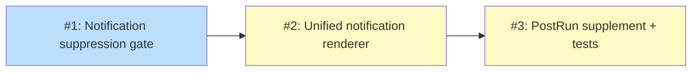

# PLAN: Notification system

## Status

Draft

## Scope Summary

Add a suppression gate and unified notification renderer to tsuku's auto-update system. Covers layered suppression (non-TTY, CI, quiet, env vars), four notification types (applied, failed, self-update, available), and PreRun/PostRun timing.

## Decomposition Strategy

**Horizontal.** Components have clear, stable interfaces: the suppression gate is a pure function, the unified renderer depends on it, and the PostRun supplement and tests depend on the renderer. Each layer builds on the previous one with well-defined boundaries.

## Issue Outlines

### Issue 1: feat(updates): add notification suppression gate

**Complexity:** testable

**Goal:** Add `ShouldSuppressNotifications(quiet bool) bool` in `internal/updates/suppress.go` that composes five suppression signals into a single gate for notification output.

**Acceptance criteria:**
- [ ] `ShouldSuppressNotifications` exists in `internal/updates/suppress.go`
- [ ] Returns `false` (don't suppress) when `TSUKU_AUTO_UPDATE=1` is set, regardless of other signals
- [ ] Returns `true` when `TSUKU_NO_UPDATE_CHECK=1` is set (unless overridden by TSUKU_AUTO_UPDATE)
- [ ] Returns `true` when `CI=true` is set (case-insensitive, unless overridden)
- [ ] Returns `true` when `quiet` parameter is true
- [ ] Returns `true` when stdout is not a TTY (uses `progress.IsTerminalFunc`)
- [ ] Returns `false` when no suppression signals are active
- [ ] Precedence order matches design: AUTO_UPDATE > NO_UPDATE_CHECK > CI > quiet > non-TTY > default
- [ ] Unit tests cover all 5 signals individually and precedence interactions
- [ ] Tests use `t.Setenv` for env vars and mock `progress.IsTerminalFunc` for TTY

**Dependencies:** None

### Issue 2: feat(updates): add unified notification renderer

**Complexity:** testable

**Goal:** Replace `DisplayUnshownNotices` with `DisplayNotifications(cfg, quiet, results)` that renders all four notification types gated by the suppression function. Change `MaybeAutoApply` to return `[]ApplyResult` instead of printing.

**Acceptance criteria:**
- [ ] `ApplyResult` struct defined with Tool, OldVersion, NewVersion, Err fields
- [ ] `MaybeAutoApply` returns `[]ApplyResult` instead of void; no longer calls `DisplayUnshownNotices`
- [ ] `DisplayNotifications(cfg *config.Config, quiet bool, results []ApplyResult)` exists in `internal/updates/notify.go`
- [ ] `DisplayNotifications` calls `ShouldSuppressNotifications(quiet)` and returns early if suppressed
- [ ] Renders "Updated <tool> <old> -> <new>" for each successful ApplyResult
- [ ] Renders failure details for each failed ApplyResult (tool, version, error)
- [ ] Reads unshown notices from `$TSUKU_HOME/notices/` and renders self-update success/failure
- [ ] Reads cache entries and counts tools with LatestWithinPin set; renders "N updates available. Run 'tsuku update' to apply." when count > 0 and auto_apply is disabled
- [ ] Available-update summary uses `.notified` sentinel file in cache dir for deduplication (shown once per check cycle)
- [ ] `cmd/tsuku/main.go` PersistentPreRun updated to pass `quietFlag` and MaybeAutoApply results to `DisplayNotifications`
- [ ] `DisplayUnshownNotices` removed from `apply.go`
- [ ] Unit tests for DisplayNotifications covering: suppressed mode, apply results rendering, notice rendering, available-update counting, sentinel deduplication

**Dependencies:** Issue 1

### Issue 3: feat(updates): add PostRun notification supplement and functional tests

**Complexity:** testable

**Goal:** Add `DisplayAvailableSummary` in PersistentPostRun as a best-effort supplement and add functional test scenarios covering notification suppression and display.

**Acceptance criteria:**
- [ ] `DisplayAvailableSummary(cfg *config.Config, quiet bool)` exists in `internal/updates/notify.go`
- [ ] Shows "N updates available" after command output on successful exits (reads cache entries, checks sentinel)
- [ ] Gated by `ShouldSuppressNotifications(quiet)`
- [ ] `PersistentPostRun` added to rootCmd in `cmd/tsuku/main.go`, calls `DisplayAvailableSummary`
- [ ] PostRun uses same skip map as PreRun (check-updates, hook-env, run, help, version, completion)
- [ ] Functional test: `--quiet` flag suppresses notification output
- [ ] Functional test: `CI=true` environment suppresses notification output
- [ ] Functional test: notification display works in normal interactive mode
- [ ] PostRun is droppable: if removed, PreRun still handles all notification types
- [ ] README updated if notification behavior changes are user-facing

**Dependencies:** Issue 2

## Dependency Graph

**Legend**: Blue = ready, Yellow = blocked

## Implementation Sequence

**Critical path:** Issue 1 -> Issue 2 -> Issue 3 (linear chain, no parallelization)

Issue 1 (suppression gate) is the entry point with no dependencies. Issue 2 (renderer) is the largest piece: it changes the MaybeAutoApply API, creates the new DisplayNotifications function, and adds the sentinel mechanism. Issue 3 (PostRun + tests) is explicitly droppable -- if it adds complexity, the PreRun path in Issue 2 already handles all notification types.
