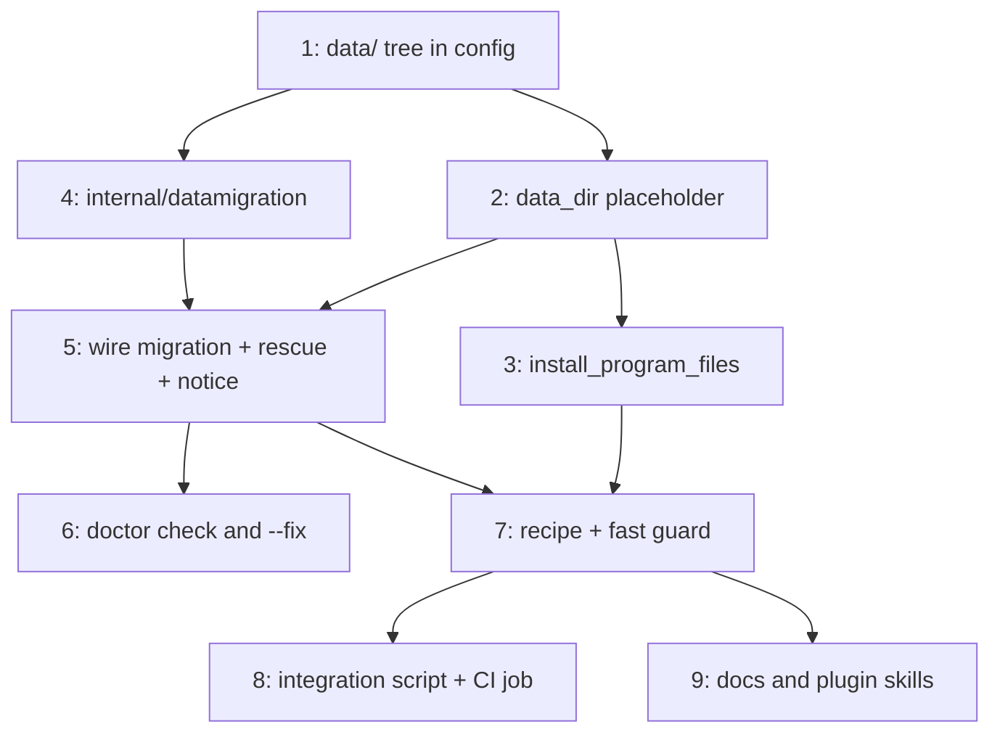

# PLAN: nvm data root

## Status

Active

## Scope Summary

Move nvm's data root out of the versioned, garbage-collected tool directory into a new
stable `$TSUKU_HOME/data/nvm`, keep `nvm exec` working across the resulting program/data
split, and migrate the two populations of existing installs in the same event that
rewrites the export.

## Decomposition Strategy

**Horizontal.** The design's components have stable, well-defined boundaries and the
integration risk that would otherwise argue for a walking skeleton has already been
retired empirically: the exploration ran two real nvm releases through the exact
tsuku-shaped layout — copy in `share/shell.d`, export from a `00-env-` fragment, program
files in the data root — and confirmed every subcommand including `exec` and `run`,
across an upgrade, across deletion of the old tool directory, and across a `mv`-based
migration carrying a native-binary global package. There is no end-to-end unknown left
for a skeleton to surface.

What remains is layered and each layer is a prerequisite for the next: the config tree
before the placeholder that names it, the placeholder before the actions that expand it,
the merge primitive before the three call sites that invoke it. Issue 1 is the
foundation; issues 3 and 4 are independent of each other and can proceed in parallel once
it lands.

Single-pr because no hard constraint forces a split and no intermediate slice is
independently useful — a `data/` tree nothing points at, or a placeholder no recipe uses,
delivers nothing on its own. The unit of usable value is "upgrading nvm stops destroying
your Node installs," and that is one PR.

## Issue Outlines

### <<ISSUE:1>> Add the `data/` tree to config

**Complexity:** simple

**Goal.** Give tsuku a top-level `$TSUKU_HOME/data/` directory that no cleanup path
enumerates, as the home for user data that must outlive any tool version.

**Acceptance criteria.**
- `Config` gains a `DataDir` field alongside `ShareDir`, populated in the `DefaultConfig`
  literal.
- `EnsureDirectories` creates it **behind the same `if c.DataDir != ""` guard `ShareDir`
  uses**. Without the guard a partial `Config{}` literal makes `filepath.Join("", "data")`
  yield `"data"` and `os.MkdirAll` writes a stray relative directory into the test
  process's working directory; such literals exist at `cmd/tsuku/doctor_test.go:48` and
  `cmd/tsuku/post_install_test.go:26`.
- The directory is created `0700`, matching `share/shell.d` and `share/completions`
  rather than `tools/`'s `0755`. This affects only the root — nvm creates `versions/`
  and the rest itself under the user's umask.
- The `"data"` path segment is a shared exported constant, so the config field and the
  action-side helper cannot drift on spelling.
- Tests follow the `TestEnsureEnvFile_*` pattern in `internal/config/config_test.go`,
  including one that constructs a partial `Config{}` and asserts no stray directory
  appears.

**Dependencies.** None.

### <<ISSUE:2>> Add the `{data_dir}` placeholder to `set_env`

**Complexity:** testable

**Goal.** Let a recipe name a stable per-tool data path, which no existing placeholder
can express.

**Acceptance criteria.**
- A `dataDir(ctx)` helper in `internal/actions` returns
  `filepath.Join(filepath.Dir(ctx.ToolsDir), <data segment>, <recipe name>)`, reusing
  `envTargetName`'s existing single-path-segment validation (it already rejects `.`,
  `..`, separators, and `@`).
- `set_env` expands `{data_dir}` in its `value`. Expansion stays local to the consuming
  actions rather than widening `GetStandardVars`, which would push the placeholder into
  all nine callers to serve one recipe.
- The value still passes through `shellQuote`, so the single-quoting that keeps
  recipe-controlled strings out of the shell is preserved.
- An unexpanded `{data_dir}` reaching a consumer is a **runtime error from the action
  that saw it**, mirroring `CheckUnexpandedDepVars` (`internal/actions/util.go:56-69`) —
  not a list of expanding actions inside `validator.go`, which would drift from the
  actions that actually expand and fail `--strict` against a correct recipe.
- The action asserts `filepath.Dir(ctx.ToolsDir) == config.HomeDir` rather than assuming
  it, since the cleanup path resolves recorded paths against `config.HomeDir`.
- Table-driven tests in `internal/actions/set_env_test.go` (`dupl` fires at 250 tokens).

**Dependencies.** <<ISSUE:1>>

### <<ISSUE:3>> Add the `install_program_files` action

**Complexity:** critical

**Goal.** Copy a tool's own program files into its data directory on every install, so
`nvm exec` and `nvm run` keep working once `NVM_DIR` no longer names the directory
`nvm.sh` was extracted into.

This issue is classified critical because it is the design's security surface: it copies
attacker-influenced archive content to a path outside the staging directory, and it
records cleanup actions that `tsuku remove` later executes.

**Acceptance criteria.**
- The action takes **only** a `files` list. There is deliberately no `dir` parameter —
  the destination is always `dataDir(ctx)`. A recipe-named destination would admit
  `$TSUKU_HOME/share/shell.d`, which `RebuildShellCache` concatenates into the cache the
  user's shell sources, and `ShellDSelection.excludes` returns *false* for a path it does
  not know (`internal/shellenv/selection.go:35-40`), so an unrecorded fragment is sourced
  rather than filtered. Since the action ignores `--no-shell-init`, that would be a clean
  bypass of the one flag a user has for saying "do not touch my shell".
- Phase is `post-install`, declared via `PhaseDeclarer`. The source is
  `ctx.ToolInstallDir`, populated only after the atomic rename; `Execute` hard-errors when
  it is empty, matching `set_env.go:126-136`.
- Each `files` entry is resolved with `filepath.EvalSymlinks` and required to stay inside
  the **resolved** tool directory. A lexical `..` rejection is insufficient: it says
  nothing about a symlinked directory component, and the archive extractor does not
  contain tarball symlinks (see the design's Security Considerations — its containment is
  purely lexical and a symlink chain escapes it).
- The source is opened `O_RDONLY|O_NOFOLLOW` and the regular-file check is done on the
  **file handle**, so the type check and the read see the same object. The temp
  destination is opened `O_CREATE|O_EXCL|O_NOFOLLOW`, then renamed, so a concurrent
  `nvm exec` never observes a partial file. The shared `copyFile`
  (`internal/actions/download_cache.go:319-337`) cannot be reused: it uses plain
  `os.Create`, which follows a destination symlink and preserves no mode.
- Mode is `0755` when the source has any execute bit and `0644` otherwise — not derived
  from tar-header bytes.
- Records a `delete_file` cleanup per placed file, via `upsertCleanup` for idempotence.
- Ignores `--no-shell-init`, following `install_completions` rather than its two other
  siblings, with a comment saying why: a data root is not a shell.d file, and a user
  wiring nvm up by hand still needs `nvm-exec`. This also keeps every installed version
  recording the cleanup, which is what keeps GC's cross-version guard effective.
- Registered in `internal/actions/action.go` **and** given an `ActionEvaluability` entry
  in `internal/executor/plan.go`. Omitting the latter silently makes every recipe using
  the action non-reproducible — `install_completions` is already missing from that map.
- `IsDeterministic()` true, `RequiresNetwork()` false.
- Tests cover the symlink-escape rejection, the non-regular-file rejection, the mode
  outcome, idempotent re-run, and the cleanup record.

**Dependencies.** <<ISSUE:1>>, <<ISSUE:2>>

### <<ISSUE:4>> Add `internal/datamigration`

**Complexity:** critical

**Goal.** A merge-move that relocates a tool's data between roots without ever being able
to destroy anything, plus the nvm-specific predicates that say what to move and from
where.

Critical because it moves irreplaceable user data, and because its safety rests on
invariants that are easy to implement subtly wrong.

**Acceptance criteria.**
- `merge.go` holds a tool-agnostic `Merge(src, dst, entries)`; `nvm.go` holds the nvm
  predicate table. Split by generality rather than by tool: `internal/` holds no
  tool-named package, and this repo's convention for ecosystem-specific code is a *file*
  inside a general package (`brew_actions.go`, `gem_install.go`, `nix_portable.go`).
  `nvm.go` is the single deletable unit when the migration outlives its usefulness.
- The package imports only stdlib and `internal/config`. It is a leaf because both
  `internal/actions` and `internal/install` need it and **neither imports the other
  today** — verified — so any other home would create that edge.
- **No `os.RemoveAll`, no overwrite, ever.** For each named entry: rename when the
  destination path does not exist; recurse when both sides are directories; otherwise
  leave the source and record a conflict. The destination always wins; the source is
  never destroyed; every conflict is reported by path.
- **Every stat is `os.Lstat`**, and every type test is `Mode().IsDir()` on an `Lstat`
  result or `DirEntry.IsDir()` from `os.ReadDir`. A symlink on either side is a conflict:
  left in place, reported, never followed. With `os.Stat`, a symlink at `src/versions`
  pointing at an arbitrary directory makes the merge enumerate *that* directory and
  rename its entries into the data root — a move-anything primitive built out of an
  algorithm whose headline invariant is about deletion.
- `Merge` takes the entries to move as an argument and **never removes its own source**.
  An unconditional `os.Remove(src)` fits neither call shape, and for the pre-fix
  population the source *is* `share/shell.d`.
- **No `copyDir` fallback, ever** — a prohibition in the doc comment, not an omission a
  future contributor helpfully fills in. On `EXDEV` or `EACCES`, record the path, report,
  and stop. `copyDir` has no hard-link tracking, so npm's content-addressable store
  becomes N full copies; a single unreadable file aborts mid-tree leaving a partial
  destination with nothing saying which side is authoritative.
- Predicates for both populations, per the design's detection table. The pre-fix
  population moves **every entry that is a directory** under `share/shell.d` — provable
  rather than heuristic, because tsuku's only writers there write named *files* and both
  enumerators `continue` on `IsDir()`. The post-fix population moves the **enumerated**
  set (`versions/`, `alias/`, `.cache/`, `default-packages`, `current`), not an inverse
  rule: the source is also a program directory, and an inverse rule would misclassify a
  file dropped between releases as user data, gutting the directory GC preserves as the
  rollback target.
- Post-fix population is processed before pre-fix: it is on a deletion clock and the
  other is not, so it wins any collision.
- Tests: happy path, idempotent, migrates, **idempotent after migration** (the one that
  matters for a re-runnable move), conflict reporting, and a symlink planted on each side
  — two `os.Symlink` calls, and the test that pins the invariant.

**Dependencies.** <<ISSUE:1>>

### <<ISSUE:5>> Wire the migration into `set_env`, the removal rescue, and the notice

**Complexity:** critical

**Goal.** Run the merge at the three moments that matter, and tell the user when it
could not finish.

**Acceptance criteria.**
- `set_env` calls the migration immediately after writing the fragment, gated on the
  exported variable being a known data-root name. It is **not** a separate recipe action:
  a declared step would have to state "ordered after `set_env`" as a constraint a future
  recipe edit could violate, and would owe a registry entry, an evaluability entry, a
  plugin-skill entry, and a contract never to return an error (because `ExecutePhase`
  aborts a phase's remaining steps on the first one). The precedent for an inline
  ecosystem-specific fixup on a general path is `fixPipxShebangs`, called unconditionally
  from `installDirectoryMode` (`internal/install/manager.go:177`).
- This placement is the load-bearing correctness property of the whole design. `set_env`
  expands to an **absolute literal** and single-quotes it into a version-keyed fragment,
  and nothing in the tree rewrites a fragment's body outside an install of nvm itself. So
  the moment `set_env` runs is the only moment where the data moving and `NVM_DIR` being
  rewritten are the same event. Any general install hook fires additionally at moments
  when the recipe has *not* run, where the export still names the old location — and
  moving the data then causes exactly the bug this design exists to fix.
- Migration failures are reported, never returned as errors.
- The removal rescue calls the same merge immediately before **both**
  `os.RemoveAll(toolDir)` sites in `internal/install/remove.go`, skipped when the tool
  directory is not nvm's. It needs no gate: `executeCleanupActions` has already torn the
  fragment down, so there is no live export to invalidate. Without it, `tsuku remove nvm`
  destroys an un-migrated user's whole estate and no install path runs first — which
  would make the design's "removal preserves the data root" guarantee vacuous for exactly
  the users it protects. It also covers orphaned-dependency auto-removal, where nvm can
  be reaped without the user ever naming it.
- Do **not** touch the deprecated `Manager.Remove` (`internal/install/remove.go:21`); it
  has zero non-test callers.
- A `KindDataMigration` notice kind plus one render case. Without it the notice falls
  through to a branch printing `tsuku rollback <tool>` — telling a user whose estate is
  half in two places to run a command that cannot succeed.
- The notice is **failure-only**, keyed `nvm-data-migration` (not `nvm` — `WriteNotice`
  writes `<Tool>.json`, so a notice named `nvm` is overwritten twice in the same tick),
  and carries a **non-empty `Error`**. That one field routes it around every trap for
  free: `isBackgroundSuccess` becomes false so it escapes `renderBackgroundSuccess`,
  which drops `Messages` entirely; `cmd/tsuku/cmd_notices.go` needs no change because it
  deletes only error-free notices; and it persists rather than being single-view removed.
- The notice is written from `cmd/tsuku/post_install.go`, which already holds config, by
  re-running the shape detector. Writing it from inside an action would need a
  `NoticesDir` on `ExecutionContext` — the most-constructed struct in the tree — plumbed
  through five construction sites, plus a new `internal/actions` → `internal/notices`
  edge.
- Nothing is reported on success: the user's `nvm ls` looks exactly as it did.

**Dependencies.** <<ISSUE:2>>, <<ISSUE:4>>

### <<ISSUE:6>> Add the `doctor` check and `--fix` stanza

**Complexity:** testable

**Goal.** Make an incomplete migration visible and retryable, and tell an un-migrated
user where their data is.

**Acceptance criteria.**
- Gated on nvm being installed, so it emits nothing for the overwhelming majority of
  users, and kept as one contiguous hunk so the eventual deletion is a single cut. It
  would be the first tool-specific check in `runDoctorChecks`, which is otherwise eight
  generic checks.
- Two verdicts. Fragment names `data/nvm` while data is still in an old location →
  **FAIL**, the shell points at an empty root right now, and `--fix` retries the merge.
  Fragment names an old path and the data is there → **WARN**, working but at risk, and
  `--fix` must **not** touch it: moving data while the fragment names the old path breaks
  a working install. The WARN verdict is the only surface that tells the never-updated
  population where their data is, which the issue's fourth acceptance criterion requires
  via its second clause.
- The check **reads the active fragment** rather than inferring from disk. An
  `os.Stat($TSUKU_HOME/data/nvm/nvm.sh)` shortcut is unsound: `Manager.Activate`
  re-selects fragments without running post-install, so after a rollback that file exists
  while the active fragment names the old path.
- `--fix` reports honestly that it cannot repair the two documented failure modes —
  `EXDEV` and a genuine conflict both reproduce on retry — rather than claiming success.
- `--no-shell-init` falls out for free: `set_env` returns early writing nothing, no
  fragment exists, the predicate is false, nothing moves.
- Tests modeled on `TestDoctorFix_EnvRewrite` (`cmd/tsuku/doctor_test.go:136-178`).

**Dependencies.** <<ISSUE:5>>

### <<ISSUE:7>> Update the recipe and add the fast behavioral guard

**Complexity:** testable

**Goal.** Point nvm at the new root, and add the always-running test that fails today.

**Acceptance criteria.**
- `recipes/n/nvm.toml`: `set_env` exports `NVM_DIR = "{data_dir}"`, an
  `install_program_files` step places `nvm.sh` and `nvm-exec`, and the header comment
  describes the model actually in force — where the data lives, that no tsuku command
  deletes it, that removal prints the path, and that a pre-existing `$HOME/.nvm` is left
  alone. The current comment describes the old model and is now wrong.
- The fast guard lives in `cmd/tsuku/shelld_lifecycle_test.go` — the only place install,
  actions and shellenv meet. Its harness already stands up a real `$TSUKU_HOME` under
  `t.TempDir()` with a real `Manager` and a bash reader, needs no network, runs in about
  1.7 seconds, and carries no `testing.Short()` guard, so it runs under
  `go test -short ./...` on every PR that touches Go.
- The guard seeds a user file under the path the **shell** was told to use, installs a
  second version, removes the first, and asserts the file survives and the shell still
  names the same root. Observable behavior, read out of a real bash subshell — not
  intermediate state. **It must fail on `main` today.**
- A second case covers the end-to-end migration: seed the legacy location, run the
  trigger, assert the tree moved **and** that `NVM_DIR` read from a real bash subshell
  names the new root.
- Fixture writes need explicit error checks — `errcheck` covers test files with no
  `os.WriteFile`/`os.MkdirAll` exclusion — and table-driven subtests, since `dupl` fires
  at 250 tokens.
- Each guard is mutation-tested by hand: apply a one-line defect, confirm the test fails,
  revert. The repo has no mutation-testing tooling, so this is manual discipline and the
  applied defects are recorded in the PR body.

**Dependencies.** <<ISSUE:3>>, <<ISSUE:5>>

### <<ISSUE:8>> Add the real-nvm integration script and its CI job

**Complexity:** testable

**Goal.** Satisfy the issue's sixth acceptance criterion with a test that exercises real
nvm, real Node, and a real upgrade.

**Acceptance criteria.**
- A script under `test/scripts/`, matching `test-checksum-pinning.sh` and
  `test-homebrew-recipe.sh`: install nvm, install a Node version, set a `default` alias,
  upgrade nvm, then in a **fresh shell** assert that `nvm ls` still lists the version,
  the `default` alias survives, and `nvm exec <v> node -v` works.
- The alias assertion is not decoration — `nvm alias default` is named explicitly in the
  issue's acceptance criteria. The `nvm exec` assertion is what catches the one
  regression that is otherwise silent: if the program files go missing or stale,
  `install`, `ls`, `use`, `which`, and `alias` all keep working and only `exec`/`run`
  break, with `rc=127`.
- **Adding the job is part of this issue**, not an assumed side effect. It goes in
  `integration-tests.yml` with `TSUKU_REGISTRY_URL` pointed at the head ref the way the
  existing jobs do — otherwise the modified recipe is never fetched and the test passes
  against the old one.
- It does not go in a `@critical` Gherkin scenario, which would put a multi-minute
  network download on every PR in the repo; and an untagged scenario would run only on
  PRs touching `test/functional/**`, so it would pass green once and lie dormant forever.

**Dependencies.** <<ISSUE:7>>

### <<ISSUE:9>> Update docs and plugin skills

**Complexity:** simple

**Goal.** Keep the agent-facing skills and user-facing docs true, as the repo's
plugin-maintenance table requires in the same PR.

**Acceptance criteria.**
- `tsuku-recipe-author`: the new `install_program_files` action and the new `{data_dir}`
  placeholder, in both `SKILL.md` and `references/action-reference.md`.
- `tsuku-recipe-test`: any changed step ordering or phase behavior.
- `tsuku-user`: the `data/` tree, what `tsuku remove` does to it, and the new `doctor`
  check.
- `recipes/README.md`: the action table row.
- A documentation note covering where `data/` lives, that `rm -rf $TSUKU_HOME` now
  destroys user data, and the manual reclaim command. This is the **only** mitigation the
  design offers for that consequence, so it is a deliverable rather than a claim.
- No AI attribution or co-author lines anywhere.

**Dependencies.** <<ISSUE:7>>

## Implementation Issues

Not applicable — `execution_mode: single-pr`. The outlines above are the decomposition;
no GitHub issues are created.

## Dependency Graph

## Implementation Sequence

**Critical path:** 1 → 2 → 5 → 7 → 8. Five of the nine issues, and it runs through the
migration wiring because that is what both the recipe change and the end-to-end test
depend on.

**Parallelizable.** Issues 3 and 4 are independent of each other; 4 needs only issue 1,
so it can start as soon as the config tree lands, while 2 and 3 proceed on their own
branch of the graph. Issue 6 depends only on 5 and can run alongside 7. Issue 9 needs 7
only because the recipe's final shape is what it documents.

**Ordering constraint worth stating.** Issue 3 must land its `ActionEvaluability` entry
with the action itself. An action registered without one silently evaluates as
non-evaluable through the unknown-action default, which makes every recipe using it
non-reproducible — and `install_completions` is already in that state, so the failure is
demonstrably easy to miss.

**Verification gate before the PR flips to ready.** `go test ./...`, `go vet ./...`, and
`gofmt` clean; `golangci-lint` clean, with particular attention to `errcheck` on test
files and `dupl` at 250 tokens; `git status --porcelain` empty after the test run, since
the unit job fails on a dirty tree; and each new guard mutation-tested by hand with the
applied defects recorded in the PR body.
