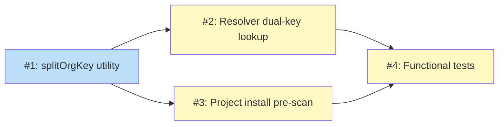

# PLAN: Org-Scoped Project Config

## Status

Draft

## Scope Summary

Implement support for org-scoped tools in `.tsuku.toml` using TOML quoted keys, a pre-scan phase in `runProjectInstall` for distributed provider bootstrapping, and a dual-key lookup in the resolver for shell integration. Fixes #2230.

## Decomposition Strategy

**Horizontal.** Components have clear, stable interfaces: `splitOrgKey` is a pure utility consumed by both the resolver and project install. Layer-by-layer decomposition avoids integration complexity. The utility ships first, then both consumers can be implemented in parallel, followed by end-to-end tests.

## Issue Outlines

### Issue 1: feat(project): add splitOrgKey utility for org-scoped tool keys

**Goal:** Add a shared utility that splits org-scoped tool keys into source and bare recipe name with validation.

**Acceptance Criteria:**
- `splitOrgKey("tsukumogami/koto")` returns `("tsukumogami/koto", "koto", true, nil)`
- `splitOrgKey("tsukumogami/registry:mytool")` returns `("tsukumogami/registry", "mytool", true, nil)`
- `splitOrgKey("node")` returns `("", "node", false, nil)`
- Path traversal inputs (containing `..`) return an error
- Invalid source formats return an error
- Unit tests cover all formats and edge cases

**Dependencies:** None

**Files:**
- `internal/project/orgkey.go` (new)
- `internal/project/orgkey_test.go` (new)

### Issue 2: feat(project): add dual-key lookup to resolver for org-scoped tools

**Goal:** Teach the resolver to match org-scoped config keys against bare binary-index recipe names via a reverse map, with duplicate detection warning.

**Acceptance Criteria:**
- `NewResolver` builds a `bareToOrg` reverse map from config keys containing `/`
- `ProjectVersionFor` tries bare key first (backward-compatible fast path), then falls back to org-scoped keys via reverse map
- Multiple org-scoped keys mapping to the same bare name are sorted alphabetically for deterministic resolution
- Duplicate bare-name detection logs a warning at construction time
- Existing bare-key configs continue to work unchanged
- Unit tests cover: bare keys (unchanged), org-scoped keys, name collision case, empty config

**Dependencies:** Issue 1

**Files:**
- `internal/project/resolver.go` (modified)
- `internal/project/resolver_test.go` (new or extended)

### Issue 3: feat(install): add org-scoped tool support to project install

**Goal:** Add pre-scan phase to `runProjectInstall` that detects org-scoped keys, batch-bootstraps distributed providers, and routes qualified names through the distributed install path.

**Acceptance Criteria:**
- Pre-scan detects tool keys containing `/` via `parseDistributedName`
- Unique sources are collected and `ensureDistributedSource` is called once per source
- `installYes` flag propagates to `ensureDistributedSource` for CI auto-approval
- Per-tool install loop builds qualified names (`source:recipe`) for distributed tools
- `checkSourceCollision`, `fetchRecipeBytes`, `computeRecipeHash`, and `recordDistributedSource` are called per distributed tool (parity with CLI path)
- Source bootstrap failures are handled gracefully (continue with remaining tools)
- Bare-key tools are unaffected
- Display logic handles org-scoped names in tool list output

**Dependencies:** Issue 1

**Files:**
- `cmd/tsuku/install_project.go` (modified)

### Issue 4: test(project): add functional tests for org-scoped .tsuku.toml

**Goal:** Add end-to-end tests covering config parsing, project install, and shell integration resolution with org-scoped tools.

**Acceptance Criteria:**
- Test: `.tsuku.toml` with `"org/tool" = "version"` parses correctly
- Test: `tsuku install` (no args) with org-scoped tools installs from distributed source
- Test: resolver resolves correct version for org-scoped tools via shell integration
- Test: bare-key tools in the same config still work
- Test: `strict_registries` blocks unregistered org-scoped sources

**Dependencies:** Issue 2, Issue 3

**Files:**
- `test/functional/features/project_config.feature` (new or extended)

## Implementation Issues

_Single-pr mode: no GitHub issues. See Issue Outlines above._

## Dependency Graph

**Legend**: Blue = ready, Yellow = blocked

## Implementation Sequence

**Critical path:** Issue 1 -> Issue 2 or 3 (parallel) -> Issue 4

**Parallelization:** Issues 2 and 3 can be implemented in parallel after Issue 1 completes. Both depend only on the `splitOrgKey` utility.

**Estimated implementation order:**
1. Issue 1 (splitOrgKey) -- pure function, fast to implement
2. Issues 2 + 3 in parallel (resolver + project install) -- the main work
3. Issue 4 (functional tests) -- validates everything end-to-end
