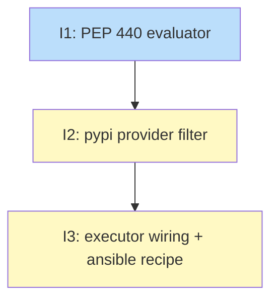

# PLAN: pipx PyPI Version Pinning by Python Compatibility

## Status

Draft

## Scope Summary

Add automatic Python-compatibility filtering to `pipx_install` recipes
so PyPI version selection picks the newest release whose
`requires_python` is satisfied by tsuku's bundled `python-standalone`,
without requiring recipe authors to declare versions or constraints.
Closes #2331's acceptance criteria for `ansible-core`. azure-cli is
tracked separately as a follow-up.

## Decomposition Strategy

**Horizontal.** The accepted design's Implementation Approach already
breaks the work into three sequential phases with explicit
dependencies (Phase 1 has no deps; Phase 2 uses Phase 1; Phase 3
wires Phase 2 into the executor and lands the proof-point recipe).
Walking-skeleton decomposition would not buy anything — there is no
"minimal e2e flow with stubs" worth landing first; the parser
genuinely cannot stub. Horizontal mirrors the design's phasing 1:1.

The chain is strictly linear (1 → 2 → 3); no parallelization
opportunities exist. In single-PR mode, this becomes the natural
commit order inside the branch, so linearity is a feature, not a
constraint.

## Issue Outlines

### Issue 1: feat(version): in-tree PEP 440 specifier evaluator

**Complexity:** testable

**Goal.** Add an in-tree PEP 440 specifier evaluator at
`internal/version/pep440/` that parses PyPI `requires_python` strings,
evaluates them against a target Python version, and exposes a
sanitized canonical form for safe error rendering.

**Acceptance Criteria.**

- Package directory `internal/version/pep440/` exists with `version.go`,
  `specifier.go`, `match.go`, `pep440_test.go`.
- `ParseVersion(s string) (Version, error)`, `ParseSpecifier(s string)
  (Specifier, error)`, `(Specifier).Satisfies(target Version) bool`,
  and `Canonical(s string) string` are exported with the signatures
  shown in the design's "Key Interfaces" section.
- `Version` exports `Compare(other Version) int` returning -1/0/1 and
  `String() string`. 1- to 4-segment integer parsing; missing trailing
  components default to 0.
- All five input-hardening checks enforced at `ParseSpecifier` entry
  with dedicated negative test cases:
  - Total length cap of 1024 bytes (`ErrInputTooLong`).
  - Clause count cap of 32 (`ErrInputTooLong`).
  - Per-clause length cap of 256 bytes (`ErrInputTooLong`).
  - ASCII-only validation: any byte > 0x7F rejected (`ErrNonASCII`).
  - Segment-magnitude cap: > 6 digits or > `math.MaxInt32` rejected
    (`ErrSegmentTooLarge`).
- Operators supported: `>=`, `<=`, `>`, `<`, `==`, `!=`, plus
  `==X.Y.*` / `!=X.Y.*` wildcards. `~=` and `===` rejected with
  `ErrUnsupportedOperator`. `ErrMalformed` covers other parse failures.
  All error sentinels exported.
- Operator matching uses longest-prefix semantics; comma-joined
  clauses parsed with AND semantics; each clause `TrimSpace`-d.
- `Canonical` returns sanitized parseable form for valid inputs and
  the literal `"<malformed>"` for inputs failing any hardening
  check; never raw upstream bytes.
- Table-driven tests seeded with the 96 `requires_python` strings
  from the L5 survey (poetry, ansible, black, mypy, ruff, flake8,
  pylint, isort, tox, pipx, httpx, requests, django, numpy, pandas)
  parse without error and produce non-zero clause counts. `Canonical`
  round-trip cases assert each survey string produces ASCII-only
  output that re-parses successfully.
- No regex (byte-level scanning only); no recursion in the parser.
- No new module dependencies (Go stdlib only).
- `go test ./internal/version/pep440/...`, `go vet ./internal/version/pep440/...`,
  and `gofmt -l internal/version/pep440/` all pass with no output.

**Dependencies.** None.

### Issue 2: feat(version): pypi provider gains python-compat filter

**Complexity:** testable

**Goal.** Teach `PyPIProvider` to filter PyPI releases by per-release
`requires_python` against a bundled-Python major.minor, opt-in via a
new pipx-specific constructor.

**Acceptance Criteria.**

- `internal/version/pypi.go`: `pypiPackageInfo.Releases` changes from
  `map[string][]struct{}` to `map[string][]pypiReleaseFile` where
  `pypiReleaseFile { RequiresPython string` json:"requires_python" `}`.
  The 10 MB response cap (`maxPyPIResponseSize`) is unchanged.
- Existing `pkgInfo.Releases` references in `pypi.go` (loops at
  approximately lines 194-198 in `ListPyPIVersions`) compile and behave
  correctly under the new shape. `ResolvePyPI` continues to behave
  exactly as today.
- `internal/version/errors.go`: append `ErrTypeNoCompatibleRelease` to
  the existing iota-based `ErrorType` enum (the type defined at
  line 15). Doc comment matches the convention of surrounding values.
- `internal/version/provider_pypi.go`: `PyPIProvider` gains an
  unexported `pythonMajorMinor string` field. `NewPyPIProvider`
  retains today's signature with no behavior change. New constructor
  `NewPyPIProviderForPipx(resolver, pkg, pythonMajorMinor)` constructs
  a filter-aware provider.
- When `pythonMajorMinor` is non-empty, `ResolveLatest` walks
  `ListVersions()` newest-first and returns the first release whose
  `requires_python` is satisfied. Empty/null `requires_python`
  treated as compatible (matches pip). Unparseable specifiers
  (including unsupported operators from Issue 1) cause that release
  to be skipped without aborting the walk. `ListVersions` filters by
  the same rule. When `pythonMajorMinor` is empty, the provider
  behaves exactly as today on every method.
- `ResolveVersion` (user-pin path) is never filtered, regardless of
  `pythonMajorMinor`.
- When no release is compatible: `ResolveLatest` returns a
  `*ResolverError` with `Type = ErrTypeNoCompatibleRelease`,
  `Source = "pypi"`, and message of the shape `"no release of
  <package> is compatible with bundled Python <X.Y> (latest is <V>,
  requires Python <pep440.Canonical(Z)>)"`. The `<Z>` slot is
  rendered through `pep440.Canonical(...)` — never raw bytes.
- Tests using the existing `httptest`-based fixture pattern from
  `provider_pypi_test.go` cover: latest compatible in middle of list;
  no compatible release; null `requires_python` treated as
  compatible; unparseable specifier on a release skipped without
  aborting the walk; user-pin path unaffected; error message renders
  `Canonical(Z)` not raw bytes; `pythonMajorMinor == ""` smoke test
  preserves existing non-pipx behavior.
- `go test ./internal/version/...` and `go vet ./internal/version/...`
  pass.

**Dependencies.** Blocked by Issue 1.

### Issue 3: feat(executor): wire python-compat into pipx_install + ansible recipe

**Complexity:** testable

**Goal.** `tsuku eval --recipe recipes/a/ansible.toml` resolves
`ansible-core` to a release whose `requires_python` is satisfied by
the bundled `python-standalone` binary's major.minor, producing a
deterministic, Python-compatible install plan end-to-end.

**Acceptance Criteria.**

- `internal/version/provider_factory.go`: `PyPISourceStrategy` and
  `InferredPyPIStrategy` accept a `pythonMajorMinor` input (via
  strategy field populated before `Create`, or via extended `Create`
  signature). When non-empty, both strategies construct via
  `NewPyPIProviderForPipx`. When empty, both fall back to today's
  `NewPyPIProvider` — non-pipx callers and non-pipx recipes are
  unaffected.
- `internal/executor/plan_generator.go`: before `e.resolveVersionWith`
  runs, the recipe's steps are scanned for `Action == "pipx_install"`.
  When at least one is present:
  - `actions.GetEvalDeps("pipx_install")` returns the eval-dep list
    (which includes `python-standalone`).
  - `actions.CheckEvalDeps(...)` is called against that list; missing
    deps trigger the existing `cfg.OnEvalDepsNeeded` path (no new
    install code).
  - `actions.ResolvePythonStandalone()` provides the binary path.
  - The existing `getPythonVersion(pythonPath)` helper probes the
    full version (e.g., `"3.13.0"`).
  - The full version is truncated to major.minor with
    `strings.SplitN(full, ".", 3)[:2]` joined with `"."`.
  - The major.minor value is threaded into the provider factory
    before version resolution runs.
- When the recipe has no `pipx_install` steps, the early eval-deps
  path is skipped entirely (no `python-standalone` install triggered
  for non-pipx recipes).
- `internal/actions/pipx_install.go` is unchanged. The
  `ctx.Constraints` golden-file branch in `Decompose` is unchanged.
- `recipes/a/ansible.toml` is added with a `pipx_install` step for
  `ansible-core` and the appropriate `executables` list. Metadata
  sets `curated = true`. No version pin in the recipe.
- `tsuku validate --strict --check-libc-coverage recipes/a/ansible.toml`
  passes.
- `tsuku eval --recipe recipes/a/ansible.toml --os linux --arch amd64`
  resolves to a Python-compatible `ansible-core` (e.g., 2.17.x for
  CPython 3.10/3.11/3.12 — the precise version depends on the
  python-build-standalone line bundled at land time).
- The cache key (from `Executor.ResolveVersion`), the install
  directory name (`$TSUKU_HOME/tools/ansible-<version>/`), and the
  version `pipx_install.Decompose` writes into the
  `pip download <package>==<version>` invocation are the same string
  — no divergence.
- The resolved plan is deterministic across repeated `tsuku eval`
  runs (modulo upstream PyPI publishing new compatible releases).
- Tests cover: factory routing for pipx vs. non-pipx steps and for
  set vs. unset `pythonMajorMinor`; plan-generator early eval-deps
  path with `python-standalone` absent (triggers
  `cfg.OnEvalDepsNeeded`) and present (probe + truncate + thread);
  plan-generator no-op for recipes without `pipx_install` steps;
  end-to-end resolution against `recipes/a/ansible.toml`.
- `go test ./...`, `go vet ./...`, and
  `golangci-lint run --timeout=5m ./...` pass.

**Dependencies.** Blocked by Issue 2.

## Dependency Graph

**Legend**: Green = done, Blue = ready, Yellow = blocked.

## Implementation Sequence

**Critical path:** Issue 1 → Issue 2 → Issue 3.

**Length:** 3 issues.

**Parallelization:** None — the chain is strictly linear. Each issue
depends on the previous. In single-PR mode, this is also the natural
commit order inside the branch.

**Recommended order:**

1. Land the standalone PEP 440 evaluator with full table-driven test
   coverage. This is the riskiest piece (new parser, untrusted input)
   and benefits from being verified in isolation before integration.
2. Wire it into `PyPIProvider` with the `httptest`-based fixture
   coverage. Verify the typed error path and the canonical-form
   rendering.
3. Thread the `pythonMajorMinor` value through the factory and add
   the early eval-deps path in plan generation. Land the curated
   `ansible-core` recipe as the proof point and run end-to-end
   acceptance via `tsuku eval`.
