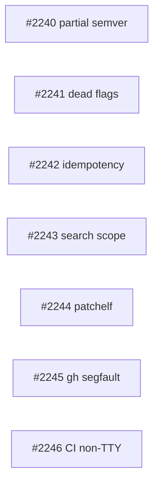

# PLAN: v0.9.1 Post-Release Stabilization

## Scope Summary

Fix bugs and CI blockers discovered during v0.9.0 adoption of project-level
tool management (.tsuku.toml). Seven independent issues covering version
resolution, dead CLI flags, CI compatibility, RPATH relocation, a misreported
segfault, install idempotency, and search scope.

## Decomposition Strategy

**Horizontal.** All seven issues are independent bug fixes in different code
paths with no shared interfaces. Each can be implemented, tested, and shipped
in isolation. No walking skeleton needed.

## Implementation Issues

| # | Issue | Title | Complexity | Dependencies |
|---|-------|-------|------------|-------------|
| 1 | [#2241](https://github.com/tsukumogami/tsuku/issues/2241) | fix(install): plumb --dry-run, --json, and --fresh flags through project install path | testable | None |
| 2 | [#2240](https://github.com/tsukumogami/tsuku/issues/2240) | fix(install): partial semver version resolution fails for distributed source and Homebrew recipes | testable | None |
| 3 | [#2246](https://github.com/tsukumogami/tsuku/issues/2246) | fix(install): distributed source approval fails in non-TTY environments | testable | None |
| 4 | [#2244](https://github.com/tsukumogami/tsuku/issues/2244) | fix(actions): patchelf discovery fails during homebrew_relocate | testable | None |
| 5 | [#2245](https://github.com/tsukumogami/tsuku/issues/2245) | fix(recipes): investigate gh segfault and fix supported_libc metadata | simple | None |
| 6 | [#2242](https://github.com/tsukumogami/tsuku/issues/2242) | fix(install): idempotent install re-executes full plan for already-installed tools | testable | None |
| 7 | [#2243](https://github.com/tsukumogami/tsuku/issues/2243) | feat(search): include distributed source recipes in search results | testable | None |

## Dependency Graph

No dependencies between issues. All can be worked in parallel.

## Implementation Sequence

**Recommended priority order** (by user impact, not dependency):

1. **#2241** -- dead flags are a trust violation; users run --dry-run expecting safety
2. **#2240** -- blocks .tsuku.toml adoption for anyone using partial semver pins
3. **#2246** -- blocks CI adoption for distributed recipes
4. **#2244** -- systemic; affects 1,185 homebrew recipes on Linux
5. **#2245** -- likely a misreport; verify and close or fix recipe metadata
6. **#2242** -- UX improvement; noisy but functional
7. **#2243** -- feature enhancement; workaround exists

**Parallelization**: All seven can be worked simultaneously by different agents
or developers. No merge ordering constraints.

## Out of Scope

The following adoption gaps were identified during exploration but are feature
work, not stabilization. They should be planned separately (PRD or design doc):

- Shell activation silently skips unpinned tools
- `outdated` and `update` commands not project-aware
- No drift detection command (`tsuku status`)
- No lock file for deterministic version resolution
- `tsuku init` gives no guidance
- Website missing .tsuku.toml documentation
