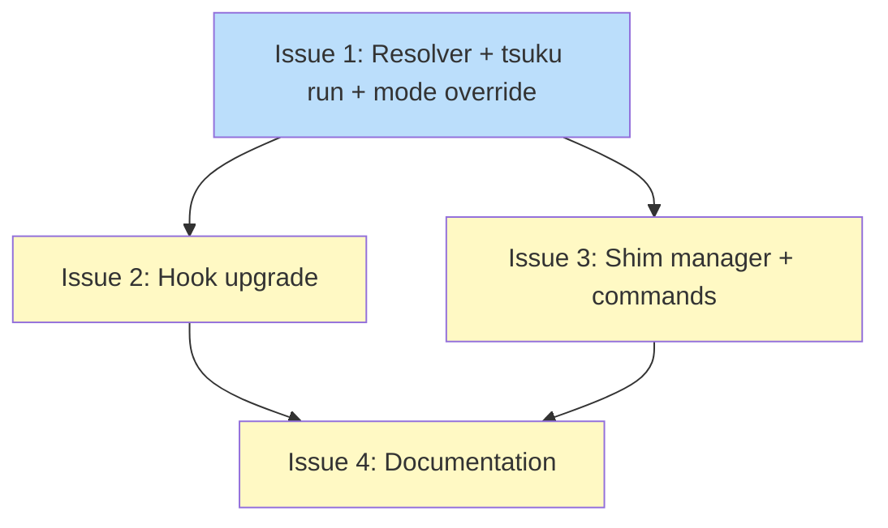

# PLAN: Project-Aware Exec Wrapper

## Status

Draft

## Scope Summary

Wire project awareness into the auto-install flow so that `tsuku run` checks `.tsuku.toml` for version pins, upgrade command-not-found hooks to call `tsuku run` for project-declared tools (treating the config as consent), and add optional shim generation for CI/scripts.

## Decomposition Strategy

**Walking skeleton.** The resolver, tsuku run wiring, and auto mode override must work together for the e2e flow. Issue 1 proves the integration. Hook upgrade (Issue 2) and shims (Issue 3) are independent refinements that build on the working foundation.

## Issue Outlines

### Issue 1: feat(project): add resolver and wire into tsuku run with auto mode override

**Complexity:** testable (skeleton)

Implement `ProjectVersionResolver` in `internal/project/resolver.go`, wire it into `cmd_run.go` (replacing nil), and add auto mode override in `autoinstall/run.go` when the resolver returns a version. `.tsuku.toml` declaring a tool is treated as consent -- no confirmation needed.

**Acceptance Criteria:**

- [ ] `internal/project/resolver.go` exports `NewResolver(config *ConfigResult, lookup autoinstall.LookupFunc) autoinstall.ProjectVersionResolver`
- [ ] `Resolver.ProjectVersionFor(ctx, command)` maps command -> recipe via `LookupFunc`, then recipe -> version via `ConfigResult.Tools`; returns `("", false, nil)` when not in project config
- [ ] `NewResolver(nil, lookup)` returns a resolver where all calls return `("", false, nil)` (handles no `.tsuku.toml`)
- [ ] `cmd_run.go` calls `LoadProjectConfig` with working directory, constructs resolver, passes to `Runner.Run` instead of `nil`
- [ ] `autoinstall/run.go` overrides effective mode to `ModeAuto` when resolver returns `ok=true`; no override when `ok=false` or resolver is `nil`
- [ ] TTY gate in `cmd_run.go` is bypassed for project-declared tools (mode override happens before the gate)
- [ ] Unit tests for resolver: command in index + config, in index but not config, not in index, nil config, index error propagation
- [ ] Unit tests for mode override: resolver returns version -> auto; resolver !ok -> unchanged; nil resolver -> unchanged
- [ ] `go test` and `go vet` pass

**Dependencies:** None

---

### Issue 2: feat(hooks): upgrade command-not-found to call tsuku run for project tools

**Complexity:** testable

Change `internal/hooks/tsuku.{bash,zsh,fish}` so that when `.tsuku.toml` declares the missing command, the hook calls `tsuku run <command> [args]` instead of `tsuku suggest <command>`. Undeclared tools and directories without `.tsuku.toml` keep the existing suggest behavior.

**Acceptance Criteria:**

- [ ] `tsuku.bash` checks whether `.tsuku.toml` declares the command before choosing which subcommand to call
- [ ] `tsuku.zsh` applies the same logic
- [ ] `tsuku.fish` applies equivalent logic in fish syntax
- [ ] When command is declared: hook calls `tsuku run "$1" "$@"` (passes all arguments)
- [ ] When command is not declared or no `.tsuku.toml`: hook calls `tsuku suggest "$1"` (existing behavior)
- [ ] Hook check completes in under 50ms
- [ ] Existing hook chaining (original `command_not_found_handle`) is preserved
- [ ] Tests cover: tool in config -> tsuku run, tool not in config -> tsuku suggest, no config -> tsuku suggest

**Dependencies:** Blocked by Issue 1

---

### Issue 3: feat(shim): add shim manager and tsuku shim commands

**Complexity:** testable

Add `internal/shim/manager.go` for shim creation/removal and `cmd/tsuku/cmd_shim.go` with `tsuku shim install/uninstall/list` commands. Shims are static shell scripts calling `tsuku run`.

**Acceptance Criteria:**

- [ ] `internal/shim/manager.go` implements `Manager` with `Install`, `Uninstall`, `List`, `IsShim`
- [ ] Each shim contains: `#!/bin/sh\nexec tsuku run "$(basename "$0")" -- "$@"\n`
- [ ] `IsShim` identifies shims by content, not path
- [ ] `Uninstall` removes only files identified as shims
- [ ] Installing a shim refuses to overwrite existing non-shim files (including the `tsuku` binary)
- [ ] `cmd/tsuku/cmd_shim.go` registers `shim` with `install <tool>`, `uninstall <tool>`, `list` subcommands
- [ ] `tsuku shim install` prints created shim paths
- [ ] `tsuku shim list` prints a table of shim name and recipe
- [ ] Unit tests with temp directory: install, uninstall, list, IsShim, overwrite protection
- [ ] `go test` and `go vet` pass

**Dependencies:** Blocked by Issue 1

---

### Issue 4: docs: add project-aware exec documentation

**Complexity:** simple

Update CLI help text and documentation for project-aware behavior.

**Acceptance Criteria:**

- [ ] `cmd_run.go` long help documents project-as-consent model and auto mode override for declared tools
- [ ] `cmd_shim.go` has complete help with usage examples and PATH precedence explanation
- [ ] Shell integration docs describe updated hook behavior (declares-tool -> run, undeclared -> suggest)
- [ ] CI usage example included (tsuku shim install in workflow)
- [ ] Writing style follows project conventions

**Dependencies:** Blocked by Issues 2 and 3

## Dependency Graph

**Legend**: Green = done, Blue = ready, Yellow = blocked

## Implementation Sequence

**Critical path:** Issue 1 -> Issue 2 -> Issue 4 (3 steps)

**Recommended order:**

1. Start with Issue 1 (skeleton) -- resolver + wiring + mode override
2. After Issue 1, work Issues 2 and 3 in parallel
3. After Issues 2 and 3, complete Issue 4 (documentation)

**Parallelization:** Issues 2 and 3 are independent after Issue 1.
