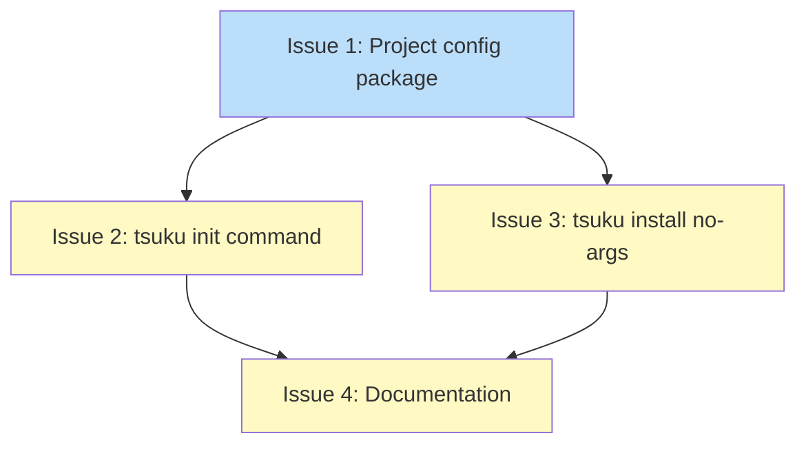

# PLAN: Project Configuration

## Status

Draft

## Scope Summary

Implement per-directory project configuration via `.tsuku.toml` files. Adds a new `internal/project` Go package for file discovery and parsing, a `tsuku init` command for creating config files, and a `tsuku install` no-args mode for batch-installing all declared tools with interactive confirmation and lenient error handling.

## Decomposition Strategy

**Horizontal decomposition.** Components have clear, stable interfaces: the core package (`internal/project`) is a prerequisite consumed by both CLI commands. Layer-by-layer matches the design's phased approach -- foundation first, then commands, then documentation.

## Issue Outlines

### Issue 1: feat(project): add project configuration package

**Complexity:** testable

Add the `internal/project` package that defines the project configuration data model, TOML parsing (including mixed string/table unmarshaling), and file discovery via parent directory traversal with configurable ceilings.

**Acceptance Criteria:**

- [ ] `internal/project/config.go` defines `ConfigFileName` (`.tsuku.toml`), `MaxTools` (256), `ProjectConfig`, `ToolRequirement`, and `ConfigResult` types matching the design spec
- [ ] `ToolRequirement` implements the `BurntSushi/toml` `Unmarshaler` interface to accept both string shorthand (`node = "20.16.0"`) and inline table form (`python = { version = "3.12" }`)
- [ ] `LoadProjectConfig(startDir string)` walks parent directories from `startDir` to find the nearest `.tsuku.toml`, returning a `*ConfigResult` or `nil` if none found
- [ ] `startDir` is resolved via `filepath.EvalSymlinks` before traversal begins
- [ ] Traversal stops at `$HOME` unconditionally; `TSUKU_CEILING_PATHS` (colon-separated) adds additional ceilings but cannot remove the `$HOME` boundary
- [ ] Returns an error if a config file exists but contains invalid TOML or declares more than `MaxTools` (256) tools
- [ ] `FindProjectDir(startDir string)` returns the directory containing the nearest `.tsuku.toml`, or `""` if none found
- [ ] `ExitPartialFailure = 15` is added to `cmd/tsuku/exitcodes.go`
- [ ] `internal/project/config_test.go` covers: string shorthand parsing, inline table parsing, empty/latest version, missing file returns nil, invalid TOML returns error, MaxTools exceeded returns error, parent traversal finds config in ancestor, ceiling paths stop traversal, symlink resolution

**Dependencies:** None

---

### Issue 2: feat(cli): add tsuku init command

**Complexity:** testable

Add the `tsuku init` command that creates a minimal `.tsuku.toml` file in the current directory with an empty `[tools]` section.

**Acceptance Criteria:**

- [ ] `cmd/tsuku/init.go` registers a `tsuku init` Cobra command
- [ ] Running `tsuku init` writes `.tsuku.toml` in the current directory with this template:
  ```toml
  # Project tools managed by tsuku.
  # See: https://tsuku.dev/docs/project-config
  [tools]
  ```
- [ ] If `.tsuku.toml` already exists, the command errors with a message indicating the file already exists and exits non-zero
- [ ] `--force` flag overwrites an existing `.tsuku.toml` without error
- [ ] On success, prints "Created .tsuku.toml"
- [ ] Uses `project.ConfigFileName` constant from `internal/project` (no hardcoded file name)
- [ ] `cmd/tsuku/init_test.go` covers: successful creation, already-exists error, force overwrite

**Dependencies:** Blocked by Issue 1

---

### Issue 3: feat(cli): add tsuku install no-args mode

**Complexity:** testable

Add a no-args mode to `tsuku install` that discovers the nearest `.tsuku.toml` and batch-installs all declared tools with lenient error handling and a summary report.

**Acceptance Criteria:**

- [ ] When `tsuku install` is invoked with no tool arguments, it calls `LoadProjectConfig(cwd)` to discover the project config
- [ ] No config found: prints error suggesting `tsuku init`, exits `ExitUsage` (2)
- [ ] Config found with empty `[tools]`: prints "No tools declared in \<path\>", exits 0
- [ ] Config found with tools: prints the config file path and tool list (e.g., `Using: /path/to/.tsuku.toml` and `Tools: node@20.16.0, go@1.22, ripgrep@latest, jq, python@3.12`)
- [ ] Warns when tools use unpinned versions ("latest" or empty), encouraging pinning for reproducibility
- [ ] On interactive TTY without `--yes`/`-y`: prompts "Proceed? [Y/n]" for confirmation; exits `ExitUserDeclined` (13) if declined
- [ ] `--yes`/`-y` flag skips interactive confirmation
- [ ] Iterates tools in sorted alphabetical order, calling `runInstallWithTelemetry` for each
- [ ] Errors are aggregated (not fail-fast) -- all tools are attempted regardless of individual failures
- [ ] Prints summary after completion: installed count, already-current count, failed count with tool names and error messages
- [ ] Exit code 0 if all succeeded, `ExitPartialFailure` (15) if some failed, `ExitInstallFailed` (6) if all failed
- [ ] `--dry-run`, `--force`, `--fresh` flags are supported in no-args mode
- [ ] `--plan`, `--recipe`, `--from`, `--sandbox` flags are incompatible with no-args mode -- errors if combined
- [ ] `cmd/tsuku/install_project_test.go` covers: no-config error, empty tools, partial failure exit code, all-success, all-failure, flag incompatibility errors, sorted iteration order

**Dependencies:** Blocked by Issue 1

---

### Issue 4: docs: add project configuration documentation

**Complexity:** simple

Update user-facing documentation to cover the new project configuration feature: `tsuku init` command, `tsuku install` no-args mode, and `.tsuku.toml` file format reference.

**Acceptance Criteria:**

- [ ] `tsuku init` command has complete help text (Short, Long, Example fields in Cobra command)
- [ ] `tsuku install` help text documents the no-args project config mode alongside existing usage
- [ ] `.tsuku.toml` format is documented with examples covering: version string shorthand, inline table form, "latest"/empty version, and prefix matching
- [ ] Exit code table in CLI help or docs includes `ExitPartialFailure` (15)
- [ ] Flag compatibility for no-args mode is documented (`--yes`, `--dry-run`, `--force`, `--fresh` supported; `--plan`, `--recipe`, `--from`, `--sandbox` incompatible)

**Dependencies:** Blocked by Issues 2 and 3

## Dependency Graph



**Legend**: Green = done, Blue = ready, Yellow = blocked

## Implementation Sequence

**Critical path:** Issue 1 -> Issue 3 -> Issue 4 (3 steps)

**Recommended order:**

1. Start with Issue 1 (core package) -- no dependencies, foundation for everything else
2. After Issue 1, work Issues 2 and 3 in parallel (they share no dependencies beyond Issue 1)
3. After Issues 2 and 3, complete Issue 4 (documentation)

**Parallelization:** Issues 2 and 3 are independent after Issue 1 completes. If two developers are available, they can work simultaneously. Otherwise, Issue 3 (larger, more complex) should be prioritized over Issue 2 since it's on the critical path.
