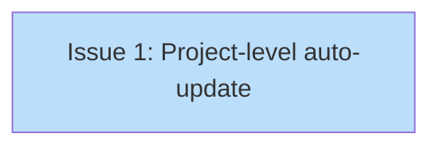

# PLAN: Project-Level Auto-Update Integration

## Status

Draft

## Scope Summary

Add project-level auto-update awareness to MaybeAutoApply so that `.tsuku.toml` version constraints override global pins during auto-apply filtering.

## Decomposition Strategy

**Single issue.** The design modifies 3 files in one package boundary (`internal/updates` + `cmd/tsuku`) with no new infrastructure, no API changes, and no cross-package coupling beyond the existing `project` import. The change is small enough that splitting would create trivially dependent fragments.

## Issue Outlines

### Issue 1: feat(update): project-level auto-update integration

**Complexity:** testable

**Goal:** Make MaybeAutoApply respect `.tsuku.toml` version constraints by loading project config from CWD and using project pins as effective overrides during auto-apply filtering.

**Acceptance Criteria:**
- [ ] `MaybeAutoApply` accepts `*project.ConfigResult` parameter (nil-safe)
- [ ] `effectivePin()` helper returns project version when tool is declared, falls back to cached Requested
- [ ] Exact project pin (e.g., `"20.16.0"`) suppresses auto-update for that tool
- [ ] Prefix project pin narrower than global (e.g., project `"20"`, global `"latest"`) blocks updates outside the boundary
- [ ] Prefix project pin broader than global (e.g., project `"20"`, global `"20.16"`) allows updates (no-op narrowing)
- [ ] Undeclared tools in `.tsuku.toml` use global pin unchanged
- [ ] Nil project config (no `.tsuku.toml`) preserves current behavior
- [ ] Channel pins (`@stable`) conservatively suppress auto-update
- [ ] `effectivePin()` calls `ValidateRequested` on project version strings
- [ ] `cmd/tsuku/main.go` loads project config from CWD and passes to MaybeAutoApply
- [ ] `go test ./internal/updates/...` passes with new tests
- [ ] `go vet ./...` and `go build ./...` clean
- [ ] Existing auto-apply tests remain green

**Dependencies:** None

**Files:** `internal/updates/apply.go`, `internal/updates/apply_test.go`, `cmd/tsuku/main.go`

## Dependency Graph

**Legend**: Green = done, Blue = ready, Yellow = blocked, Purple = needs-design, Orange = tracks-design/tracks-plan

## Implementation Sequence

**Critical path:** Issue 1 (the only issue)

**Recommended approach:** Implement `effectivePin()` first, then modify the filtering loop in `MaybeAutoApply`, then update `main.go`, then add tests. The whole change is a single PR.
