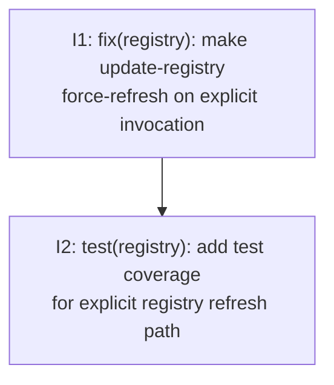

# PLAN: Registry Refresh TTL Semantics

## Status

Draft

## Scope Summary

Rewrite `runRegistryRefreshAll` in `cmd/tsuku/update_registry.go` to unconditionally force-fetch every cached recipe, removing the `--all` flag, `forceRegistryRefreshAll` helper, and `registryRefreshAll` variable. Add tests covering empty cache, all-success, partial-error, and cache-clear side effects.

## Decomposition Strategy

**Horizontal.** The two phases from the design map to two sequential issues: the code change first, tests second. No new end-to-end data flow requires a walking skeleton — the TTL bypass is a routing change within an existing code path, and the test surface is stable once the implementation is in place.

## Issue Outlines

### Issue 1: fix(registry): make update-registry force-refresh on explicit invocation

**Complexity:** testable
**Dependencies:** None

**Goal:** Remove the `--all` flag from `update-registry` so that explicit invocation always force-refreshes every cached recipe, regardless of TTL.

**Acceptance Criteria:**
- [ ] `runRegistryRefreshAll` in `cmd/tsuku/update_registry.go` no longer branches on `registryRefreshAll`; it calls `cachedReg.Refresh(ctx, name)` for every cached recipe unconditionally.
- [ ] `forceRegistryRefreshAll` (lines 212–238 in `cmd/tsuku/update_registry.go`) is deleted.
- [ ] The `registryRefreshAll` package-level variable is removed from `cmd/tsuku/update_registry.go`.
- [ ] The `--all` flag registration (`updateRegistryCmd.Flags().BoolVar(...)`) is removed from the `init()` function in `cmd/tsuku/update_registry.go`.
- [ ] The `--all` mention is removed from `updateRegistryCmd.Long` in `cmd/tsuku/update_registry.go`.
- [ ] `CachedRegistry.RefreshAll` in `internal/registry/` is left unchanged.
- [ ] Running `tsuku update-registry` on a registry with fresh cached recipes refreshes all of them (no "already fresh" skips).
- [ ] Running `tsuku update-registry --all` exits with an error or "unknown flag" message (the flag no longer exists).
- [ ] `go build ./cmd/tsuku` succeeds with no compilation errors.
- [ ] `go vet ./...` reports no issues.

---

### Issue 2: test(registry): add test coverage for explicit registry refresh path

**Complexity:** testable
**Dependencies:** Issue 1

**Goal:** Add tests for `runRegistryRefreshAll` in `cmd/tsuku/update_registry_test.go`, covering empty cache, all-success, partial-error, and cache-clear side effects.

**Acceptance Criteria:**
- [ ] `TestRunRegistryRefreshAll_EmptyCache` — when `ListCached()` returns an empty slice, `runRegistryRefreshAll` prints "No cached recipes to refresh." and returns without calling `Refresh`; the loader's in-memory cache is not cleared.
- [ ] `TestRunRegistryRefreshAll_AllSuccess` — when all recipes are listed and `Refresh` succeeds for each, `stats.Refreshed` equals the recipe count, `stats.Errors` is zero, and the summary line "Refreshed N of N cached recipes." appears on stdout.
- [ ] `TestRunRegistryRefreshAll_PartialError` — when one recipe's `Refresh` returns an error, the loop continues and refreshes remaining recipes; the failed recipe's error appears on stderr; the summary reports the correct `Refreshed` and `Errors` counts.
- [ ] `TestRunRegistryRefreshAll_ClearCacheSideEffect` — after a successful `runRegistryRefreshAll` call, `loader.ClearCache()` has been called, verifiable by checking that the loader's in-memory recipe count drops to zero (populate one recipe before the call via `loader.CacheRecipe`).
- [ ] All four tests use a fake `*registry.CachedRegistry` (backed by a `t.TempDir()` cache directory and an `httptest.Server`) or a stub type that satisfies the call interface, consistent with how existing tests in the file structure their mocks.
- [ ] Tests follow the same pattern as the existing `TestRefreshDistributedSources_*` tests: swap the package-level `loader` variable in setup, restore it via `defer`, and capture stdout/stderr with `os.Pipe`.
- [ ] All tests pass under `go test ./cmd/tsuku/... -run TestRunRegistryRefreshAll`.

---

## Dependency Graph

## Implementation Sequence

**Critical path**: I1 → I2

Start with I1. It has no blockers and can be picked up immediately. I2 depends on I1's deliverable — the rewritten `runRegistryRefreshAll` — and cannot be completed until I1 is merged.

Both issues land in a single PR on the `docs/registry-refresh-ttl-semantics` branch (see PR [#2257](https://github.com/tsukumogami/tsuku/pull/2257)).
