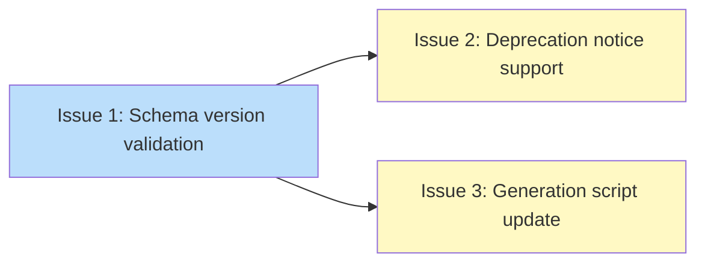

# PLAN: Registry Schema Versioning and Deprecation Signaling

## Status

Draft

## Scope Summary

Add integer schema versioning and optional deprecation signaling to the registry manifest, so the CLI detects incompatible format changes and registries can pre-announce migrations with actionable warnings.

## Decomposition Strategy

**Horizontal decomposition.** Version validation is a prerequisite for deprecation support, and the components have clear stable interfaces: struct changes and validation in `internal/registry`, warning display in `cmd/tsuku`, generation script in `scripts/`. Each layer builds on the previous one. Walking skeleton wasn't appropriate because there's no meaningful vertical slice -- the version check must exist before deprecation notices can use it.

## Issue Outlines

### Issue 1: feat(registry): add integer schema version validation to manifest parsing

**Complexity:** testable

**Goal:** Change `Manifest.SchemaVersion` from `string` to `int`, add `[Min, Max]` range validation in `parseManifest()`, and introduce `ErrTypeSchemaVersion` with an upgrade suggestion.

**Acceptance Criteria:**
- [ ] `Manifest.SchemaVersion` field type is `int` (was `string`)
- [ ] `MinManifestSchemaVersion = 1` and `MaxManifestSchemaVersion = 1` constants defined
- [ ] `parseManifest()` validates `SchemaVersion` against `[Min, Max]` range after unmarshal
- [ ] Above-range version returns `RegistryError` with `ErrTypeSchemaVersion` type
- [ ] Error message includes current version, supported range, and upgrade suggestion
- [ ] Suggestion mentions both `tsuku update-registry` and upgrading tsuku
- [ ] Existing tests updated (9 locations across `manifest_test.go` and `satisfies_test.go`)
- [ ] New tests: valid integer version parsing, out-of-range rejection (above max), zero value handling
- [ ] `go test ./internal/registry/... ./internal/recipe/...` passes

**Dependencies:** None

### Issue 2: feat(registry): add deprecation notice parsing and warning display

**Complexity:** testable

**Goal:** Add `DeprecationNotice` struct and manifest parsing, `printWarning()` helper with `--quiet` support and `sync.Once` dedup, and `min_cli_version` comparison using `version.CompareVersions()` with dev build detection.

**Acceptance Criteria:**
- [ ] `DeprecationNotice` struct with `SunsetDate`, `MinCLIVersion`, `Message`, `UpgradeURL` fields
- [ ] `Deprecation *DeprecationNotice` pointer field on `Manifest` (nil when absent)
- [ ] Manifest with deprecation object parses correctly; manifest without it has nil `Deprecation`
- [ ] `printWarning()` helper in `cmd/tsuku/helpers.go` writes to stderr, respects `--quiet`
- [ ] Warning fires at most once per CLI invocation via `sync.Once`
- [ ] Warning identifies registry by actual fetch URL (from `manifestURL()`), not hardcoded
- [ ] Warning format: `Warning: Registry at <url> reports: <message>`
- [ ] When CLI version >= `min_cli_version`: shows "your CLI already supports the new format"
- [ ] When CLI version < `min_cli_version`: shows "upgrade to vX.Y"
- [ ] Dev builds (`dev-*`, `dev`, `unknown`) skip version comparison, treated as current
- [ ] CLI never suggests downgrading (downgrade prevention rule)
- [ ] `upgrade_url` displayed as text only, never auto-opened
- [ ] Tests for: deprecation parsing, nil when absent, warning display, quiet suppression, dev build handling, version comparison branches

**Dependencies:** Blocked by Issue 1

### Issue 3: chore(scripts): update generation script to emit integer schema version

**Complexity:** simple

**Goal:** Change `scripts/generate-registry.py` from `SCHEMA_VERSION = "1.2.0"` to `SCHEMA_VERSION = 1` so deployed `recipes.json` uses integer format.

**Acceptance Criteria:**
- [ ] `SCHEMA_VERSION = 1` (was `"1.2.0"`) in `scripts/generate-registry.py`
- [ ] Generated `recipes.json` contains `"schema_version": 1` (integer, not string)
- [ ] CI passes

**Dependencies:** Blocked by Issue 1

## Dependency Graph

**Legend**: Green = done, Blue = ready, Yellow = blocked

## Implementation Sequence

**Critical path:** Issue 1 -> Issue 2 (2 issues)

**Recommended order:**
1. Issue 1 -- version validation infrastructure (foundation for everything else)
2. Issues 2 and 3 -- can proceed in parallel after Issue 1

**Parallelization:** After Issue 1, Issues 2 and 3 are independent and can be worked simultaneously.
