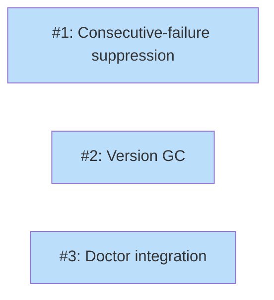

# PLAN: Resilience

## Status

Draft

## Scope Summary

Add consecutive-failure suppression (3-strike rule), old version garbage collection with configurable retention, and doctor integration for orphaned artifacts. Graceful offline degradation already works and needs no new code.

## Decomposition Strategy

**Horizontal.** The three sub-features have distinct boundaries: failure suppression modifies the notice system, version GC adds a new cleanup pass, and doctor integration extends an existing command. Issue 1 must come before Issue 3 (doctor checks for stale notices depend on the counter field), but Issue 2 (GC) is independent of both.

## Issue Outlines

### Issue 1: feat(updates): add consecutive-failure suppression

**Complexity:** testable

**Goal:** Extend the Notice struct with a ConsecutiveFailures counter and suppress notices below the 3-failure threshold. Actionable errors bypass suppression.

**Acceptance criteria:**
- [ ] `Notice` struct gains `ConsecutiveFailures int` field with `json:"consecutive_failures,omitempty"`
- [ ] `MaybeAutoApply` reads existing notice for a tool before writing a new one
- [ ] On transient failure: increments `ConsecutiveFailures` from existing notice (or starts at 1)
- [ ] On actionable error (checksum mismatch, disk full, recipe parse): sets `ConsecutiveFailures = 3` to force display
- [ ] Sets `Shown = true` when `ConsecutiveFailures < 3` (suppresses display)
- [ ] Sets `Shown = false` when `ConsecutiveFailures >= 3` (allows display)
- [ ] Successful update removes the notice file (resets counter)
- [ ] `isActionableError(err)` helper classifies errors by pattern-matching for "checksum", "disk", "recipe"
- [ ] Existing notice files without the field parse correctly (counter defaults to 0)
- [ ] Unit tests: transient failure increments counter (1, 2, 3), actionable error forces display, success resets
- [ ] Unit tests: backward compatibility with old notice files missing the field

**Functional tests:**
- [ ] Scenario: `tsuku notices --help` exists and shows help
- [ ] Scenario: config key `updates.version_retention` exists (validates config surface)

**Dependencies:** None

### Issue 2: feat(updates): add old version garbage collection

**Complexity:** testable

**Goal:** Add `GarbageCollectVersions` that removes old version directories after a configurable retention period, protecting the active and rollback versions.

**Acceptance criteria:**
- [ ] `GarbageCollectVersions(toolsDir, toolName, activeVersion, previousVersion string, retention time.Duration, now time.Time) error` exists in `internal/updates/gc.go`
- [ ] Scans `$TSUKU_HOME/tools/` for directories matching `<toolName>-*`
- [ ] Skips the active version directory
- [ ] Skips the PreviousVersion directory (rollback target)
- [ ] Removes directories with mtime older than the retention period
- [ ] Does nothing when no old versions exist
- [ ] `updates.version_retention` config key in `internal/userconfig/userconfig.go` (default "168h" = 7 days)
- [ ] `MaybeAutoApply` calls `GarbageCollectVersions` after each successful apply
- [ ] Clock injection via `time.Time` parameter for testability
- [ ] Unit tests: GC with active/previous protection, retention boundary, empty dir, multiple old versions
- [ ] Unit tests: config accessor with default, custom value, env var override

**Functional tests:**
- [ ] Scenario: `tsuku config set updates.version_retention 168h` then `tsuku config get updates.version_retention` returns "168h"
- [ ] Scenario: `tsuku config set updates.version_retention invalid` returns error

**Dependencies:** None (parallel with Issue 1)

### Issue 3: feat(doctor): add orphaned artifact and stale notice checks

**Complexity:** testable

**Goal:** Extend `tsuku doctor` to detect orphaned staging directories and stale notices, completing the resilience feature set.

**Acceptance criteria:**
- [ ] Doctor checks for `.staging-*` directories in `$TSUKU_HOME/tools/` and reports them
- [ ] Doctor checks for notice files in `$TSUKU_HOME/notices/` older than 30 days and reports them
- [ ] Reports are warnings (don't fail doctor), user can clean up manually
- [ ] Doctor output includes suggested cleanup commands
- [ ] Unit tests for detection logic with temp dirs containing staging files and old notices

**Functional tests:**
- [ ] Scenario: `tsuku doctor` runs without errors in a clean environment
- [ ] Scenario: `tsuku doctor --help` shows help text including artifact detection

**Dependencies:** None (parallel with Issues 1 and 2)

## Dependency Graph

**Legend**: Blue = ready, Yellow = blocked

## Implementation Sequence

**No critical path.** All three issues are independent. The recommended sequence is Issue 1 first (most impactful for user experience), then Issue 2 (GC), then Issue 3 (doctor). But they can be implemented in any order.
