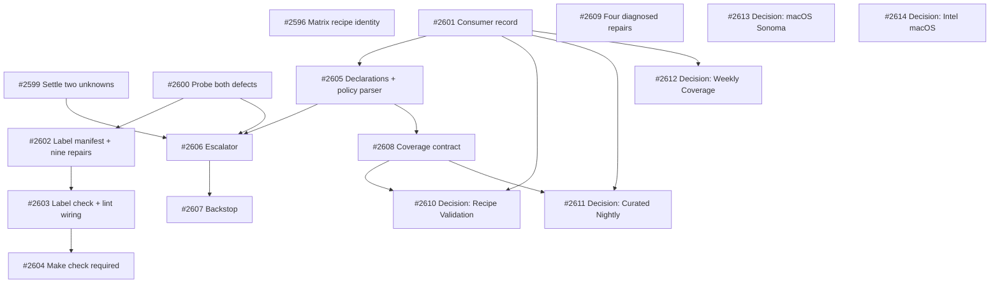

# PLAN: Honest states and a working failure path for scheduled workflows

## Status

Active

## Scope Summary

Repairs the escalation path for tsuku's twenty-one scheduled workflows, makes a missing
label fail before it merges, stops a run that validated nothing concluding success, and
lands four diagnosed repairs. Retirement and reshaping are proposed with evidence, never
executed.

## Decomposition Strategy

Horizontal. The design describes components with stable interfaces — a label check, a
policy parser, an escalator, a coverage contract — that interact through declared data
rather than at runtime, so building each fully is cheaper than a thin slice through all
of them.

The riskiest integration question is pulled out as a spike instead. Whether
`workflow_run` fires for `schedule`-triggered runs, and whether an assignment made by
the Actions bot notifies anyone, are both answerable in about an hour and either can
change which components exist. A walking skeleton would have built the escalator to
discover the same thing more expensively.

## Issue Outlines

### <<ISSUE:1>> Settle the two escalation unknowns

**Goal.** Establish, on real runs, whether `workflow_run` fires for `schedule`-triggered
runs and whether an issue assignment made by `github-actions[bot]` produces a
notification for the assignee.

**Acceptance criteria.** Both answers recorded with the run URLs that produced them. If
assignment does not notify, the delivery mechanism is reconsidered and
<<ISSUE:8>> is re-scoped before it starts. Temporary workflows used to answer either
question are removed.

**Depends on.** Nothing. **Complexity.** simple.

### <<ISSUE:2>> Establish both escalation defects independently

**Goal.** Prove the missing-permission defect and the missing-label defect as separate
faults, each by a single-variable experiment with a control.

**Acceptance criteria.** A `workflow_dispatch`-only probe with no `permissions:` block,
filing with a label that already exists, fails carrying `Resource not accessible by
integration`. The same probe with `permissions: issues: write` added and nothing else
changed succeeds. A second probe with the permission and a nonexistent label fails
carrying `could not add label`. Run URLs and quoted log lines recorded in the pull
request. If the first probe succeeds, the permission defect does not exist, that
requirement is withdrawn rather than satisfied, and the withdrawal is recorded. Both
probes removed before the work is complete.

**Depends on.** Nothing. **Complexity.** critical.

### <<ISSUE:3>> Record who consumes each scheduled workflow

**Goal.** Name, for each of the twenty-one scheduled workflows, the person, issue,
committed artifact or notification that consumes its output.

**Acceptance criteria.** Every scheduled workflow appears with a named consumer and the
kind of consumer it is. A workflow with no consumer is listed for <<ISSUE:13>> rather
than left blank. The count of workflows recorded equals the count carrying a `schedule:`
trigger across both `.yml` and `.yaml`.

**Depends on.** Nothing. This lands before <<ISSUE:8>>, because escalating a workflow
nobody reads converts a silent problem into a noisy one. **Complexity.** simple.

### <<ISSUE:4>> Label manifest, reconciliation, and the nine repairs

**Goal.** Move labels to a committed manifest, reconcile it with the repository, and
resolve the nine references that name labels which do not exist.

**Acceptance criteria.** A manifest seeded from the labels that exist today. A
reconciliation job that applies it with no delete code path. A drift check that fails
when manifest and repository disagree. Each of the nine references either created as a
declared label or repointed at an existing one, with the choice stated per label.
Discovery Registry Freshness completes a run that files and assigns its issue, ending a
streak running back to at least 2026-06-29, and the issue names the invalid entries it
found.

**Depends on.** <<ISSUE:2>>. **Complexity.** testable.

### <<ISSUE:5>> Label check, fixture, and lint wiring

**Goal.** A check that resolves every label reference in `.github/workflows/` against the
manifest and fails on anything it cannot reduce to a literal.

**Acceptance criteria.** Scans `*.yml` and `*.yaml`; extracts `--label`, `--add-label`
and `actions/github-script` `labels:` in both string and array form; splits comma-joined
values. Resolves a shell variable with a single static assignment in the same file, and
fails on any reference it cannot reduce. Passes the workflow whose variable resolves to
an existing label and fails the one whose variable resolves to a missing label in the
same run, with no per-site configuration. Excludes a `labels:` value that is wholly a
`${{ }}` expression naming a step output, by rule and not by path allowlist. Against a
committed fixture of the repository as it stood at 2026-09-20, reports exactly nine
missing names across fifteen call sites. Fails on a zero-reference floor when all label
arguments are stripped. Fails when a deliberately unresolvable reference is added. The
`paths:` filter is removed from the lint workflow in this change, before the check is
made required.

**Depends on.** <<ISSUE:4>>. **Complexity.** testable.

### <<ISSUE:6>> Make the label check required

**Goal.** Convert the check from advice to enforcement.

**Acceptance criteria.** The check is a required status check. A pull request
introducing a reference to a nonexistent label is blocked by it. A pull request touching
only Go code is not left waiting for a status that never reports. Run against the live
repository rather than the fixture, the check reports zero unresolved references before
this is switched on.

**Depends on.** <<ISSUE:5>>. Not a pull request — a repository-settings change.
**Complexity.** simple.

### <<ISSUE:7>> Declaration blocks and the policy parser

**Goal.** Every scheduled workflow declares its escalation policy, its assignee, its
coverage contract, and where applicable its event scoping.

**Acceptance criteria.** A parser enumerates workflows carrying a `schedule:` trigger
across both extensions, reports how many it found, fails if that number is zero or
differs from the number independently known to carry one, and fails if any lacks a
declaration or declares `none` without a reason. `escalation-only-on: schedule` is
present on every workflow declaring both `schedule` and `pull_request`. The set of
workflows declaring the `issue` policy is compared against the escalator's registry in
both directions and any difference fails. Declarations are read from the default branch,
so a pull request cannot register itself.

**Depends on.** <<ISSUE:3>>. **Complexity.** testable.

### <<ISSUE:8>> The escalator: listener, sweeper, and hygiene check

**Goal.** A failing scheduled workflow reaches a named person by a path that does not
run inside the failing workflow.

**Acceptance criteria.** A `workflow_run` listener and an hourly sweeper, sharing one
script. Every filed issue is assigned to a repository collaborator and the assignment is
read back from the API; an attempt naming a non-collaborator fails the run. Escalation is
demonstrated for `failure`, `cancelled` and `timed_out`; for `startup_failure` either
demonstrated or the blind spot recorded with a stated fallback. Three runs against the
same failure leave one open item with an increased comment count; a healthy run closes
it. The `escalation-only-on` filter is enforced on both paths. Jobs declare
`issues: write`, `actions: read` and `contents: read`. A hygiene check enumerates every
step that files or edits an issue, reports the count, fails if zero, and fails on any
suppressed error or undeclared permission. Both escalation workflows carry their own
declaration blocks and emit receipts.

**Depends on.** <<ISSUE:1>>, <<ISSUE:2>>, <<ISSUE:7>>. **Complexity.** critical.

### <<ISSUE:9>> Escalation backstop

**Goal.** One control that is independent of both escalation workflows.

**Acceptance criteria.** Runs in the pull-request lint job. Queries the Actions API for
non-success runs of registered workflows in a stated window and asserts each was tracked,
accepting a closed item as satisfying the assertion. Applies the `escalation-only-on`
scoping. Reports how many runs it examined and fails if it examined none. Shares neither
the trigger, the script, nor the token of the escalation workflows.

**Depends on.** <<ISSUE:8>>. Lands immediately after, not deferred. **Complexity.**
critical.

### <<ISSUE:10>> Coverage contract and the first retrofit

**Goal.** A run that validated nothing stops concluding `success`.

**Acceptance criteria.** A receipt written as work proceeds — a header declaring the
expected set, one line per item — uploaded with `if: always()` and `if-no-files-found:
error`, named per matrix leg, asserted by a job that also runs with `if: always()`. A run
whose attempted count is zero concludes as something other than `success`, demonstrated
against an empty input set. A run that does not cover its declared set fails naming both
numbers. Nightly Registry Validation is retrofitted first: its most recent green
validated zero recipes while reporting success, and after this change that run shape
fails.

**Depends on.** <<ISSUE:7>>. **Complexity.** testable.

### <<ISSUE:11>> Four diagnosed repairs

**Goal.** Land the repairs that depend on nothing else in this plan.

**Acceptance criteria.** Weekly Coverage Report's hardcoded Go version replaced with
`go-version-file`, so it builds against the version `go.mod` requires. The seeding audit
writer creates the directory implied by a scoped package name, so scoped packages no
longer fail. The cask verification step carries the tool-home variable its check reads.
The Homebrew decomposition path honours the `rebuild` counter, so a formula published
with `rebuild >= 1` resolves to the manifest reference that exists — this one affects
Linux as well as macOS. Each demonstrated against what the defect broke, not against the
run's colour. No matrix leg removed, no `--label` dropped, no exit code swallowed, no
`continue-on-error` added, no threshold widened.

**Depends on.** Nothing. **Complexity.** testable.

### <<ISSUE:12>> Matrix recipe passthrough and identity assertion

**Goal.** The seven tests that declare a recipe install the recipe they declare.

**Acceptance criteria.** The matrix projection carries the `recipe` field and the install
step uses it. Each of the seven tests is shown to install from its declared path. The
check is shown to fail on all seven before the fix, not on the one that was red — counts
cannot satisfy this, because attempted and declared counts already match while the
identities differ. The identity comparison lives at the matrix-generation step, where the
identities are chosen. The `waypoint-tap` leg is not deleted.

**Depends on.** Nothing. Tracked as #2596. **Complexity.** testable.

### <<ISSUE:13>> Retire-or-reshape proposals

**Goal.** Turn five stalled questions into decisions someone can make.

**Acceptance criteria.** Five proposals, each an issue decidable on its own merits with
its evidence and its cost stated: Recipe Validation's input-set shortfall; Curated Recipe
Nightly's scope mismatch; Weekly Coverage Report's absent consumer; the macOS arm64
runner move; and Intel macOS bottle coverage. Each states what is lost as well as what is
gained. The count of proposals is stated, so "none were proposed" is distinguishable from
"none were needed". No pull request in this plan deletes a scheduled workflow, removes a
`schedule:` trigger, or disables a scheduled run.

**Depends on.** <<ISSUE:3>>, <<ISSUE:10>>. **Complexity.** simple.

## Implementation Issues

### Milestone: [Scheduled Workflow Health](https://github.com/tsukumogami/tsuku/milestone/114)

| Issue | Dependencies | Complexity |
|-------|--------------|------------|
| [#2599: ci: settle whether workflow_run fires for scheduled runs, and whether bot assignment notifies](https://github.com/tsukumogami/tsuku/issues/2599) | None | simple |
| _Answers two documented unknowns on real runs. A negative answer on bot assignment re-scopes the escalator before it is written._ | | |
| [#2600: ci: establish the missing-label and missing-permission defects independently](https://github.com/tsukumogami/tsuku/issues/2600) | None | critical |
| _Two probe workflows, each a single-variable experiment with a control, pinning distinct literal error strings. Includes the disconfirming branch that withdraws the permission requirement._ | | |
| [#2601: ci: record who consumes each scheduled workflow's output](https://github.com/tsukumogami/tsuku/issues/2601) | None | simple |
| _Names a person, issue, committed artifact or notification per workflow. Decides which workflows declare escalation-policy none, so it precedes the escalation work._ | | |
| [#2602: ci: put labels in a committed manifest and repair the nine broken references](https://github.com/tsukumogami/tsuku/issues/2602) | [#2600](https://github.com/tsukumogami/tsuku/issues/2600) | testable |
| _Manifest seeded from existing labels, reconciliation with no delete code path, drift check, and the nine references created or repointed._ | | |
| [#2603: ci: add a label-reference check that cannot pass by scanning nothing](https://github.com/tsukumogami/tsuku/issues/2603) | [#2602](https://github.com/tsukumogami/tsuku/issues/2602) | testable |
| _Scans both extensions and all three reference forms, resolves single-assignment variables, fails on anything unresolvable, and carries a zero-reference floor. Removes the paths filter._ | | |
| [#2604: ci: make the label check required, after the path filter is removed](https://github.com/tsukumogami/tsuku/issues/2604) | [#2603](https://github.com/tsukumogami/tsuku/issues/2603) | simple |
| _Repository-settings change, not a pull request. Doing it before the path filter is removed would leave every Go-only pull request waiting on a status that never reports._ | | |
| [#2605: ci: declare an escalation policy per scheduled workflow, and check it is wired up](https://github.com/tsukumogami/tsuku/issues/2605) | [#2601](https://github.com/tsukumogami/tsuku/issues/2601) | testable |
| _Comment-block declarations plus a parser that compares declaring workflows against the escalator registry in both directions._ | | |
| [#2606: ci: move escalation outside the workflows it monitors](https://github.com/tsukumogami/tsuku/issues/2606) | [#2599](https://github.com/tsukumogami/tsuku/issues/2599), [#2600](https://github.com/tsukumogami/tsuku/issues/2600), [#2605](https://github.com/tsukumogami/tsuku/issues/2605) | critical |
| _A workflow_run listener and an hourly sweeper sharing one script, with assignee read-back and per-workflow event scoping._ | | |
| [#2607: ci: add an escalation backstop independent of the escalator](https://github.com/tsukumogami/tsuku/issues/2607) | [#2606](https://github.com/tsukumogami/tsuku/issues/2606) | critical |
| _Queries the Actions API from the pull-request lint job, sharing neither trigger, script nor token with the escalation workflows._ | | |
| [#2608: ci: stop a run that validated nothing from concluding success](https://github.com/tsukumogami/tsuku/issues/2608) | [#2605](https://github.com/tsukumogami/tsuku/issues/2605) | testable |
| _Run receipts written as work proceeds, asserted by a job that runs with if always. Retrofits Nightly Registry Validation first._ | | |
| [#2609: fix(ci): four diagnosed repairs behind four failing scheduled workflows](https://github.com/tsukumogami/tsuku/issues/2609) | None | testable |
| _The Go version pin, the seeding audit directory, the cask verification environment, and the Homebrew rebuild counter._ | | |
| [#2596: ci: scheduled tests install registry recipes instead of the fixtures they declare, and six of seven pass anyway](https://github.com/tsukumogami/tsuku/issues/2596) | None | testable |
| _Six of seven tests pass while exercising a different code path. The fix asserts the identity of the recipe resolved, not the run's colour._ | | |
| [#2610: decision needed: does anyone intend to close Recipe Validation's corpus shortfall?](https://github.com/tsukumogami/tsuku/issues/2610) | [#2601](https://github.com/tsukumogami/tsuku/issues/2601), [#2608](https://github.com/tsukumogami/tsuku/issues/2608) | simple |
| _Does anyone intend to close it. If yes it stays red, known and owned; if no it is retired with the reason recorded._ | | |
| [#2611: decision needed: does anyone intend to close Curated Recipe Nightly's scope mismatch?](https://github.com/tsukumogami/tsuku/issues/2611) | [#2601](https://github.com/tsukumogami/tsuku/issues/2601), [#2608](https://github.com/tsukumogami/tsuku/issues/2608) | simple |
| _Does anyone intend to narrow it to its discovered set. Retirement is the default if not; it has never once been green._ | | |
| [#2612: decision needed: does anyone intend to give Weekly Coverage Report a consumer?](https://github.com/tsukumogami/tsuku/issues/2612) | [#2601](https://github.com/tsukumogami/tsuku/issues/2601) | simple |
| _Does anyone want a coverage signal. If not it is retired, which is more honest than green and unread._ | | |
| [#2613: decision needed: does tsuku intend to keep testing macOS Sonoma?](https://github.com/tsukumogami/tsuku/issues/2613) | None | simple |
| _Is Sonoma a platform tsuku intends to keep verifying. A supported-platform question, not a CI one._ | | |
| [#2614: decision needed: does tsuku intend to keep supporting Intel macOS?](https://github.com/tsukumogami/tsuku/issues/2614) | None | simple |
| _Is Intel macOS a platform tsuku intends to keep verifying. If not, the supported-platform list is updated to match._ | | |

Issues #2610 through #2614 each ask whether anyone intends to close a shortfall.
Retirement is the recorded outcome where the answer is no. No pull request in this
milestone acts on them.

## Dependency Graph

## Implementation Sequence

**Critical path.** 2 → 4 → 5 → 6 is the longest chain that cannot be compressed, because
each step is a merge gate for the next: the probe evidence must be recorded before the
labels change, the labels must resolve before the check can be honest, and the check must
exist on the default branch with its path filter removed before it can be required.

The escalation chain 1, 2, 7 → 8 → 9 runs alongside it and is gated separately. Unit 1
can invalidate unit 8's delivery mechanism, so it goes first even though it produces no
code.

**Parallelisable from the start.** Units 1, 2, 3, 11 and 12 have no dependencies. Units
11 and 12 touch none of the escalation machinery and can land at any point.

**Expected end state: red only where someone intends to fix.** After the coverage
contract lands, five workflows report true shortfalls they cannot currently close —
Recipe Validation reporting `declared=1256 attempted=1193` is a working check reporting a
real problem. What happens to each is not "stay red with an issue attached". For each,
someone answers whether anyone actually intends to close the shortfall.

Where intent exists, the workflow stays red and the red means known, owned and coming;
the issue names what closes it. Where no intent exists, the workflow is **retired**, and
the reason is recorded in its issue so the knowledge outlives the workflow.

That is the rule rather than five separate verdicts, and it is why units 13 through 17
ask "does anyone intend to close this, yes or no" rather than offering a menu. Retirement
is the default when the answer is no. Permanent red with nobody acting is the outcome
this milestone exists to remove, not a resting state it settles into.
