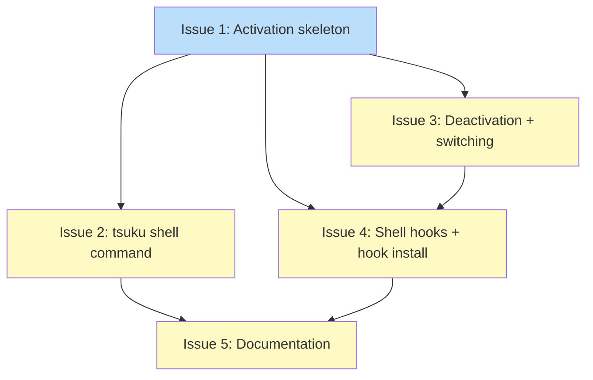

# PLAN: Shell Environment Activation

## Status

Draft

## Scope Summary

Implement per-directory tool version activation via prompt hooks and an explicit `tsuku shell` command. Adds `internal/shellenv` package for PATH computation, `tsuku hook-env` for prompt hooks, `tsuku shell` for explicit use, and shell hook scripts for bash/zsh/fish.

## Decomposition Strategy

**Walking skeleton.** Components are tightly coupled at runtime: shell hooks call `hook-env` which calls `ComputeActivation` from `internal/shellenv`. The skeleton (Issue 1) wires the full path from `.tsuku.toml` through to `export PATH` output, surfacing integration issues early. Refinement issues add deactivation, the explicit shell command, hook scripts, and documentation.

## Issue Outlines

### Issue 1: feat(shellenv): add activation skeleton with hook-env command

**Complexity:** testable (skeleton)

Deliver a minimal end-to-end activation path: the `internal/shellenv` package with core types and logic, plus a hidden `tsuku hook-env` command that reads `.tsuku.toml` and outputs `export PATH` statements for bash.

**Acceptance Criteria:**

- [ ] New `internal/shellenv/activate.go` with `ActivationResult` type, `ComputeActivation(cwd, prevPath, curDir)`, and `FormatExports(result, shell)` functions matching the design signatures
- [ ] `ComputeActivation` reads `.tsuku.toml` via `project.LoadProjectConfig`, resolves tool bin directories via `config.ToolDir`, and builds a prepended PATH
- [ ] `ComputeActivation` returns `nil` when `cwd == curDir` (early-exit, no directory change)
- [ ] `ComputeActivation` populates `Skipped` for tools whose declared version is not installed (directory does not exist)
- [ ] `FormatExports` produces valid bash export statements (`export PATH="..."`, `export _TSUKU_DIR="..."`, `export _TSUKU_PREV_PATH="..."`)
- [ ] New hidden `tsuku hook-env` command (`cmd/tsuku/hook_env.go`) that accepts a shell argument (e.g., `tsuku hook-env bash`)
- [ ] `hook-env` reads `_TSUKU_DIR` and `_TSUKU_PREV_PATH` from the environment, passes them to `ComputeActivation`, and prints `FormatExports` output to stdout
- [ ] `hook-env` produces no output and exits 0 when the directory has not changed (early-exit path)
- [ ] Unit tests in `internal/shellenv/activate_test.go` covering: activation (project found), no-op (same directory), no config (no `.tsuku.toml`), and skipped tools
- [ ] E2e flow works: running `tsuku hook-env bash` in a directory with `.tsuku.toml` outputs export statements that prepend project tool bin paths to PATH

**Dependencies:** None

---

### Issue 2: feat(cli): add tsuku shell command

**Complexity:** testable

Add a `tsuku shell` command for explicit one-shot activation. Users run `eval $(tsuku shell)` to activate per-project tool versions without prompt hooks.

**Acceptance Criteria:**

- [ ] New `cmd/tsuku/shell.go` with a visible Cobra command registered on the root command
- [ ] `tsuku shell` calls `ComputeActivation(cwd, "", "")` (always runs, no early-exit)
- [ ] Reads `_TSUKU_PREV_PATH` from environment if set (handles re-running in same shell)
- [ ] Outputs shell export statements to stdout via `FormatExports`
- [ ] Defaults to bash output; accepts `--shell` flag for bash/zsh/fish
- [ ] Auto-detects shell from `$SHELL` when `--shell` not provided
- [ ] Prints error to stderr when no `.tsuku.toml` found
- [ ] Unit tests covering: activation output, no-config error, repeated invocation
- [ ] `eval $(tsuku shell)` in a directory with `.tsuku.toml` correctly sets PATH, `_TSUKU_DIR`, and `_TSUKU_PREV_PATH`

**Dependencies:** Blocked by Issue 1

---

### Issue 3: feat(shellenv): add deactivation and project-to-project switching

**Complexity:** testable

Implement `_TSUKU_PREV_PATH` save/restore for clean deactivation when leaving a project directory and correct behavior when switching between projects.

**Acceptance Criteria:**

- [ ] `ComputeActivation` returns a deactivation result when no `.tsuku.toml` found and `_TSUKU_PREV_PATH` is set
- [ ] Deactivation result: `Active=false`, `PATH` set to `_TSUKU_PREV_PATH` value
- [ ] `FormatExports` for deactivation produces: `export PATH="$original"` and `unset _TSUKU_DIR _TSUKU_PREV_PATH`
- [ ] Fish deactivation uses `set -e` instead of `unset`
- [ ] Project-to-project switching: uses `_TSUKU_PREV_PATH` (not current PATH) as base when switching projects
- [ ] `_TSUKU_PREV_PATH` preserved (not overwritten) during project-to-project transitions
- [ ] Returns `nil` (no-op) when leaving a non-project directory with no prior activation
- [ ] Unit tests covering: deactivation, project-to-project switch, no-op when no prior activation, PATH restoration correctness
- [ ] `hook-env` correctly emits deactivation output when moving from project to non-project directory

**Dependencies:** Blocked by Issue 1

---

### Issue 4: feat(hooks): add activation shell hooks and hook install --activate

**Complexity:** testable

Create prompt hook scripts for bash/zsh/fish and extend `hook install` with `--activate` flag.

**Acceptance Criteria:**

- [ ] New `internal/hooks/tsuku-activate.bash`: `_tsuku_hook` function on `PROMPT_COMMAND`, calls `eval "$(tsuku hook-env bash)"`
- [ ] New `internal/hooks/tsuku-activate.zsh`: `_tsuku_hook` on `precmd_functions`, calls `eval "$(tsuku hook-env zsh)"`
- [ ] New `internal/hooks/tsuku-activate.fish`: `_tsuku_hook` on `fish_prompt` event, calls `tsuku hook-env fish | source`
- [ ] `internal/hooks/embed.go` updated with `//go:embed` for new files
- [ ] Hook files written to `$TSUKU_HOME/share/hooks/` by `WriteHookFiles`
- [ ] `tsuku hook install` accepts `--activate` flag
- [ ] `--activate` writes a separate marker block in rc file (distinct from command-not-found marker)
- [ ] Idempotent: running twice does not duplicate the marker block
- [ ] `tsuku hook uninstall` removes activation marker blocks
- [ ] Unit tests for: hook file content, marker block insertion, idempotency, uninstall cleanup

**Dependencies:** Blocked by Issues 1 and 3

---

### Issue 5: docs: add shell environment activation documentation

**Complexity:** simple

Update CLI help text for the new commands and flags.

**Acceptance Criteria:**

- [ ] `tsuku shell` has short and long help text explaining one-shot activation
- [ ] `tsuku shell --help` documents `--shell` flag with supported values and auto-detection
- [ ] `tsuku hook-env` has help text explaining it's an internal command (hidden from top-level help)
- [ ] `tsuku hook install --help` documents `--activate` flag
- [ ] Help text uses `$TSUKU_HOME` (not `~/.tsuku`) per conventions

**Dependencies:** Blocked by Issues 2 and 4

## Dependency Graph

**Legend**: Green = done, Blue = ready, Yellow = blocked

## Implementation Sequence

**Critical path:** Issue 1 -> Issue 3 -> Issue 4 -> Issue 5 (4 steps)

**Recommended order:**

1. Start with Issue 1 (skeleton) -- establishes the e2e activation flow
2. After Issue 1, work Issues 2 and 3 in parallel (independent refinements)
3. After Issue 3, work Issue 4 (shell hooks depend on deactivation logic)
4. After Issues 2 and 4, complete Issue 5 (documentation)

**Parallelization:** Issues 2 and 3 are independent after Issue 1. Issue 4 requires both 1 and 3.
