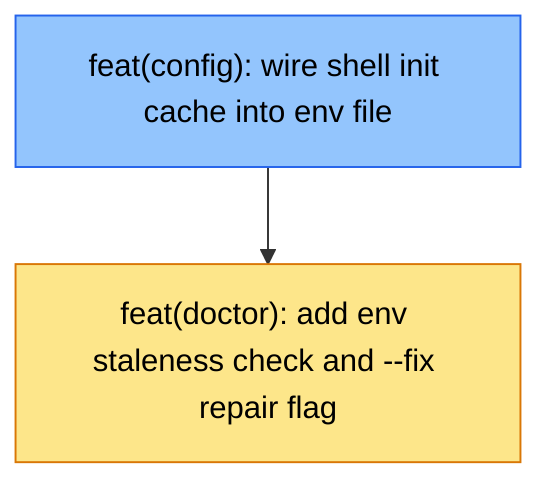

# PLAN: Shell Env Integration

## Status

Draft

## Scope Summary

Wire `$TSUKU_HOME/env` to source the shell.d init cache so tools installed with
`install_shell_init` have their shell functions loaded in new terminals. Adds
`env.local` for user customizations and a `tsuku doctor --fix` repair path.

## Decomposition Strategy

**Horizontal decomposition.** The dependency is strictly sequential: `internal/config/config.go`
must be updated first (new `envFileContent` constant, updated `EnsureEnvFile()`) because
`cmd/tsuku/doctor.go` calls both `EnsureEnvFile()` and compares against the constant.
No walking skeleton needed — these are targeted changes to existing files with no
integration risk between layers.

## Issue Outlines

### Issue 1: `feat(config): wire shell init cache into env file`

**Goal**

Update `envFileContent` in `internal/config/config.go` to source the shell init cache
and `env.local`, add a one-time migration to `EnsureEnvFile()` that moves non-managed
`export` lines to `env.local` before rewriting, and update `website/install.sh` to
write the telemetry opt-out to `env.local`.

**Acceptance Criteria**

- [ ] `envFileContent` includes shell detection via `$BASH_VERSION`/`$ZSH_VERSION` that sources `.init-cache.bash` or `.init-cache.zsh`, guarded by a file existence check
- [ ] `envFileContent` includes a line to source `$TSUKU_HOME/env.local` when the file exists
- [ ] The init cache block uses `_tsuku_init_cache` as a local variable and calls `unset _tsuku_init_cache` after use
- [ ] `EnsureEnvFile()` migrates any `export` lines from the existing `env` that are not in `envFileContent` to `env.local` (creating the file if absent) before rewriting
- [ ] The migration is dedup-safe: running `EnsureEnvFile()` twice does not produce duplicate lines in `env.local`
- [ ] Comment lines in the existing `env` are dropped during migration and not written to `env.local`
- [ ] After migration and rewrite, a second call to `EnsureEnvFile()` is a no-op
- [ ] `website/install.sh` defines `ENV_LOCAL_FILE="$TSUKU_HOME/env.local"` alongside `ENV_FILE`
- [ ] `website/install.sh` writes the telemetry opt-out to `$ENV_LOCAL_FILE` instead of `$ENV_FILE`
- [ ] `TestEnsureEnvFile` covers migration (unknown exports → `env.local`, env rewritten) and idempotency (second run is a no-op)
- [ ] `go test ./internal/config/...` passes
- [ ] `go vet ./...` passes

**Dependencies**

None.

---

### Issue 2: `feat(doctor): add env staleness check and --fix repair flag`

**Goal**

Add an env file staleness check to `tsuku doctor` and a `--fix` flag that repairs
stale env files and shell caches, replacing the broken `--rebuild-cache` reference
in doctor's error output.

**Acceptance Criteria**

- [ ] `tsuku doctor` reports `Env file... FAIL` and suggests `tsuku doctor --fix` when `$TSUKU_HOME/env` differs from the `envFileContent` constant
- [ ] `tsuku doctor` reports `Env file... FAIL` when `$TSUKU_HOME/env` is missing
- [ ] `tsuku doctor` reports `Env file... OK` when `$TSUKU_HOME/env` matches `envFileContent` exactly
- [ ] `tsuku doctor` accepts a `--fix` flag (implemented via `BoolVar`)
- [ ] `--fix` calls `cfg.EnsureEnvFile()` when the env file is stale or missing, and prints confirmation
- [ ] `--fix` calls `shellenv.RebuildShellCache(homeDir, shell)` for each stale cache, passing stored content hashes from `state.json` — not an empty or nil hash map
- [ ] `--fix` does not call `RebuildShellCache` without hashes under any code path
- [ ] `--fix` re-runs all checks after repair and prints the final summary
- [ ] All `--rebuild-cache` references in `cmd/tsuku/doctor.go` error messages are replaced with `--fix`
- [ ] `TestDoctorEnvFileCheck` covers stale, missing, and current env file states
- [ ] `TestDoctorFix` covers env rewrite and cache rebuild with hashes
- [ ] `go test ./cmd/tsuku/...` passes
- [ ] `go vet ./...` passes

**Dependencies**

Blocked by Issue 1. Requires the updated `envFileContent` constant and the updated
`EnsureEnvFile()` with migration logic.

---

## Dependency Graph

Legend: Blue = ready to start, Yellow = blocked

## Implementation Sequence

**Start**: Issue 1 — no dependencies, can begin immediately.

**Then**: Issue 2 — unblocked once Issue 1 is merged.

Both issues land in the same PR. Implement in order: Issue 1 changes first (config.go,
install.sh, tests), then Issue 2 changes (doctor.go, tests) in the same branch.
