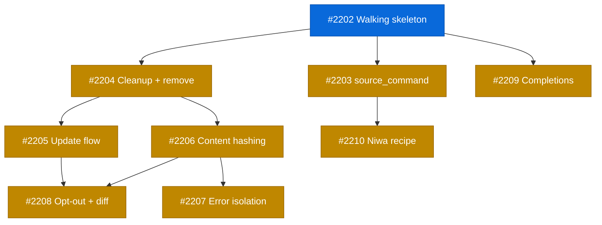

# PLAN: Tool Lifecycle Hooks

## Status

Active

## Scope Summary

Add lifecycle hooks to tsuku's recipe system so tools can declare post-install shell
integration, with automatic cleanup on removal and seamless updates. Extends the
action system with a phase field, adds a shell.d directory with cached delivery via
shellenv, and tracks cleanup in state.

## Decomposition Strategy

**Walking skeleton.** The design spans recipe parsing, executor, shell.d, shellenv,
state management, remove, and update -- tight coupling across components that
benefits from early integration. Issue #2202 creates the minimal end-to-end pipeline,
and all subsequent issues refine aspects of that skeleton.

## Implementation Issues

| # | Title | Dependencies | Complexity |
|---|-------|-------------|------------|
| [#2202](https://github.com/tsukumogami/tsuku/issues/2202) | feat(lifecycle): add walking skeleton for post-install hooks | None | testable |
| [#2203](https://github.com/tsukumogami/tsuku/issues/2203) | feat(lifecycle): add source_command variant with input validation | #2202 | critical |
| [#2204](https://github.com/tsukumogami/tsuku/issues/2204) | feat(lifecycle): add state-tracked cleanup and remove integration | #2202 | testable |
| [#2205](https://github.com/tsukumogami/tsuku/issues/2205) | feat(lifecycle): add lifecycle-aware update flow | #2202, #2204 | testable |
| [#2206](https://github.com/tsukumogami/tsuku/issues/2206) | feat(lifecycle): add content hashing and security hardening | #2202, #2204 | critical |
| [#2207](https://github.com/tsukumogami/tsuku/issues/2207) | feat(lifecycle): add error isolation and diagnostics | #2202, #2206 | testable |
| [#2208](https://github.com/tsukumogami/tsuku/issues/2208) | feat(lifecycle): add opt-out flag and update diff visibility | #2202, #2205, #2206 | testable |
| [#2209](https://github.com/tsukumogami/tsuku/issues/2209) | feat(lifecycle): add install_completions action | #2202 | testable |
| [#2210](https://github.com/tsukumogami/tsuku/issues/2210) | feat(recipes): add lifecycle hooks to niwa recipe | #2203 | simple |

## Dependency Graph

**Legend**: Green = done, Blue = ready, Yellow = blocked

## Implementation Sequence

**Critical path**: #2202 -> #2204 -> #2206 -> #2208 (4 issues)

**Recommended order**:

1. Start with #2202 (walking skeleton) -- no dependencies, unblocks everything
2. After #2202, three tracks can run in parallel:
   - Track A: #2203 (source_command) -> #2210 (niwa recipe)
   - Track B: #2204 (cleanup/remove) -> #2205 (update flow) and #2206 (security)
   - Track C: #2209 (completions) -- independent leaf
3. After #2206: #2207 (error isolation + diagnostics)
4. After #2205 + #2206: #2208 (opt-out + update diff)
