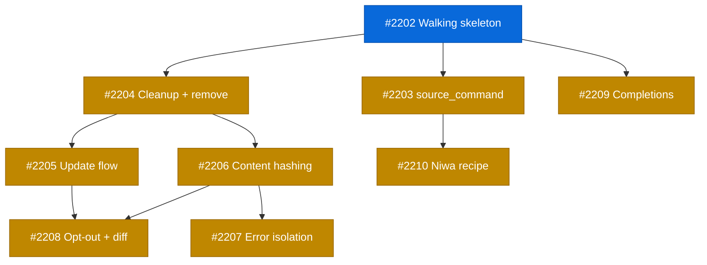

# PLAN: Tool Lifecycle Hooks

## Status

Active

## Scope Summary

Add lifecycle hooks to tsuku's recipe system so tools can declare post-install shell
integration, with automatic cleanup on removal and seamless updates. Extends the
action system with a phase field, adds a shell.d directory with cached delivery via
shellenv, and tracks cleanup in state.

## Decomposition Strategy

**Walking skeleton.** The design spans recipe parsing, executor, shell.d, shellenv,
state management, remove, and update -- tight coupling across components that
benefits from early integration. Issue #2202 creates the minimal end-to-end pipeline,
and all subsequent issues refine aspects of that skeleton.

## Implementation Issues

| # | Title | Dependencies | Complexity |
|---|-------|-------------|------------|
| [#2202](https://github.com/tsukumogami/tsuku/issues/2202) | feat(lifecycle): add walking skeleton for post-install hooks | None | testable |
| [#2203](https://github.com/tsukumogami/tsuku/issues/2203) | feat(lifecycle): add source_command variant with input validation | #2202 | critical |
| [#2204](https://github.com/tsukumogami/tsuku/issues/2204) | feat(lifecycle): add state-tracked cleanup and remove integration | #2202 | testable |
| [#2205](https://github.com/tsukumogami/tsuku/issues/2205) | feat(lifecycle): add lifecycle-aware update flow | #2202, #2204 | testable |
| [#2206](https://github.com/tsukumogami/tsuku/issues/2206) | feat(lifecycle): add content hashing and security hardening | #2202, #2204 | critical |
| [#2207](https://github.com/tsukumogami/tsuku/issues/2207) | feat(lifecycle): add error isolation and diagnostics | #2202, #2206 | testable |
| [#2208](https://github.com/tsukumogami/tsuku/issues/2208) | feat(lifecycle): add opt-out flag and update diff visibility | #2202, #2205, #2206 | testable |
| [#2209](https://github.com/tsukumogami/tsuku/issues/2209) | feat(lifecycle): add install_completions action | #2202 | testable |
| [#2210](https://github.com/tsukumogami/tsuku/issues/2210) | feat(recipes): add lifecycle hooks to niwa recipe | #2203 | simple |

## Issue Outlines

### Issue 2202: feat(lifecycle): add walking skeleton for post-install hooks
**Complexity:** testable
**Goal:** Prove the full pipeline: recipe phase field -> executor phase filtering -> install_shell_init (source_file) -> shell.d -> cached init -> shellenv delivery
**Acceptance Criteria:**
- [ ] Step struct has Phase field; existing recipes load unchanged
- [ ] ResolvedStep carries Phase; GeneratePlan propagates it
- [ ] ExecutePhase filters steps by phase correctly
- [ ] install_shell_init action registered; accepts source_file, target, shells
- [ ] Action copies file to $TSUKU_HOME/share/shell.d/{target}.{shell}
- [ ] RebuildShellCache concatenates shell.d files into .init-cache.{shell} atomically
- [ ] tsuku shellenv includes source line when cache exists, omits when not
- [ ] Unit tests cover phase filtering, backward compat, shell_init, cache, shellenv
- [ ] All existing tests pass (go test ./...)
**Dependencies:** None

### Issue 2203: feat(lifecycle): add source_command variant with input validation
**Complexity:** critical
**Goal:** Enable install_shell_init to run the tool's binary via source_command with exec-based invocation, shells allowlist, and binary containment check
**Acceptance Criteria:**
- [ ] source_command param accepted (mutually exclusive with source_file)
- [ ] {shell} and {install_dir} placeholders substituted
- [ ] Command invoked via exec.Command, not sh -c
- [ ] shells validated against allowlist: bash, zsh, fish
- [ ] source_command executable must resolve within ToolInstallDir
- [ ] Symlinks resolved before containment check
- [ ] Output written to shell.d/{target}.{shell}
- [ ] Non-zero exit logs warning, doesn't fail install
- [ ] Empty output skips file creation
- [ ] Unit tests and security tests pass
**Dependencies:** Issue 2202

### Issue 2204: feat(lifecycle): add state-tracked cleanup and remove integration
**Complexity:** testable
**Goal:** Record CleanupActions in VersionState during post-install, execute during remove, handle multi-version safety, rebuild cache after cleanup
**Acceptance Criteria:**
- [ ] CleanupAction struct with Action and Path fields
- [ ] VersionState gains CleanupActions field
- [ ] install_shell_init records cleanup actions for each file written
- [ ] RemoveVersion executes cleanup actions before directory deletion
- [ ] Multi-version: skip cleanup if another version references same path
- [ ] Failures log warnings, never block removal
- [ ] RebuildShellCache called after cleanup
- [ ] Legacy tools without cleanup state remove cleanly
- [ ] State serialization round-trips correctly
**Dependencies:** Issue 2202

### Issue 2205: feat(lifecycle): add lifecycle-aware update flow
**Complexity:** testable
**Goal:** Wire hooks into tsuku update: install new first, compute stale cleanup, execute stale, rebuild cache
**Acceptance Criteria:**
- [ ] Update runs post-install hooks for new version before cleaning old
- [ ] Stale cleanup computes set difference of old vs new CleanupActions
- [ ] Shared shell.d files not deleted during update
- [ ] Cache rebuilt after stale cleanup
- [ ] Tools without hooks update as today
- [ ] Empty old state doesn't error
- [ ] Stale cleanup failures log warnings
- [ ] Unit and integration tests pass
**Dependencies:** Issue 2202, Issue 2204

### Issue 2206: feat(lifecycle): add content hashing and security hardening
**Complexity:** critical
**Goal:** SHA-256 hashes in state, verify during cache rebuild, symlink checks, file locking, restrictive permissions
**Acceptance Criteria:**
- [ ] CleanupAction gains ContentHash field (hex SHA-256)
- [ ] install_shell_init computes and stores hash after writing
- [ ] RebuildShellCache verifies hashes, warns on mismatch
- [ ] RebuildShellCache rejects symlinks in shell.d
- [ ] Shell.d directory created with 0700, files with 0600
- [ ] File lock acquired during cache rebuild
- [ ] Legacy files without hashes tolerated
- [ ] Unit tests cover hash computation, mismatch detection, symlink rejection
**Dependencies:** Issue 2202, Issue 2204

### Issue 2207: feat(lifecycle): add error isolation and diagnostics
**Complexity:** testable
**Goal:** Error-trapped blocks in cache, tsuku doctor shell.d checks, tsuku info shell integration indicator
**Acceptance Criteria:**
- [ ] Each tool's content in cache wrapped in error-trapped block
- [ ] Syntax error in one tool doesn't prevent others from loading
- [ ] tsuku doctor reports shell.d health (freshness, integrity, symlinks, syntax)
- [ ] tsuku info shows shell integration indicator for tools with hooks
- [ ] Error isolation adds negligible startup overhead
**Dependencies:** Issue 2202, Issue 2206

### Issue 2208: feat(lifecycle): add opt-out flag and update diff visibility
**Complexity:** testable
**Goal:** --no-shell-init flag on install, update diff logging when init output changes
**Acceptance Criteria:**
- [ ] tsuku install --no-shell-init skips shell.d creation
- [ ] No CleanupActions recorded when flag used
- [ ] shellenv doesn't source init for --no-shell-init tools
- [ ] tsuku update logs warning when init output changes from stored hash
- [ ] No warning when output matches
- [ ] Reinstall without flag restores shell integration
**Dependencies:** Issue 2202, Issue 2205, Issue 2206

### Issue 2209: feat(lifecycle): add install_completions action
**Complexity:** testable
**Goal:** install_completions action for shell completions to $TSUKU_HOME/share/completions/{shell}/{tool}
**Acceptance Criteria:**
- [ ] Action registered with source_command and source_file variants
- [ ] Completions written to share/completions/{shell}/{target}
- [ ] Zsh completions prefixed with _ per convention
- [ ] CleanupAction entries recorded for each file
- [ ] Same security constraints as install_shell_init
**Dependencies:** Issue 2202

### Issue 2210: feat(recipes): add lifecycle hooks to niwa recipe
**Complexity:** simple
**Goal:** Add niwa.toml with install_shell_init using source_command, first recipe to use lifecycle hooks
**Acceptance Criteria:**
- [ ] recipes/n/niwa.toml exists with install and post-install steps
- [ ] install_shell_init has source_command = "niwa shell-init {shell}", target = "niwa"
- [ ] Recipe passes validation tests
**Dependencies:** Issue 2203

## Dependency Graph

**Legend**: Green = done, Blue = ready, Yellow = blocked

## Implementation Sequence

**Critical path**: #2202 -> #2204 -> #2206 -> #2208 (4 issues)

**Recommended order**:

1. Start with #2202 (walking skeleton) -- no dependencies, unblocks everything
2. After #2202, three tracks can run in parallel:
   - Track A: #2203 (source_command) -> #2210 (niwa recipe)
   - Track B: #2204 (cleanup/remove) -> #2205 (update flow) and #2206 (security)
   - Track C: #2209 (completions) -- independent leaf
3. After #2206: #2207 (error isolation + diagnostics)
4. After #2205 + #2206: #2208 (opt-out + update diff)
