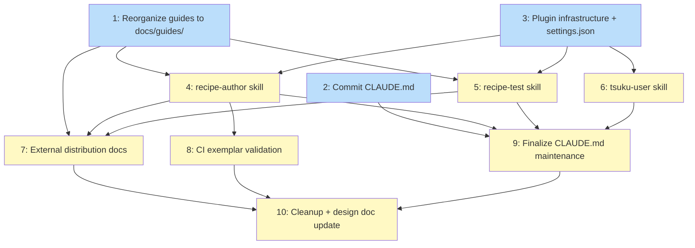

# PLAN: tsuku AI Skills

## Status

Draft

## Scope Summary

Add two Claude Code plugins (tsuku-recipes and tsuku-user) to the tsuku monorepo with 4 skills, a committed CLAUDE.md, reorganized public documentation, and CI freshness checks. Implements PRD-tsuku-ai-skills.md across 8 workstreams.

## Decomposition Strategy

**Horizontal.** Components are documentation and configuration with clear boundaries and no runtime interaction. Infrastructure is prerequisite for skills, skills are prerequisite for distribution docs. The docs reorganization (GUIDE-*.md move) happens first since skill references point to new paths.

## Issue Outlines

### 1. docs: reorganize public guides into docs/guides/

**Goal:** Move all GUIDE-*.md files from docs/ root to docs/guides/ and update cross-references so skills can point to a clean public documentation root.

**Acceptance Criteria:**
- All GUIDE-*.md files moved from docs/ to docs/guides/
- No GUIDE-*.md files remain at docs/ root
- All cross-references updated (CONTRIBUTING.md, design docs)
- docs/guides/ directory exists with all 11 guides

**Complexity:** simple

**Dependencies:** None

**Research:** `wip/research/plan_skills_guides-catalog.md` -- lists all 11 guides with current paths and content assessment

### 2. docs: commit CLAUDE.md and reduce CLAUDE.local.md

**Goal:** Promote universally-useful content from CLAUDE.local.md to a committed CLAUDE.md. Add key internal packages table and plugin maintenance protocol following koto's pattern. Reduce CLAUDE.local.md to workspace-specific sections only.

**Acceptance Criteria:**
- CLAUDE.md exists at repo root and is committed
- Contains: repo description, monorepo structure, build/test/lint commands, CLI command table, development workflow, release process, conventions
- Contains "Key Internal Packages" section listing at least 12 packages with one-line descriptions
- Contains "tsuku-recipes Plugin Maintenance" section naming internal/actions/, internal/version/, internal/recipe/ as trigger areas
- Maintenance section distinguishes "broken contracts" and "new surface" and instructs contributors to update skills in the same PR
- CLAUDE.local.md contains only: Repo Visibility, Default Scope, QA Configuration, Environment
- No section headings or multi-line blocks duplicated between the two files

**Complexity:** simple

**Dependencies:** None

**Research:** `wip/research/plan_skills_claude-md-catalog.md` -- content split plan, 24+ internal packages with descriptions, draft maintenance protocol text

### 3. feat(plugins): add plugin infrastructure and committed settings.json

**Goal:** Create the marketplace, plugin scaffolding for both plugins, and committed settings.json. Empty SKILL.md stubs so plugins load without errors.

**Acceptance Criteria:**
- .claude-plugin/marketplace.json declares tsuku marketplace with tsuku-recipes and tsuku-user plugins
- plugins/tsuku-recipes/.claude-plugin/plugin.json lists recipe-author and recipe-test skills
- plugins/tsuku-user/.claude-plugin/plugin.json lists tsuku-user skill
- .claude/settings.json committed, enables tsuku-recipes@tsuku, tsuku-user@tsuku, shirabe@shirabe
- settings.json declares tsuku marketplace via file source and shirabe via GitHub source with sparsePaths
- settings.json does not contain env, hooks, permissions, or mcpServers keys
- Empty SKILL.md stubs exist for all 4 skills
- No hooks.json in either plugin directory

**Complexity:** simple

**Dependencies:** None

**Research:** `wip/research/plan_skills_plugin-infrastructure-catalog.md` -- JSON schemas from koto/shirabe, exact directory structure, settings split guidance

### 4. feat(plugins): add recipe-author skill with bundled references

**Goal:** Write the recipe-author SKILL.md with hybrid quick-reference architecture. Create bundled agent-shaped reference files for actions, platform conditionals, verification, dependencies, and distributed recipes. Create exemplar recipes list.

**Acceptance Criteria:**
- plugins/tsuku-recipes/skills/recipe-author/SKILL.md exists with frontmatter
- SKILL.md contains action names table with columns: action name, category, one-line description
- SKILL.md lists all version provider types with source values
- SKILL.md includes when clause syntax with os, libc, linux_family, and gpu examples
- SKILL.md includes verification quick-start (version mode, output mode, format transforms)
- SKILL.md covers .tsuku-recipes/ directory setup and documents install syntax: owner/repo, owner/repo:recipe, owner/repo@version
- SKILL.md links to each bundled reference file with one-line description
- SKILL.md includes fallback pointer to docs/guides/ with note about external consumer access
- references/action-reference.md exists with action names and key parameters as lookup table
- references/platform-reference.md exists with when clause patterns and libc decision tree
- references/verification-reference.md exists with mode selection flowchart and format transforms
- references/dependencies-reference.md exists with dependency declaration patterns
- references/distributed-reference.md exists with .tsuku-recipes/ setup and testing
- references/exemplar-recipes.md exists with at least 7 recipe paths (one per required category)
- All listed exemplar recipe files exist in recipes/
- No listed exemplar has llm_validation = "skipped"

**Complexity:** testable

**Dependencies:** <<ISSUE:1>>, <<ISSUE:3>>

**Research:**
- `wip/research/plan_skills_actions-catalog.md` -- 52 actions with params, categories, deps
- `wip/research/plan_skills_version-providers-catalog.md` -- 14 providers with config fields
- `wip/research/plan_skills_recipe-format-catalog.md` -- full TOML schema, when clause syntax
- `wip/research/plan_skills_exemplar-recipes-catalog.md` -- curated recipes per pattern category
- `wip/research/plan_skills_distributed-catalog.md` -- .tsuku-recipes/ setup, install syntax
- `wip/research/plan_skills_guides-catalog.md` -- bundle vs pointer recommendations

### 5. feat(plugins): add recipe-test skill

**Goal:** Write the recipe-test SKILL.md covering the full testing workflow with exact commands, test infrastructure pointers, and common failure patterns.

**Acceptance Criteria:**
- plugins/tsuku-recipes/skills/recipe-test/SKILL.md exists with frontmatter
- Contains exact commands for: tsuku validate, tsuku eval, tsuku install --sandbox, golden file validation
- References: docker-dev.sh, make build-test, tsuku doctor, TSUKU_HOME isolation
- Documents at least exit codes 6 (container failure) and 8 (verification failure) with failure scenarios
- Contains pointer to CONTRIBUTING.md for full testing documentation

**Complexity:** testable

**Dependencies:** <<ISSUE:1>>, <<ISSUE:3>>

**Research:** `wip/research/plan_skills_testing-catalog.md` -- full testing workflow, commands, exit codes, CI patterns, container testing, golden files

### 6. feat(plugins): add tsuku-user skill

**Goal:** Write the tsuku-user SKILL.md covering .tsuku.toml project config, CLI commands, shell integration, troubleshooting, and auto-update workflow.

**Acceptance Criteria:**
- plugins/tsuku-user/skills/tsuku-user/SKILL.md exists with frontmatter
- Covers .tsuku.toml [tools] section with version pinning examples (exact, major, minor, latest, channel)
- Covers core CLI commands: install, remove, update, list, outdated, search, info, versions with descriptions and common flags
- Covers shell integration: tsuku shellenv, eval pattern for bash/zsh/fish, PATH setup, tsuku doctor
- Covers troubleshooting: common exit codes, tsuku verify, tsuku doctor, auto-update configuration (TSUKU_AUTO_UPDATE)

**Complexity:** testable

**Dependencies:** <<ISSUE:3>>

**Research:** `wip/research/plan_skills_user-surface-catalog.md` -- 23 CLI commands, .tsuku.toml schema, shell integration, exit codes, config.toml, update workflow

### 7. docs: add external distribution documentation

**Goal:** Add Claude Code Integration section to the distributed recipe authoring guide with settings.json snippet. Create AGENTS.md for non-Claude-Code agents.

**Acceptance Criteria:**
- docs/guides/GUIDE-distributed-recipe-authoring.md contains "Claude Code Integration" section
- Section contains settings.json snippet with sparsePaths for .claude-plugin/ and plugins/tsuku-recipes/
- Snippet does not include autoUpdate: true
- plugins/tsuku-recipes/AGENTS.md exists, is 120 lines or fewer
- AGENTS.md covers recipe format overview, action reference pointer, testing workflow, docs/guides/ links

**Complexity:** simple

**Dependencies:** <<ISSUE:1>>, <<ISSUE:4>>, <<ISSUE:5>>

**Research:** `wip/research/plan_skills_plugin-infrastructure-catalog.md` (external consumer snippet), `wip/research/plan_skills_distributed-catalog.md`

### 8. ci: add skill exemplar validation workflow

**Goal:** Create CI workflow validating exemplar recipe paths exist and pass tsuku validate. Verify no hooks.json in either plugin.

**Acceptance Criteria:**
- CI workflow triggers on changes to plugins/tsuku-recipes/ or referenced recipe files
- Validates all recipe paths in exemplar-recipes.md exist
- Runs tsuku validate on each referenced recipe
- Checks plugins/tsuku-recipes/hooks.json and plugins/tsuku-user/hooks.json do not exist

**Complexity:** simple

**Dependencies:** <<ISSUE:4>>

**Research:** `wip/research/plan_skills_testing-catalog.md` (CI patterns, existing workflow structure)

### 9. docs: finalize CLAUDE.md plugin maintenance with actual skill paths

**Goal:** After all skills exist, verify and update the CLAUDE.md maintenance protocol with final skill paths and source-area mappings.

**Acceptance Criteria:**
- Maintenance section references actual skill file paths in plugins/
- Source-area-to-skill mapping verified against actual skill content
- tsuku-user plugin included in maintenance section alongside tsuku-recipes

**Complexity:** simple

**Dependencies:** <<ISSUE:2>>, <<ISSUE:4>>, <<ISSUE:5>>, <<ISSUE:6>>

### 10. chore: clean up research catalogs and update design doc

**Goal:** Remove wip/research/plan_skills_*.md catalogs. Update or replace the existing design doc on the branch to reflect the PRD-driven scope.

**Acceptance Criteria:**
- All wip/research/plan_skills_*.md files removed
- All wip/plan_*.md files removed
- Design doc updated to reflect: single plugin architecture (no tsuku-dev), bundled references, tsuku-user plugin, docs/guides/ reorganization

**Complexity:** simple

**Dependencies:** <<ISSUE:7>>, <<ISSUE:8>>, <<ISSUE:9>>

## Dependency Graph

**Legend**: Blue = ready (no dependencies), Yellow = blocked

## Implementation Sequence

**Critical path:** Issue 1 (guide reorg) -> Issue 4 (recipe-author) -> Issue 7 (distribution docs) -> Issue 10 (cleanup)

**Parallelization:**
- Issues 1, 2, 3 are independent and can start in parallel
- After 1 and 3 complete: Issues 4, 5 can start in parallel
- After 3 completes: Issue 6 can start (independent of 1)
- After 4 and 5 complete: Issue 7 can start
- After 4 completes: Issue 8 can start
- After 2, 4, 5, 6 complete: Issue 9 can start
- Issue 10 is the final convergence point

**Recommended single-PR order:** 1 -> 2 -> 3 -> 4 -> 5 -> 6 -> 7 -> 8 -> 9 -> 10
