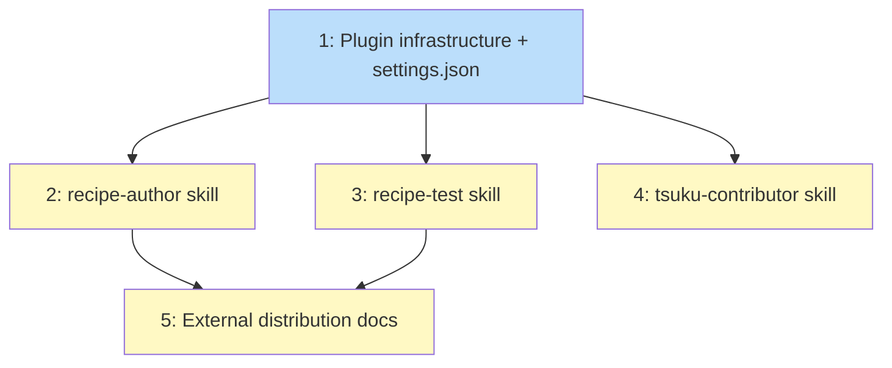

# PLAN: tsuku AI Skills

## Status

Draft

## Scope Summary

Add two Claude Code plugins (tsuku-recipes and tsuku-dev) to the tsuku monorepo with 3 skills total, committed settings.json for auto-loading, and external distribution documentation. All implementation targets the tsuku repo.

## Decomposition Strategy

**Horizontal.** Components have clear, stable boundaries with no runtime interaction. Plugin infrastructure is a prerequisite for all skills. Skills are independent of each other. Documentation depends on skills existing. This is primarily documentation and configuration work with well-defined interfaces between components.

## Issue Outlines

### 1. feat(plugins): add plugin infrastructure and committed settings.json

**Goal:** Create the marketplace and plugin scaffolding that enables both plugins for all tsuku repo contributors.

**Acceptance Criteria:**
- `.claude-plugin/marketplace.json` declares the `tsuku` marketplace with two plugins (`tsuku-recipes` and `tsuku-dev`)
- `plugins/tsuku-recipes/.claude-plugin/plugin.json` lists `recipe-author` and `recipe-test` skills
- `plugins/tsuku-dev/.claude-plugin/plugin.json` lists `tsuku-contributor` skill
- `.claude/settings.json` (committed) enables `tsuku-recipes@tsuku`, `tsuku-dev@tsuku`, and `shirabe@shirabe`
- `.claude/settings.json` declares local tsuku marketplace via file source and shirabe via GitHub source with sparsePaths
- Existing `.claude/settings.local.json` retains only personal config (tsukumogami, env vars, hooks, permissions)
- Empty SKILL.md stubs exist for all 3 skills so the plugin loads without errors

**Complexity:** simple

**Dependencies:** None

### 2. feat(plugins): add recipe-author skill with hybrid quick-reference

**Goal:** Write the recipe-author SKILL.md with the hybrid content architecture: embedded quick-reference for common lookups, pointers to full guide files, and curated exemplar recipes.

**Acceptance Criteria:**
- `plugins/tsuku-recipes/skills/recipe-author/SKILL.md` is ~150 lines with frontmatter
- Embedded action names table with one-line descriptions covering all action categories (file ops, system packages, ecosystem primitives, composites)
- Version provider types listed (GitHub, PyPI, crates.io, npm, RubyGems, Go, etc.)
- Platform conditional syntax cheat sheet with `[steps.when]` examples
- Verification quick-start covering version mode and output mode
- Deep-dive pointers to: GUIDE-actions-and-primitives.md, GUIDE-hybrid-libc-recipes.md, GUIDE-library-dependencies.md, GUIDE-recipe-verification.md, GUIDE-troubleshooting-verification.md
- `references/exemplar-recipes.md` with 5-8 curated recipes covering: binary download, homebrew-backed, source build with deps, platform-conditional, ecosystem-delegated, library with rpath, custom verification, version provider inference
- Exemplar recipes are human-authored (not `llm_validation = "skipped"`)
- Workflow note directs the model to compare against exemplars when fixing `tsuku create` output

**Complexity:** testable

**Dependencies:** <<ISSUE:1>>

### 3. feat(plugins): add recipe-test skill for testing workflow

**Goal:** Write the recipe-test SKILL.md covering the full validate -> eval -> sandbox -> golden workflow with test infrastructure pointers.

**Acceptance Criteria:**
- `plugins/tsuku-recipes/skills/recipe-test/SKILL.md` is ~80-100 lines with frontmatter
- Testing workflow steps with exact commands: `tsuku validate`, `tsuku eval`, `tsuku install --sandbox`, golden file validation
- Test infrastructure pointers: `docker-dev.sh`, `make build-test`, `tsuku doctor`, `TSUKU_HOME` isolation
- Cross-family testing instructions (condensed from CONTRIBUTING.md parallel testing script)
- Common failure patterns with exit codes (6 = container failure, 8 = verification failure)
- Known issues section referencing `--recipe` post-install bug (tsukumogami/tsuku#2218)
- Pointer to CONTRIBUTING.md for full testing documentation

**Complexity:** testable

**Dependencies:** <<ISSUE:1>>

### 4. feat(plugins): add tsuku-contributor skill for CLI development

**Goal:** Write the tsuku-contributor SKILL.md covering action development, version provider development, and CI patterns.

**Acceptance Criteria:**
- `plugins/tsuku-dev/skills/tsuku-contributor/SKILL.md` is ~120-150 lines with frontmatter
- Action development section: Action interface (Name, Execute, IsDeterministic, Dependencies), BaseAction embedding, registration via init(), Decomposable interface for composites, dual-context architecture (ExecutionContext vs EvalContext)
- Version provider section: VersionResolver/VersionLister interfaces, strategy pattern with priority levels (PriorityKnownRegistry=100 through PriorityInferred=10), NewProviderFactory registration
- Key file locations: `internal/actions/`, `internal/version/`, `internal/executor/`, `internal/install/`, `internal/recipe/`
- CI patterns and testing conventions
- Pointers to Go source for full interface details

**Complexity:** testable

**Dependencies:** <<ISSUE:1>>

### 5. docs: add external distribution documentation and AGENTS.md files

**Goal:** Update the distributed recipe authoring guide with Claude Code integration and create AGENTS.md for non-Claude-Code agents.

**Acceptance Criteria:**
- `docs/GUIDE-distributed-recipe-authoring.md` has a new "Claude Code Integration" section
- Section contains the external consumer settings.json snippet (without `autoUpdate` -- opt-in)
- Snippet uses `sparsePaths: [".claude-plugin", "plugins/tsuku-recipes"]` to limit downloads
- Brief explanation of what the plugin provides and how to enable it
- `plugins/tsuku-recipes/AGENTS.md` provides recipe authoring guidance for non-Claude-Code agents (Codex, Windsurf)
- `plugins/tsuku-dev/AGENTS.md` provides contributor development guidance for non-Claude-Code agents

**Complexity:** simple

**Dependencies:** <<ISSUE:2>>, <<ISSUE:3>>

## Dependency Graph

**Legend**: Blue = ready, Yellow = blocked

## Implementation Sequence

**Critical path:** Issue 1 (infrastructure) -> Issue 2 (recipe-author) -> Issue 5 (docs)

**Parallelization:** After Issue 1 completes, Issues 2, 3, and 4 can be worked in parallel. Issue 5 depends on Issues 2 and 3 (it documents the recipe skills that external authors will use).

**Recommended order for single-PR:** 1 -> 2 -> 3 -> 4 -> 5 (sequential within one branch, but 2/3/4 are independent so order among them doesn't matter).
