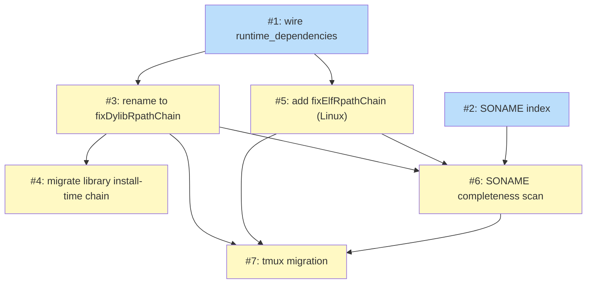

# PLAN: Tsuku Homebrew Dylib Chaining for Tool Recipes

## Status

Draft

## Scope Summary

Strengthen the `homebrew` action to chain dylibs from sibling tsuku-installed
library deps into a tool recipe's RPATH automatically. The engine walks the
recipe's existing `runtime_dependencies` AND scans the bottle binary's NEEDED
SONAMES to back-stop under-declared recipes. RPATHs use `$ORIGIN` /
`@loader_path`-relative paths into `$TSUKU_HOME/libs/<dep>-<version>/lib`,
written via `patchelf --force-rpath --set-rpath` (Linux, DT_RPATH) or
`install_name_tool -add_rpath` (macOS). Includes the canonical tmux
migration as the integration test (closes #2377).

## Decomposition Strategy

**Horizontal decomposition.** The design specifies six layered phases with
sequential dependencies (wiring → SONAME index → chain functions → scanner →
recipe migration). Each phase has its own acceptance criteria and naturally
forms one issue (with one phase split into two issues for reviewability of
the library-recipe install-time chain migration). Walking-skeleton
decomposition would add ceremony — the end-to-end shape is well-understood
from the design and the layers are tightly enough specified that integration
risk is low.

Single-pr execution mode means all 7 issues land as one branch with
sequential commits. Dependencies still matter for commit ordering and
reviewer comprehension; they don't gate independent PRs.

### Out of scope for this plan

The design's Phase 6 lists three categories of recipe migrations:
- **tmux** — included as Issue 7 here; closes #2377 and demonstrates the
  integrated mechanism end-to-end as the implementation's integration test.
- **13 darwin-punted recipes** (`bedtools`, `cbonsai`, `cdogs-sdl`, etc.) —
  follow-up recipe-only PRs after this engine work lands.
- **Next-wave top-100 tools** (`bat`, `eza`, `htop`, `delta`, `node`,
  `ripgrep`, `neovim`, `ollama`, `shellcheck`, `hadolint`) — follow-up
  recipe-only PRs after this engine work lands.

The design explicitly says "Each migration is a small recipe-only PR";
batching them into this single PR would make review unwieldy without
adding integration value (Issue 7 already proves the mechanism on a
canonical case).

## Issue Outlines

### Issue 1 — `feat(executor): wire runtime_dependencies into the relocate context`

**Complexity:** testable

**Goal:** Plumb `metadata.runtime_dependencies` from the recipe loader through
plan generation into `ctx.Dependencies.RuntimeDeps`, and add strict validator
rules on the field at recipe-load time.

**Acceptance Criteria:**

- `metadata.runtime_dependencies` from a recipe is populated into
  `ctx.Dependencies.RuntimeDeps` by the time the executor reaches the relocate
  context (today this field exists for the wrapper-PATH consumer but never
  reaches the executor relocate context).
- Wiring lives in `internal/install/install_deps.go` and
  `internal/executor/plan_generator.go`.
- A docstring on the `RuntimeDependencies` field enumerates its consumers
  (today: wrapper-PATH; post-design: also RPATH chain via `fixDylibRpathChain` /
  `fixElfRpathChain`).
- Recipe validator rejects `runtime_dependencies` entries that don't match
  `^[a-z0-9._-]+$`.
- Recipe validator rejects entries containing `..`, `/`, `\`, leading `-`, or
  null bytes.
- Recipe validator rejects empty strings inside the list and duplicate entries.
- Each entry is validated against the recipe registry (must resolve to an
  installable recipe).
- `isValidRecipeName` (currently in `internal/distributed/cache.go` and
  `internal/index/rebuild.go`) is promoted to a shared helper used by the
  validator and both existing callers.
- Plan-cache golden fixtures regenerate to include `RuntimeDeps` in the
  relocate context.
- Existing recipes that already declare `runtime_dependencies` (298 recipes
  today) still pass all CI.
- Unit tests cover the validator rules (valid names accepted; each rejection
  class has a negative test).

**Dependencies:** None

---

### Issue 2 — `feat(sonameindex): build the SONAME → recipe index`

**Complexity:** testable

**Goal:** Build a SONAME → recipe index at plan-generation time so the SONAME
completeness scanner (Issue 6) can resolve NEEDED SONAMES from bottle binaries
to tsuku-installable library recipes.

**Acceptance Criteria:**

- New leaf package `internal/sonameindex/sonameindex.go` exists.
- Package lives outside `internal/install/` so the executor
  (`internal/executor/`) and the homebrew action (`internal/actions/`) can
  both import it without inverting the existing `executor → install`
  dependency direction.
- Index walks all installable library recipes and parses their `outputs` lists
  for `lib/lib*.so.*` (Linux) and `lib/lib*.*.dylib` (macOS) patterns.
- Index is built as a single-valued map `(platform, SONAME) → providing
  recipe`.
- Parser requires the path to start with `lib/` and contain no `..` segments,
  and the basename to start with `lib`. Other entries are skipped.
- On a duplicate `(platform, SONAME)` insert, index construction fails with a
  clear error pointing at both providing recipes (collisions are loud, not
  silent).
- A small static known-gap allowlist is maintained alongside the index, listing
  SONAMES with no current tsuku-recipe coverage (e.g., `libuuid.so.1`,
  `libacl.so.1`, `libattr.so.1`). The scanner (Issue 6) uses this to downgrade
  "no provider" log lines to debug-level.
- Index handles full SONAMES (`libpcre2-8.so.0`, `libpcre2-8.0.dylib`),
  per-platform variants, and versioned variants (`libfoo.so` → `libfoo.so.1` →
  `libfoo.so.1.2.3` all map to the same provider).
- Index has entries for every dylib output in the curated library recipe set
  (`pcre2`, `libnghttp3`, `libevent`, `utf8proc`, plus the ~134 others).
- Unit tests assert correct mapping, duplicate-insert failure, and that the
  parser correctly skips non-SONAME entries.

**Dependencies:** None

---

### Issue 3 — `refactor(actions): rename fixLibraryDylibRpaths to fixDylibRpathChain (RuntimeDeps consumer)`

**Complexity:** testable

**Goal:** Rename `fixLibraryDylibRpaths` to `fixDylibRpathChain`, lift the
`Type == "library"` gate, and switch from absolute to `@loader_path`-relative
RPATHs for chain entries on macOS.

**Acceptance Criteria:**

- `fixLibraryDylibRpaths` in `internal/actions/homebrew_relocate.go` is
  renamed to `fixDylibRpathChain`.
- The `Type == "library"` gate is replaced with a check on
  `ctx.Dependencies.RuntimeDeps` non-empty.
- The new function reads `RuntimeDeps` (and the local auto-included slice from
  the SONAME scan, see Issue 6) only — it does not also walk
  `ctx.Dependencies.InstallTime`. The existing library install-time chain
  migrates separately in Issue 4.
- Path-emit form switches from absolute to `@loader_path`-relative, computed
  via `filepath.Rel` over `EvalSymlinks` on both ends.
- After `filepath.Rel`, a per-entry `filepath.Join(loaderDir, relPath)`
  post-check verifies the resolved path stays inside `$TSUKU_HOME/libs/`. A
  failed check fails the install with a clear error before any
  `install_name_tool -add_rpath` invocation for that entry.
- The chain step runs **after** the existing per-binary `fixMachoRpath` pass
  (so its `--remove-rpath` step doesn't wipe the new entries).
- Patches are written via `install_name_tool -add_rpath`.
- Tests cover: a tool recipe with non-empty `RuntimeDeps` gets correct chain
  entries; an empty `RuntimeDeps` produces no chain entries (no-op); the
  defense-in-depth post-check rejects an entry whose resolved path escapes
  `$TSUKU_HOME/libs/`.
- Existing `Type == "library"` tests for `fixLibraryDylibRpaths` carry over by
  parameterization.

**Dependencies:** Issue 1

---

### Issue 4 — `refactor(actions): migrate library install-time chain from absolute to relative paths`

**Complexity:** testable

**Goal:** Migrate the library-recipe install-time chain (which currently emits
absolute-path RPATHs from `ctx.Dependencies.InstallTime`) to use
`@loader_path`-relative paths matching the new chain mechanism.

**Acceptance Criteria:**

- The library install-time chain previously embedded in `fixLibraryDylibRpaths`
  is converted to emit `@loader_path`-relative RPATHs via `filepath.Rel` over
  `EvalSymlinks` on both ends.
- The migration is implemented as a separate, reviewable change (own commit
  and golden-fixture diff) so the absolute → relative shift is auditable in
  isolation.
- Same per-entry `filepath.Join(loaderDir, relPath)` post-check as Issue 3.
- The 4 existing `Type == "library"` recipes (`pcre2`, `libnghttp3`,
  `libevent`, `utf8proc`) install + verify cleanly on macOS amd64 + arm64 in
  the sandbox matrix with the relative-path RPATHs.
- Golden fixtures lock the new RPATH shape so any future regression to
  absolute paths is caught at test time.
- No regression in the install/verify path for any other library recipe in the
  registry.

**Dependencies:** Issue 3

---

### Issue 5 — `feat(actions): add fixElfRpathChain for Linux`

**Complexity:** testable

**Goal:** Add `fixElfRpathChain` for Linux — the ELF mirror of
`fixDylibRpathChain` — using `patchelf --force-rpath --set-rpath` (writes
`DT_RPATH`).

**Acceptance Criteria:**

- New function `fixElfRpathChain` exists in
  `internal/actions/homebrew_relocate.go`.
- Function reads `ctx.Dependencies.RuntimeDeps` (and the local auto-included
  slice from Issue 6) and emits one `$ORIGIN`-relative RPATH entry per chain
  entry, pointing at `$TSUKU_HOME/libs/<dep>-<version>/lib`.
- Path computation uses `filepath.Rel` over `EvalSymlinks` on both ends.
- RPATH writes use `patchelf --force-rpath --set-rpath` (writes `DT_RPATH`).
  `--add-rpath` (which writes `DT_RUNPATH`) is **not** used; `DT_RUNPATH` has
  subtle resolution differences that break some shared-library lookups (e.g.,
  wget's libunistring).
- Per-entry `filepath.Join(loaderDir, relPath)` defense-in-depth post-check
  verifies the resolved path stays inside `$TSUKU_HOME/libs/`. Failed check
  fails the install before any `patchelf` invocation for that entry.
- The chain step runs **after** the existing per-binary `fixElfRpath` pass.
- Tests cover correct chain entries, no-op on empty `RuntimeDeps`, the
  defense-in-depth check, and that `readelf -d` shows `DT_RPATH` (not
  `DT_RUNPATH`) entries.
- `git` and `wget` continue to pass install + verify on every Linux family
  (debian, rhel, arch, suse) in the sandbox matrix.

**Dependencies:** Issue 1

---

### Issue 6 — `feat(actions): add SONAME completeness scan with auto-include`

**Complexity:** testable

**Goal:** Add the SONAME completeness scanner: after bottle extraction,
classify each NEEDED SONAME against the SONAME index and produce a local
auto-included slice consumed by the chain walks.

**Acceptance Criteria:**

- A new scanner runs in the `homebrew` action's relocate phase, after bottle
  extraction and after the existing per-binary `fixMachoRpath` / `fixElfRpath`
  pass.
- For each binary in the unpacked bottle, the scanner calls `readelf -d`
  (Linux) or `otool -L` (macOS) and parses the NEEDED SONAMES.
- Each NEEDED SONAME is classified in this order:
  1. Resolves via the system's runtime linker → no action.
  2. Maps to a tsuku library AND in `RuntimeDeps` → no action; chain walk
     handles it.
  3. Maps to a tsuku library AND not in `RuntimeDeps` → log a warning AND add
     the dep to a local auto-included `[]chainEntry` slice.
  4. No tsuku recipe ships this SONAME → log a coverage gap (downgraded to
     debug-level for entries on the known-gap allowlist).
- The auto-included slice lives in Execute scope; the scanner does NOT mutate
  `ctx.Dependencies`.
- The chain functions from Issues 3 and 5 iterate `RuntimeDeps` ∪ the
  auto-included slice.
- Scanner correctly identifies under-declared SONAMES on `git` (zlib),
  `wget` (zlib + libuuid), `coreutils` (acl + attr).
- Auto-include closes the install on a minimal container (one without the
  system-shadow libs) for `git`, `wget`, and `coreutils` — i.e., the binaries
  actually run after install, not just compile.
- Tests cover each classification branch and the auto-include data path.
- Parse-failure handling: if `readelf -d` / `otool -L` fails on a binary, the
  scanner skips that binary with a warning rather than treating it as "no
  NEEDED entries".

**Dependencies:** Issues 2, 3, 5

---

### Issue 7 — `feat(recipes): migrate tmux to use runtime_dependencies for chaining`

**Complexity:** testable

**Goal:** Migrate the `tmux` recipe to use `runtime_dependencies` for chaining,
drop its current platform restriction, and validate the integrated mechanism
end-to-end across the full sandbox matrix.

**Acceptance Criteria:**

- `recipes/t/tmux.toml` declares `runtime_dependencies = ["libevent",
  "utf8proc", "ncurses"]` at the metadata level.
- Any current `supported_os = ["linux"]` / `unsupported_platforms` restriction
  on tmux is removed (or narrowed to genuine platform incompatibilities, not
  the dylib-chaining gap).
- No per-step `dependencies` list is required for the dylib chaining.
- No `set_rpath` step is required.
- Install + verify pass on macOS amd64 in the sandbox matrix.
- Install + verify pass on macOS arm64 in the sandbox matrix.
- Install + verify pass on every Linux family in the sandbox matrix.
- After install, `readelf -d $TSUKU_HOME/tools/tmux-<v>/bin/tmux` (Linux) or
  `otool -l ...` (macOS) shows RPATH entries pointing relative to the binary's
  location, into `$TSUKU_HOME/libs/libevent-*/lib`,
  `$TSUKU_HOME/libs/utf8proc-*/lib`, `$TSUKU_HOME/libs/ncurses-*/lib`.
- The SONAME completeness scan does not warn about under-declaration for tmux
  on the curated platforms.
- Closes #2377.

**Dependencies:** Issues 3, 5, 6

## Dependency Graph

**Legend**: Green = done, Blue = ready, Yellow = blocked, Purple = needs-design, Orange = tracks-design/tracks-plan

(Issue numbers in the diagram are internal IDs since this plan is in single-pr
mode and no GitHub issues are created.)

## Implementation Sequence

**Critical path** (length 4): Issue 1 → Issue 3 → Issue 6 → Issue 7. The
parallel critical path through Linux is Issue 1 → Issue 5 → Issue 6 → Issue 7
(same length).

**Parallelization opportunities:**

- Issues 1 and 2 have no dependencies and can start in parallel.
- After Issue 1 lands, Issues 3 and 5 are independent (both touch
  `internal/actions/homebrew_relocate.go` so commits will need ordering, but
  the work itself is independent).
- After Issue 3 lands, Issue 4 (library install-time chain migration) is
  independent of Issue 5; they can be worked in parallel.
- Issue 6 is the convergence point — needs Issues 2, 3, and 5 all landed.
- Issue 7 is the integration test — needs Issues 3, 5, and 6.

**Recommended order for the single PR's commit sequence:**

1. Issue 1 (wiring + validator)
2. Issue 2 (SONAME index)
3. Issue 3 (rename + new chain)
4. Issue 4 (library install-time chain migration)
5. Issue 5 (Linux chain)
6. Issue 6 (SONAME scan + auto-include)
7. Issue 7 (tmux migration; integration test)

This ordering keeps each commit reviewable in isolation and the cumulative
diff approachable layer by layer.

## Next Steps

Run `/implement-doc docs/plans/PLAN-tsuku-homebrew-dylib-chaining.md` to begin
implementation, or `/work-on` against a specific outline if you prefer to
walk through manually.
