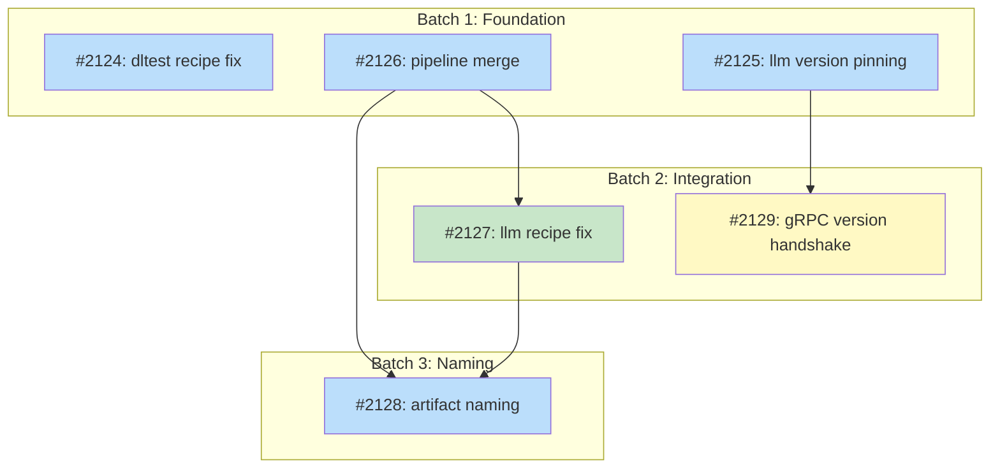

# PLAN: Unified Release Versioning

## Status

Active

## Scope Summary

Unify tsuku's release pipeline so all three binaries (CLI, dltest, llm) ship under a single `v*` tag with compile-time version enforcement, consistent artifact naming, and recipe-based version resolution from the main repo.

## Decomposition Strategy

**Horizontal decomposition.** The design describes migration of existing release infrastructure with well-defined component boundaries. Each of the six phases builds one component fully with stable interfaces between them. Walking skeleton was not appropriate because the phases are independent infrastructure changes (recipe config, version pinning, CI pipeline, naming), not layers of a single feature that benefit from early end-to-end integration.

## Issue Outlines

_(omitted in multi-pr mode -- see Implementation Issues below)_

## Implementation Issues

### Milestone: [Unified Release Versioning](https://github.com/tsukumogami/tsuku/milestone/107)

| Issue | Dependencies | Complexity |
|-------|--------------|------------|
| [#2124: fix(recipes): add github_repo to dltest recipe for version resolution](https://github.com/tsukumogami/tsuku/issues/2124) | None | simple |
| _Add explicit `github_repo` to the dltest recipe's version section, promoting resolution from InferredGitHubStrategy (priority 10) to GitHubRepoStrategy (priority 90). One-line change that ensures `tag_prefix = "v"` is respected._ | | |
| [#2125: feat(verify): add compile-time version pinning for tsuku-llm](https://github.com/tsukumogami/tsuku/issues/2125) | None | testable |
| _Extend the proven dltest version pinning pattern to llm. Adds `pinnedLlmVersion` variable with ldflags injection, enforces version match in the addon manager, and handles daemon lifecycle (shutdown, reinstall, restart) on mismatch._ | | |
| [#2126: feat(ci): merge llm release pipeline into unified release workflow](https://github.com/tsukumogami/tsuku/issues/2126) | None | critical |
| _Consolidate the standalone `llm-release.yml` into `release.yml` so all artifacts ship under one `v*` tag. Adds a 6-entry `build-llm` job matrix (2 macOS + 4 Linux GPU variants), extends integration-test and finalize-release to cover 16+ artifacts._ | | |
| [#2127: fix(recipes): add version section to llm recipe for unified tag resolution](https://github.com/tsukumogami/tsuku/issues/2127) | [#2126](https://github.com/tsukumogami/tsuku/issues/2126) | simple |
| _With llm artifacts now available under `v*` tags from #2126, update the llm recipe to resolve versions from `tsukumogami/tsuku` instead of the non-existent `tsukumogami/tsuku-llm` repo. Changes the version section and all step repo fields._ | | |
| [#2128: refactor(release): standardize artifact naming to {tool}-{os}-{arch}](https://github.com/tsukumogami/tsuku/issues/2128) | [#2126](https://github.com/tsukumogami/tsuku/issues/2126), [#2127](https://github.com/tsukumogami/tsuku/issues/2127) | testable |
| _Remove version suffixes from all artifact filenames by overriding GoReleaser's archive `name_template` and updating llm build output naming. Updates recipes and finalize-release to use the clean `{tool}-{os}-{arch}[-{backend}]` convention._ | | |
| [#2129: feat(llm): add gRPC version handshake for runtime version diagnostics](https://github.com/tsukumogami/tsuku/issues/2129) | [#2125](https://github.com/tsukumogami/tsuku/issues/2125) | testable |
| _Add `addon_version` field to the gRPC StatusResponse proto so the CLI can query the running llm daemon's version at runtime. Builds on #2125's `PinnedLlmVersion()` accessor to produce diagnostic error messages when versions diverge._ | | |

### Dependency Graph

**Legend**: Green = done, Blue = ready, Yellow = blocked, Purple = needs-design, Orange = tracks-design/tracks-plan

## Implementation Sequence

**Critical path:** #2126 -> #2127 -> #2128 (3 issues)

**Recommended order:**

1. **Batch 1** (parallel): #2124 (dltest recipe), #2125 (llm pinning), #2126 (pipeline merge) -- all independent, start immediately
2. **Batch 2** (parallel, after Batch 1): #2127 (llm recipe, needs #2126), #2129 (gRPC handshake, needs #2125)
3. **Batch 3** (after Batch 2): #2128 (artifact naming, needs #2126 + #2127)

**Parallelization:** 3 of 6 issues can start immediately. After Batch 1, two more issues unblock in parallel. Only the final naming standardization issue has a depth-3 dependency chain.

**Note:** #2124 is fully standalone (no blockers, no dependents). It can ship at any time.
