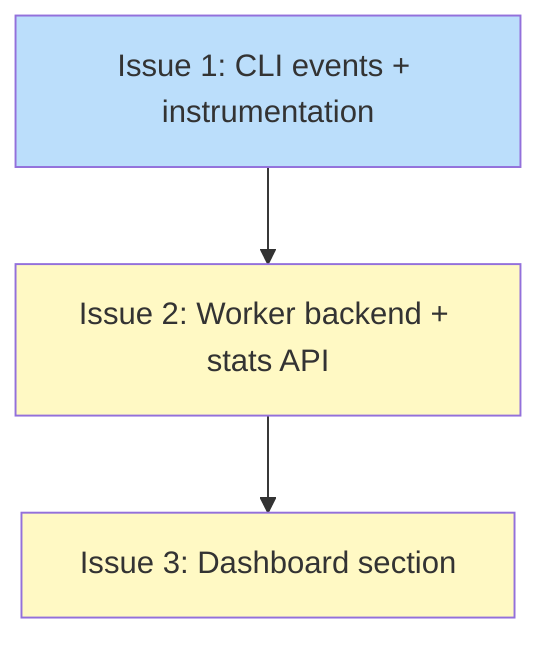

# PLAN: Update Outcome Telemetry

## Status

Draft

## Scope Summary

Add update outcome telemetry across the full pipeline: CLI event struct with error taxonomy, telemetry worker backend processing, stats API endpoint, and dashboard visualization for update reliability metrics.

## Decomposition Strategy

**Horizontal decomposition.** Three layers with well-defined interfaces between them: CLI emits events via HTTP POST, worker validates/stores and serves stats via HTTP GET, dashboard fetches and renders. Each layer follows an established pattern in the codebase (five telemetry event precedents, discovery stats for the endpoint, existing dashboard sections for the UI). Integration risk is low because all interfaces are stable and well-documented.

## Issue Outlines

### Issue 1: feat(telemetry): add update outcome events and instrumentation

**Complexity:** testable

**Goal:** Add `UpdateOutcomeEvent` telemetry struct and emit it from the auto-apply loop, manual update command, and manual rollback command. Error classification maps Go errors to a fixed 9-value taxonomy at emission time so raw error strings never leave the machine.

**Acceptance Criteria:**
- [ ] `UpdateOutcomeEvent` struct exists in `internal/telemetry/event.go` with all 10 fields matching the design doc blob layout
- [ ] `classifyError(err error) string` returns the correct taxonomy value for each error type, preferring `errors.Is`/`errors.As` with `strings.Contains` fallback
- [ ] Three constructors populate all fields correctly: success events have empty ErrorType, failure events carry the classified error, rollback events use `update_outcome_rollback` action
- [ ] `SendUpdateOutcome()` on `telemetry.Client` follows the same fire-and-forget pattern as other Send methods
- [ ] `MaybeAutoApply` accepts `*telemetry.Client` and emits at all 3 branch points with trigger "auto"
- [ ] Manual update emits failure and success outcome events with trigger "manual"
- [ ] Manual rollback emits a rollback outcome event with trigger "manual"
- [ ] `go test ./internal/telemetry/...` passes with new test coverage for `classifyError()` and constructors
- [ ] `go vet ./...` and `go build ./...` pass cleanly
- [ ] Existing telemetry tests remain green

**Dependencies:** None

**Files:** `internal/telemetry/event.go`, `internal/telemetry/event_test.go`, `internal/telemetry/client.go`, `internal/updates/apply.go`, `cmd/tsuku/main.go`, `cmd/tsuku/update.go`, `cmd/tsuku/cmd_rollback.go`

### Issue 2: feat(telemetry): add worker support for update outcome events

**Complexity:** testable

**Goal:** Add worker-side support for `update_outcome_*` telemetry events: dispatch, validation, blob layout mapping, and a `GET /stats/updates` endpoint returning aggregate update reliability metrics.

**Acceptance Criteria:**
- [ ] `POST /event` with `action` starting with `update_outcome_` dispatches to a dedicated handler following the `discovery_*` pattern
- [ ] Validation function enforces: action is one of 3 values, trigger is "auto"/"manual", error_type from taxonomy or empty, recipe max 128 chars, version max 64 chars
- [ ] Invalid events return 400 with descriptive message
- [ ] Blob layout uses 10 blobs matching the design doc specification
- [ ] `GET /stats/updates` returns JSON with: `generated_at`, `period`, `total_updates`, `by_outcome`, `success_rate`, `by_trigger`, `by_error_type` (top 10), `top_failing` (top 10)
- [ ] Stats queries filter on `blob0 LIKE 'update_outcome_%'`
- [ ] Tests: validation accepts valid events, rejects invalid fields, enforces length limits
- [ ] Tests: stats endpoint returns expected response shape

**Dependencies:** Issue 1 (defines event format and field semantics)

**Files:** `telemetry/src/index.ts`, `telemetry/src/index.test.ts`

### Issue 3: feat(website): add update reliability dashboard section

**Complexity:** simple

**Goal:** Add an "Update Reliability" section to the stats dashboard that visualizes data from the `/stats/updates` endpoint with overview cards and distribution bars.

**Acceptance Criteria:**
- [ ] `/stats/updates` fetched in the existing `Promise.all` with `.catch(() => null)` for graceful degradation
- [ ] "Update Reliability" section renders after "Discovery Resolver" when data is available; does not render when endpoint unavailable
- [ ] Overview cards: Total Updates, Success Rate (percentage, large font), Auto-Update Share
- [ ] Distribution cards: Outcome Distribution, Trigger Breakdown, Top Errors, Top Failing Recipes (horizontal bars)
- [ ] All values from stats API are HTML-escaped (XSS prevention)
- [ ] All JS remains inline in `index.html`
- [ ] Section is responsive at 600px breakpoint

**Dependencies:** Issue 2 (provides the `/stats/updates` endpoint)

**Files:** `website/stats/index.html`

## Dependency Graph

**Legend**: Green = done, Blue = ready, Yellow = blocked, Purple = needs-design, Orange = tracks-design/tracks-plan

## Implementation Sequence

**Critical path:** Issue 1 -> Issue 2 -> Issue 3 (all issues on critical path)

**Parallelization:** None. The linear chain matches the data flow: CLI must emit events before the worker can accept them, and the worker must serve stats before the dashboard can render them.

**Recommended order:**
1. Start with Issue 1 (CLI events and instrumentation) -- Go code, unit tests
2. After Issue 1 merges, proceed to Issue 2 (worker backend) -- TypeScript, deploy to Cloudflare
3. After Issue 2 deploys, finish with Issue 3 (dashboard) -- HTML/JS
