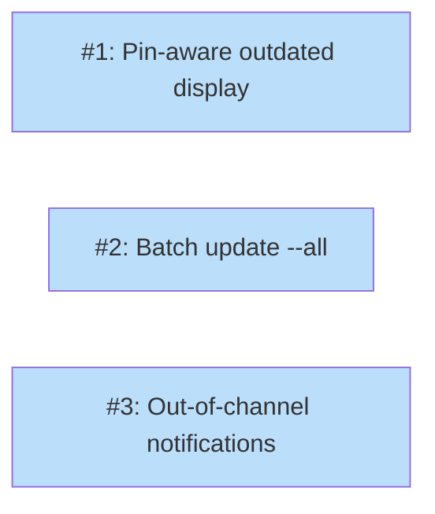

# PLAN: Update polish

## Status

Draft

## Scope Summary

Add pin-aware dual-column `tsuku outdated`, `tsuku update --all` for batch updates, and out-of-channel notifications with per-tool weekly throttle using mtime dotfiles.

## Decomposition Strategy

**Horizontal.** The three sub-features have clear boundaries: outdated display changes one command, batch update changes another, and OOC notifications extend the notification pipeline. Issues 1 and 2 are independent. Issue 3 builds on the same data (LatestOverall from cache) but doesn't depend on the other issues' code.

## Issue Outlines

### Issue 1: feat(outdated): add dual-column pin-aware display

**Complexity:** testable

**Goal:** Add "OVERALL" column to `tsuku outdated` text output and `latest_overall` field to JSON output, showing the latest version available regardless of pin boundaries.

**Acceptance criteria:**
- [ ] `tsuku outdated` text output has four columns: TOOL, CURRENT, LATEST (within pin), OVERALL
- [ ] OVERALL column is empty when the tool isn't pinned or when overall matches within-pin
- [ ] `tsuku outdated --json` includes `latest_overall` field in each update entry
- [ ] `latest_overall` is omitted (not null) when it matches the within-pin version
- [ ] Exact-pinned tools are still skipped entirely
- [ ] Second `ResolveLatest` call per tool for overall version (not just within-pin)
- [ ] Self-update entry in JSON also includes overall version (already has it from cache)
- [ ] Unit tests for new JSON output structure

**Dependencies:** None

### Issue 2: feat(update): add batch update with --all flag

**Complexity:** testable

**Goal:** Add `--all` flag to `tsuku update` that iterates all installed tools and updates each within its pin boundary.

**Acceptance criteria:**
- [ ] `tsuku update --all` iterates all installed tools
- [ ] Exact-pinned tools are skipped (consistent with outdated)
- [ ] Each tool is resolved within-pin and installed via existing `runInstallWithTelemetry`
- [ ] Individual failures are reported but don't stop the batch
- [ ] Summary line at the end: "Updated N/M tools" (or "All tools up to date")
- [ ] `--all` and positional `<tool>` argument are mutually exclusive (error if both provided)
- [ ] `--dry-run` works with `--all` (shows what would update without installing)
- [ ] Unit tests for flag validation and batch logic

**Dependencies:** None

### Issue 3: feat(updates): add out-of-channel notifications with weekly throttle

**Complexity:** testable

**Goal:** Add out-of-channel version notifications to `DisplayNotifications`, throttled to once per week per tool using mtime dotfiles.

**Acceptance criteria:**
- [ ] `IsOOCThrottled(cacheDir, toolName, now)` returns true if `.ooc-<tool>` mtime is within 7 days
- [ ] `TouchOOCThrottle(cacheDir, toolName)` creates or touches `.ooc-<tool>`
- [ ] `DisplayNotifications` checks cache entries where `LatestOverall` differs from both `LatestWithinPin` and `ActiveVersion`
- [ ] For each non-throttled tool, prints: `<tool> <overall> available (pinned to <pin>)`
- [ ] Touches throttle file after displaying
- [ ] Gated by `ShouldSuppressNotifications` (same as other notification types)
- [ ] Gated by `userCfg.UpdatesNotifyOutOfChannel()` config (default: true)
- [ ] `tsuku config set updates.notify_out_of_channel false` disables OOC notifications
- [ ] Clock injection via `time.Time` parameter (not package-level NowFunc)
- [ ] Unit tests for throttle (fresh, expired, missing file) with controlled time
- [ ] Unit tests for OOC rendering in DisplayNotifications
- [ ] Functional test scenario for OOC notification display

**Dependencies:** None (parallel with Issues 1 and 2)

## Dependency Graph

**Legend**: Blue = ready, Yellow = blocked

## Implementation Sequence

**No critical path.** All three issues are independent and can be implemented in any order or in parallel. The recommended sequence is Issue 1 first (validates that `LatestOverall` data is correct), then Issues 2 and 3 in either order. But there are no hard dependencies between them.
