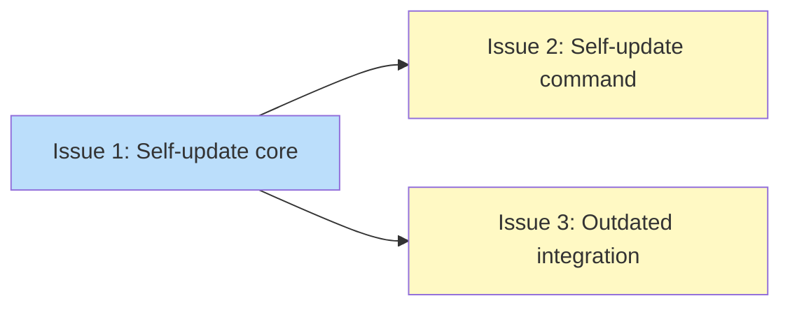

# PLAN: Self-Update Mechanism

## Status

Done

## Scope Summary

Add a self-update mechanism that auto-applies tsuku binary updates during the background update check, with a manual `tsuku self-update` fallback and `tsuku outdated` integration.

## Decomposition Strategy

**Horizontal decomposition.** Components have clear stable interfaces -- Issue 1 provides the core download-verify-replace logic consumed independently by Issues 2 and 3. Walking skeleton doesn't apply because the interfaces between layers are well-defined from the design doc.

## Issue Outlines

### Issue 1: feat(updates): add self-update core and background auto-apply

**Goal:** Add the core self-update infrastructure that resolves tsuku's latest release, downloads and verifies the binary, replaces it atomically, and integrates with the background update check flow.

**Acceptance Criteria:**
- [ ] New file `internal/updates/self.go` with `SelfToolName`, `SelfRepo` constants, `checkAndApplySelf()`, `applySelfUpdate()`, and `IsSelfUpdate()`
- [ ] `checkAndApplySelf` resolves latest version, writes `UpdateCheckEntry` with `Tool: SelfToolName`, downloads/verifies/replaces when `autoApply` is true and a newer version exists
- [ ] `applySelfUpdate` downloads `checksums.txt`, parses SHA256, downloads binary to same-directory temp, verifies checksum, performs two-rename replacement with rollback
- [ ] Version comparison normalizes `v` prefix; downgrade protection via semver comparison
- [ ] Writes success notice via `internal/notices/WriteNotice` on successful auto-apply
- [ ] `checker.go` modified: `RunUpdateCheck` calls `checkAndApplySelf()` after tool loop, gated on `userCfg.UpdatesSelfUpdate()`
- [ ] `apply.go` modified: `MaybeAutoApply` skips entries where `entry.Tool == SelfToolName`
- [ ] `userconfig.go` modified: `UpdatesSelfUpdate()` returns false when `CI=true` or `TSUKU_NO_SELF_UPDATE=1`
- [ ] Non-blocking file lock on `$TSUKU_HOME/cache/updates/.self-update.lock`
- [ ] Unit tests cover: version normalization, downgrade prevention, checksums.txt parsing, two-rename replacement, MaybeAutoApply skip, env var suppression

**Dependencies:** None

### Issue 2: feat(cli): add tsuku self-update command

**Goal:** Add a `tsuku self-update` command that manually triggers the download-verify-replace flow with interactive output, as a fallback for users who disable background auto-apply.

**Acceptance Criteria:**
- [ ] New file `cmd/tsuku/cmd_self_update.go` with `selfUpdateCmd` cobra command
- [ ] Resolves latest version, normalizes `v` prefix, compares with semver
- [ ] Already up to date: prints message, exits 0
- [ ] Current is newer: prints message, exits 0
- [ ] Newer available: acquires lock, calls `applySelfUpdate()`, prints progress
- [ ] Lock held: prints "Another self-update is running", exits with error
- [ ] Failure: prints error with "Current binary restored", exits with error
- [ ] Registered in `main.go`, added to `PersistentPreRun` skip list
- [ ] No flags -- always tracks latest stable
- [ ] Unit tests for version comparison branches and lock-held scenario

**Dependencies:** Issue 1

### Issue 3: feat(cli): add self-update status to tsuku outdated

**Goal:** Display tsuku's own update availability in `tsuku outdated`, formatted distinctly from managed tools.

**Acceptance Criteria:**
- [ ] `tsuku outdated` reads tsuku cache entry via `ReadAllEntries`
- [ ] Newer version available: displays distinct message (not in tool table)
- [ ] Up to date: no extra output
- [ ] Tsuku entry excluded from regular managed-tool update table
- [ ] JSON output includes self-update info separate from updates array
- [ ] Uses `IsSelfUpdate()` to identify the tsuku cache entry

**Dependencies:** Issue 1

## Dependency Graph

**Legend**: Green = done, Blue = ready, Yellow = blocked

## Implementation Sequence

**Critical path:** Issue 1 -> Issue 2 (or Issue 3). Depth: 2.

**Recommended order:**
1. Start with Issue 1 (no dependencies, core infrastructure)
2. After Issue 1 completes, Issues 2 and 3 can be worked in parallel
