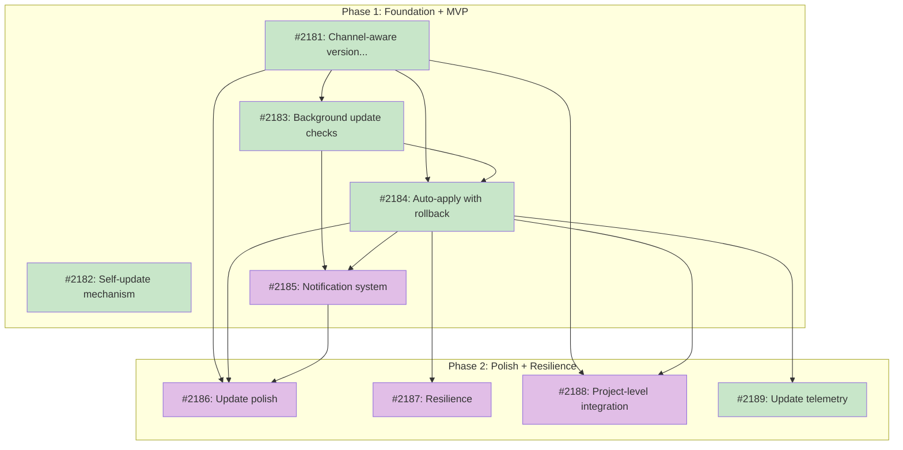

# ROADMAP: Auto-update

## Status

Active

## Theme

Tsuku users install developer tools and forget about them. Patches, security fixes, and minor improvements ship upstream but nothing happens unless the user manually runs `tsuku outdated` and `tsuku update` for each tool. This roadmap coordinates the features needed to keep tools and tsuku itself current automatically, within version boundaries the user chose at install time.

Sequencing matters here. The version resolution model (how pins work) must be solid before checks can be meaningful, checks must exist before auto-apply makes sense, and rollback must ship alongside auto-apply since it's the default behavior. Getting this order wrong means either shipping an unsafe system or doing significant rework.

## Features

### Feature 1: Channel-aware version resolution ([#2181](https://github.com/tsukumogami/tsuku/issues/2181))
**Dependencies:** None
**Status:** Done
**Upstream:** [PRD-auto-update](../prds/PRD-auto-update.md) (R1, R2, R6, R15a)
**Design:** [DESIGN-channel-aware-resolution.md](../designs/current/DESIGN-channel-aware-resolution.md) (Current)

The foundation. Fix `tsuku update` to respect the `Requested` field so that `install node@18` followed by `update node` stays within 18.x.y. Fix `tsuku outdated` to use ProviderFactory for all version providers (not just GitHub). Cache `ResolveLatest` results. Define pin-level semantics: empty string = latest, "20" = major, "1.29" = minor, "1.29.3" = exact. Everything else depends on this being right.

### Feature 2: Background update check infrastructure ([#2183](https://github.com/tsukumogami/tsuku/issues/2183))
**Dependencies:** Feature 1
**Status:** Done
**Upstream:** [PRD-auto-update](../prds/PRD-auto-update.md) (R4, R5)
**Design:** [DESIGN-background-update-checks.md](../designs/current/DESIGN-background-update-checks.md) (Current)

The plumbing. Time-cached update checks with a configurable interval (default 24h). Three trigger entry points: shell activation hook (primary, runs on every prompt), shim invocations (secondary), and tsuku commands (fallback). Staleness detection via a single stat on the cache file. Background process spawns detached and writes results to `$TSUKU_HOME/cache/update-check.json`. Update configuration in `config.toml` `[updates]` section.

### Feature 3: Auto-apply with rollback ([#2184](https://github.com/tsukumogami/tsuku/issues/2184))
**Dependencies:** Feature 1, Feature 2
**Status:** Done
**Upstream:** [PRD-auto-update](../prds/PRD-auto-update.md) (R3, R9, R10, R11a)
**Design:** [DESIGN-auto-apply-rollback.md](../designs/current/DESIGN-auto-apply-rollback.md) (Current)

The core behavior. When cached check results show a newer version within pin boundaries, tsuku downloads and installs it during the next tsuku command. If installation fails, the previous version is automatically preserved and a basic failure notice is written to `$TSUKU_HOME/notices/`. `tsuku rollback <tool>` switches to the immediately preceding version (one level deep); rollback is temporary and doesn't change the `Requested` field (D7). `tsuku notices` displays failure details (R11a). This feature implements basic notice writing only -- every failure writes a notice. Consecutive-failure suppression (the "fewer than 3 = transient" logic from R11) ships in Feature 7. This ships together with auto-apply because auto-apply without rollback is unsafe as the default.

### Feature 4: Self-update ([#2182](https://github.com/tsukumogami/tsuku/issues/2182))
**Dependencies:** None (uses Feature 2's check infrastructure when available, but can ship independently)
**Status:** Done
**Upstream:** [PRD-auto-update](../prds/PRD-auto-update.md) (R7, R8)
**Design:** [DESIGN-self-update.md](../designs/current/DESIGN-self-update.md) (Current)

Independent from tool auto-update. Tsuku auto-updates itself during the background update check by default, using a separate code path from the recipe pipeline. `tsuku self-update` provides a manual fallback. Binary replacement uses same-directory temp file with two-rename atomic swap and SHA256 verification. Self-update always tracks latest (no pinning for tsuku itself). Configurable via `updates.self_update` (default: true), suppressed in CI.

### Feature 5: Notification system ([#2185](https://github.com/tsukumogami/tsuku/issues/2185))
**Needs:** `needs-design` -- notification timing, suppression layers, and configuration surface need design
**Dependencies:** Feature 2 (needs check results to display), Feature 3 (needs apply results to report)
**Status:** Not started
**Upstream:** [PRD-auto-update](../prds/PRD-auto-update.md) (R12, R16)

Cross-cutting. Stderr notifications after command output for available or applied updates. Suppression layers: non-TTY, `CI=true`, `--quiet`, `TSUKU_NO_UPDATE_CHECK=1`. `TSUKU_AUTO_UPDATE=1` overrides CI detection for explicit opt-in. The notification format and suppression logic are shared across tool updates and self-update.

### Feature 6: Update polish ([#2186](https://github.com/tsukumogami/tsuku/issues/2186))
**Needs:** `needs-design` -- out-of-channel notification throttling (weekly per tool, persistence, injectable clock for testing) needs design decisions
**Dependencies:** Feature 1, Feature 3, Feature 5
**Status:** Not started
**Upstream:** [PRD-auto-update](../prds/PRD-auto-update.md) (R13, R14, R15b)

Refinements that build on the core system. Pin-aware `tsuku outdated` with dual columns ("within pin" and "overall"). Out-of-channel notifications when a newer version exists outside the pin boundary (configurable via `updates.notify_out_of_channel`, at most weekly per tool -- requires per-tool throttle state and injectable clock). `tsuku update --all` for batch updates within pin boundaries.

### Feature 7: Resilience ([#2187](https://github.com/tsukumogami/tsuku/issues/2187))
**Dependencies:** Feature 3 (extends auto-apply with failure handling)
**Status:** Not started
**Upstream:** [PRD-auto-update](../prds/PRD-auto-update.md) (R11, R18, R20)

Hardening for real-world conditions. Adds consecutive-failure suppression on top of Feature 3's basic notice writing -- failures with fewer than 3 consecutive occurrences for the same tool are treated as transient and suppressed (R11, building on R11a from Feature 3). Old version retention with configurable period (default 7 days) and garbage collection. Graceful offline degradation using cached results when network is unavailable. `tsuku doctor` detects orphaned staging directories and stale notices.

### Feature 8: Project-level integration ([#2188](https://github.com/tsukumogami/tsuku/issues/2188))
**Needs:** `needs-design` -- interaction between `.tsuku.toml` version constraints and global auto-update policy needs design
**Dependencies:** Feature 1, Feature 3
**Status:** Not started
**Upstream:** [PRD-auto-update](../prds/PRD-auto-update.md) (R17)

`.tsuku.toml` version constraints take precedence over global auto-update policy. Exact versions in project config (e.g., `node = "20.16.0"`) disable auto-update for that tool in that project context. Prefix versions (e.g., `node = "20"`) allow auto-update within the pin. The project config's `ToolRequirement` struct may need extension.

### Feature 9: Update telemetry ([#2189](https://github.com/tsukumogami/tsuku/issues/2189))
**Dependencies:** Feature 3 (needs update events to track)
**Status:** Done
**Upstream:** [PRD-auto-update](../prds/PRD-auto-update.md) (R22)
**Design:** [DESIGN-update-outcome-telemetry.md](../designs/current/DESIGN-update-outcome-telemetry.md) (Current)

Extend the existing telemetry system (`NewUpdateEvent`) with success/failure/rollback outcomes for auto-updates. Respects the existing opt-out mechanism. Low priority but valuable for understanding update reliability at scale.

## Cross-cutting constraints

These PRD requirements apply across multiple features. Every feature's design must account for them:

- **R19: Zero added latency.** Background update checks must not add measurable latency to any command or tool execution. The check goroutine/process has a 10-second absolute timeout. Affects Features 2, 3, 4, 5.
- **R21: Atomic operations.** All file writes (state.json, cache, notices) use temp-file-then-rename. Auto-update never leaves the system in a partially updated state. Affects Features 2, 3, 7, 8.

## Sequencing rationale

The order is driven by three constraints:

**Technical dependency chain.** Version resolution (Feature 1) must be correct before checks (Feature 2) are meaningful, and checks must produce results before auto-apply (Feature 3) can act on them. This is a hard dependency -- you can't build them in a different order without stub infrastructure.

**Safety pairing.** Auto-apply (Feature 3) and rollback ship together because auto-apply is the default behavior. Shipping auto-apply without rollback means users have no fast recovery path when an upstream release is broken. This is a design decision from the PRD, not a technical dependency.

**Independent tracks.** Self-update (Feature 4) has no code-level dependency on the tool auto-update chain. It can ship before, during, or after Features 1-3. The notification system (Feature 5) depends on having check/apply results to display but is otherwise independent in its design surface. Features 6-9 extend the core system and can be delivered in any order once the foundation is in place.

The split between Phase 1 (Features 1-5) and Phase 2 (Features 6-9) reflects a natural delivery boundary: Phase 1 delivers a complete, safe auto-update experience. Phase 2 adds polish, resilience, and integration. Phase 2 features are independently shippable and can be parallelized.

## Implementation Issues

### Milestone: [Auto-update](https://github.com/tsukumogami/tsuku/milestone/109)

| Issue | Dependencies | Tier |
|-------|--------------|------|
| ~~[#2181: channel-aware version resolution](https://github.com/tsukumogami/tsuku/issues/2181)~~ | ~~None~~ | ~~testable~~ |
| ~~_Fix `tsuku update` to respect the Requested field and `tsuku outdated` to use ProviderFactory. Establish pin-level semantics and cache ResolveLatest results. Everything else depends on this being correct._~~ | | |
| ~~[#2182: self-update mechanism](https://github.com/tsukumogami/tsuku/issues/2182)~~ | ~~None~~ | ~~testable~~ |
| ~~_Independent track: background auto-apply and manual `tsuku self-update` with rename-in-place binary replacement. Kept separate from the managed tool system to avoid bootstrap risk. Integrates with check infrastructure._~~ | | |
| ~~[#2183: background update check infrastructure](https://github.com/tsukumogami/tsuku/issues/2183)~~ | ~~[#2181](https://github.com/tsukumogami/tsuku/issues/2181)~~ | ~~testable~~ |
| ~~_With version resolution in place, add the time-cached check system: layered triggers (shell hook > shim > command), detached background process, cache file, and config.toml `[updates]` section._~~ | | |
| ~~[#2184: auto-apply with rollback](https://github.com/tsukumogami/tsuku/issues/2184)~~ | ~~[#2181](https://github.com/tsukumogami/tsuku/issues/2181), [#2183](https://github.com/tsukumogami/tsuku/issues/2183)~~ | ~~testable~~ |
| ~~_The core behavior. Reads check results, downloads and installs updates within pin boundaries, auto-rolls back on failure, and writes basic notices. Adds `tsuku rollback` and `tsuku notices` commands._~~ | | |
| [#2185: notification system](https://github.com/tsukumogami/tsuku/issues/2185) | [#2183](https://github.com/tsukumogami/tsuku/issues/2183), [#2184](https://github.com/tsukumogami/tsuku/issues/2184) | testable |
| _Cross-cutting stderr notification UX with layered suppression (non-TTY, CI, quiet, env var). Shared between tool updates and self-update. Completes the Phase 1 user experience._ | | |
| [#2186: update polish](https://github.com/tsukumogami/tsuku/issues/2186) | [#2181](https://github.com/tsukumogami/tsuku/issues/2181), [#2184](https://github.com/tsukumogami/tsuku/issues/2184), [#2185](https://github.com/tsukumogami/tsuku/issues/2185) | testable |
| _Phase 2 refinements: pin-aware dual-column `tsuku outdated`, out-of-channel notifications with weekly per-tool throttle, and `tsuku update --all` for batch updates._ | | |
| [#2187: resilience](https://github.com/tsukumogami/tsuku/issues/2187) | [#2184](https://github.com/tsukumogami/tsuku/issues/2184) | testable |
| _Hardens auto-apply for real-world conditions. Adds consecutive-failure suppression (< 3 = transient), old version GC with configurable retention, graceful offline degradation, and `tsuku doctor` integration._ | | |
| [#2188: project-level integration](https://github.com/tsukumogami/tsuku/issues/2188) | [#2181](https://github.com/tsukumogami/tsuku/issues/2181), [#2184](https://github.com/tsukumogami/tsuku/issues/2184) | testable |
| _Defines how `.tsuku.toml` version constraints interact with auto-update: exact versions disable it, prefix versions allow it within the pin. Project config takes precedence over global policy._ | | |
| ~~[#2189: update outcome telemetry](https://github.com/tsukumogami/tsuku/issues/2189)~~ | ~~[#2184](https://github.com/tsukumogami/tsuku/issues/2184)~~ | ~~simple~~ |
| ~~_Extends existing `NewUpdateEvent` telemetry with success/failure/rollback outcomes. Low priority but valuable for understanding update reliability at scale._~~ | | |

### Dependency graph

**Legend**: Green = done, Blue = ready, Yellow = blocked, Purple = needs-design, Orange = tracks-design/tracks-plan
