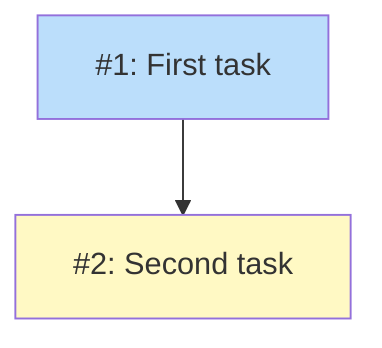

# Issues Only Diagram

## Status

Planned

## Implementation Issues

### Milestone: [Test](https://github.com/org/repo/milestone/1)

| Issue | Title | Dependencies | Tier |
|-------|-------|--------------|------|
| [#1](https://github.com/org/repo/issues/1) | First task | None | 1 |
| [#2](https://github.com/org/repo/issues/2) | Second task | #1 | 1 |

### Dependency Graph

**Legend**: Green = done, Blue = ready, Yellow = blocked, Purple = needs-design
