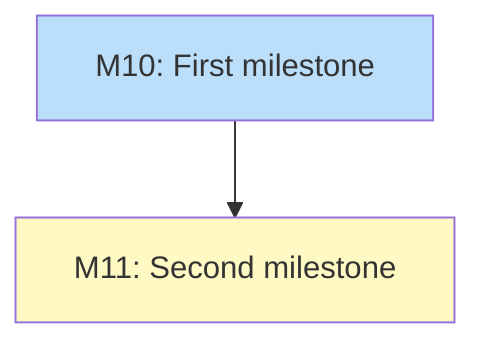

# Milestones Only Diagram

## Status

Planned

## Implementation Issues

### Milestone: [Test](https://github.com/org/repo/milestone/1)

| Issue | Title | Dependencies | Tier |
|-------|-------|--------------|------|
| [M10](https://github.com/org/repo/milestone/10) | First milestone | None | milestone |
| [M11](https://github.com/org/repo/milestone/11) | Second milestone | M10 | milestone |

### Dependency Graph

**Legend**: Green = done, Blue = ready, Yellow = blocked, Purple = needs-design
