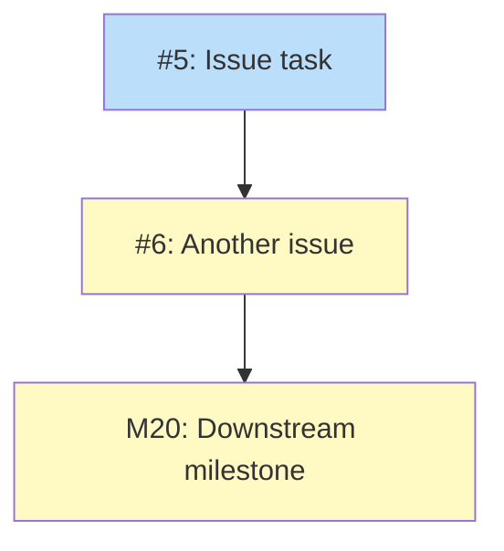

# Mixed Diagram

## Status

Planned

## Implementation Issues

### Milestone: [Test](https://github.com/org/repo/milestone/1)

| Issue | Title | Dependencies | Tier |
|-------|-------|--------------|------|
| [#5](https://github.com/org/repo/issues/5) | Issue task | None | 1 |
| [#6](https://github.com/org/repo/issues/6) | Another issue | #5 | 1 |
| [M20](https://github.com/org/repo/milestone/20) | Downstream milestone | #6 | milestone |

### Dependency Graph

**Legend**: Green = done, Blue = ready, Yellow = blocked, Purple = needs-design
