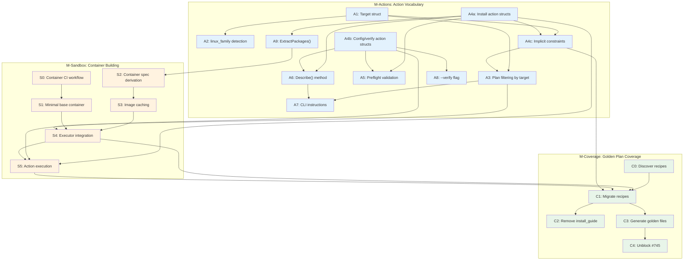

# Issue Plan Outline for #722: Structured System Dependencies

This document outlines the implementation issues for the two companion designs that address issue #722:

- [DESIGN-system-dependency-actions.md](../docs/DESIGN-system-dependency-actions.md) - Action vocabulary
- [DESIGN-structured-install-guide.md](../docs/DESIGN-structured-install-guide.md) - Sandbox container building

## Milestone Overview

```
M-Actions: System Dependency Action Vocabulary
    └─ Linux family detection, action types, implicit constraints, documentation generation

M-Sandbox: Sandbox Container Building (depends on M-Actions)
    └─ Container derivation, caching, executor integration

M-Coverage: Full Golden Plan Coverage (depends on M-Sandbox, existing M27)
    └─ Recipe discovery, migration, #745 unblocked
```

---

## Milestone: System Dependency Action Vocabulary

**Design**: DESIGN-system-dependency-actions.md
**Prerequisite**: None
**Blocks**: M-Sandbox, M-Coverage

### Issue A1: Define Target struct for plan generation

**Type**: feat(platform)
**Phase**: Infrastructure

**Description**:
Define a `Target` struct that represents the platform being targeted for plan generation. This is separate from `WhenClause` - the target is a parameter to plan generation, not a filtering condition in recipes.

**Acceptance Criteria**:
- [ ] New file: `internal/platform/target.go`
- [ ] `Target` struct with `Platform string` and `LinuxFamily string` fields
- [ ] `LinuxFamily` is only set when OS is Linux (empty for darwin, windows)
- [ ] Valid `LinuxFamily` values: `debian`, `rhel`, `arch`, `alpine`, `suse`
- [ ] Helper methods: `OS() string`, `Arch() string` (parse from Platform)
- [ ] `WhenClause` is NOT modified - remains generic (os, arch, platform only)
- [ ] Unit tests for Target struct

**Dependencies**: None

---

### Issue A2: Implement linux_family detection

**Type**: feat(platform)
**Phase**: Infrastructure

**Description**:
Implement `/etc/os-release` parsing to detect the current Linux family. Maps distro IDs to family names (ubuntu→debian, fedora→rhel, etc.). Provides `DetectTarget()` to get the full target tuple for the current host.

**Acceptance Criteria**:
- [ ] New file: `internal/platform/family.go`
- [ ] Function: `DetectFamily() (family string, err error)`
- [ ] Function: `DetectTarget() (Target, error)` - returns full target for current host
- [ ] Parses `ID` and `ID_LIKE` from `/etc/os-release`
- [ ] Maps distro IDs to families via `distroToFamily` lookup table:
  - debian family: debian, ubuntu, linuxmint, pop, elementary, zorin
  - rhel family: fedora, rhel, centos, rocky, almalinux, ol
  - arch family: arch, manjaro, endeavouros
  - alpine family: alpine
  - suse family: opensuse, opensuse-leap, opensuse-tumbleweed, sles
- [ ] Falls back to `ID_LIKE` chain if `ID` not in table
- [ ] Handles missing file gracefully (returns empty, no error)
- [ ] Detection uses `exec.LookPath()` (not `which` - missing on Fedora/Arch)
- [ ] For RHEL: detects `microdnf` as equivalent to `dnf` (minimal RHEL images use microdnf)
- [ ] Detection order for RHEL: `dnf` > `microdnf` > `yum`
- [ ] Unit tests with fixture files for: ubuntu, debian, fedora, arch, alpine, rocky (microdnf)

**Dependencies**: A1 (needs Target struct)

---

### Issue A3: Implement plan filtering by target

**Type**: feat(executor)
**Phase**: Infrastructure

**Description**:
Implement `FilterPlan(recipe, target)` that filters recipe steps based on the target tuple. This checks both action implicit constraints (D6) and explicit `when` clauses.

**Acceptance Criteria**:
- [ ] Function: `FilterPlan(recipe *Recipe, target Target) *Plan`
- [ ] Two-stage filtering:
  1. Check action's `ImplicitConstraint()` against target
  2. Check step's explicit `when` clause against target platform
- [ ] Step included only if both checks pass
- [ ] Actions without implicit constraint pass stage 1 automatically
- [ ] Steps without explicit `when` pass stage 2 automatically
- [ ] `WhenClause.Matches()` unchanged - still checks os, arch, platform only
- [ ] Integration test: `apt_install` step filtered out when target is `rhel`
- [ ] Integration test: `brew_cask` step filtered out when target is `linux/amd64`

**Related Code**:
- `internal/executor/filter.go` - New file for FilterPlan
- `internal/recipe/when.go` - WhenClause (unchanged)
- `internal/platform/target.go` - Target struct

**Dependencies**: A1, A4c (needs ImplicitConstraint interface)

---

### Issue A4a: Define package installation action structs

**Type**: feat(actions)
**Phase**: Action Vocabulary

**Description**:
Create Go structs for package installation actions. These structs hold validated parameters but do not yet implement execution. Split from A4b to reduce issue complexity.

**Acceptance Criteria**:
- [ ] Package installation actions:
  - `AptInstallAction` - packages []string, fallback? string
  - `AptRepoAction` - url, key_url, key_sha256 (all required)
  - `AptPPAAction` - ppa string
  - `BrewInstallAction` - packages []string, tap? string, fallback? string
  - `BrewCaskAction` - packages []string, tap? string, fallback? string
  - `DnfInstallAction` - packages []string, fallback? string
  - `DnfRepoAction` - url, key_url?, key_sha256?
  - `PacmanInstallAction` - packages []string, fallback? string
  - `ApkInstallAction` - packages []string, fallback? string
  - `ZypperInstallAction` - packages []string, fallback? string
- [ ] All structs implement `SystemAction` interface
- [ ] All structs have `Validate() error` method
- [ ] Action parsing from TOML step: `action = "apt_install"` → AptInstallAction
- [ ] Unit tests for each action struct

**Related Code**:
- `internal/actions/` - Action implementations
- `internal/recipe/step.go` - Step parsing

**Dependencies**: None (can run in parallel with A1-A3)

---

### Issue A4b: Define configuration and verification action structs

**Type**: feat(actions)
**Phase**: Action Vocabulary

**Description**:
Create Go structs for configuration, verification, and fallback actions. Complements A4a to complete the action vocabulary.

**Acceptance Criteria**:
- [ ] Configuration actions:
  - `GroupAddAction` - group string
  - `ServiceEnableAction` - service string
  - `ServiceStartAction` - service string
- [ ] Verification/fallback:
  - `RequireCommandAction` - command string, version_flag?, version_regex?, min_version?
  - `ManualAction` - instructions string
- [ ] All structs implement `SystemAction` interface
- [ ] All structs have `Validate() error` method
- [ ] Action parsing from TOML step: `action = "group_add"` → GroupAddAction
- [ ] Unit tests for each action struct

**Related Code**:
- `internal/actions/` - Action implementations
- `internal/recipe/step.go` - Step parsing

**Dependencies**: None (can run in parallel with A4a)

---

### Issue A4c: Implement implicit constraints for PM actions

**Type**: feat(actions)
**Phase**: Action Vocabulary

**Description**:
Each PM-specific action has an implicit, immutable constraint baked into its definition. This is NOT a `WhenClause` - it's a `Constraint` struct that specifies the action's valid targets. Recipe authors cannot override these constraints.

**Acceptance Criteria**:
- [ ] New file: `internal/actions/constraint.go`
- [ ] `Constraint` struct with `OS string` and `LinuxFamily string` fields
- [ ] Each PM action implements `ImplicitConstraint() *Constraint`
- [ ] Each action implements `MatchesTarget(target Target) bool`
- [ ] Implicit constraints:
  - `apt_install`, `apt_repo`, `apt_ppa` → `{OS: "linux", LinuxFamily: "debian"}`
  - `dnf_install`, `dnf_repo` → `{OS: "linux", LinuxFamily: "rhel"}`
  - `pacman_install` → `{OS: "linux", LinuxFamily: "arch"}`
  - `apk_install` → `{OS: "linux", LinuxFamily: "alpine"}`
  - `zypper_install` → `{OS: "linux", LinuxFamily: "suse"}`
  - `brew_install`, `brew_cask` → `{OS: "darwin"}`
- [ ] Actions without implicit constraint return `nil` from `ImplicitConstraint()`
- [ ] Unit tests verify each action's implicit constraint
- [ ] Unit tests verify `MatchesTarget()` behavior

**Related Code**:
- `internal/actions/constraint.go` - Constraint struct (new)
- `internal/actions/` - Action implementations
- `internal/platform/target.go` - Target struct

**Dependencies**: A1, A4a

---

### Issue A5: Implement action preflight validation

**Type**: feat(actions)
**Phase**: Action Vocabulary

**Description**:
Implement `Preflight()` method on all typed actions to validate parameters before execution.

**Acceptance Criteria**:
- [ ] Each action has `Preflight() error`
- [ ] Content-addressing enforcement (REQUIRED for supply chain security):
  - `apt_repo`: key_sha256 REQUIRED (no exceptions) - verified against downloaded key
  - `dnf_repo`: key_sha256 REQUIRED when key_url is provided
  - All external URLs must be HTTPS
- [ ] Validation rules:
  - `apt_install`: packages required, no shell metacharacters
  - `apt_repo`: url, key_url, key_sha256 all required; key_sha256 is 64 hex chars
  - `brew_install/cask`: packages required
  - `group_add`: group required, alphanumeric only
  - `require_command`: command required
  - `manual`: instructions required
- [ ] Error messages are actionable: "apt_repo requires key_sha256 for content verification"
- [ ] Recipe validation calls Preflight() on all parsed actions
- [ ] Unit tests for each validation rule
- [ ] Unit tests specifically for SHA256 format validation

**Related Code**:
- `internal/actions/` - Action implementations
- `internal/recipe/validate.go` - Recipe validation

**Dependencies**: A4a, A4b

---

### Issue A6: Implement Describe() for documentation generation

**Type**: feat(actions)
**Phase**: Documentation Generation

**Description**:
Implement `Describe() string` method on all typed actions to generate human-readable installation instructions.

**Acceptance Criteria**:
- [ ] Each action implements `Describe() string`
- [ ] Output examples:
  - `apt_install`: `sudo apt-get install -y docker-ce docker-ce-cli`
  - `brew_cask`: `brew install --cask docker`
  - `apt_repo`: Multi-line with key import and source list creation
  - `group_add`: `sudo usermod -aG docker $USER`
  - `require_command`: `Verify: docker --version`
  - `manual`: Returns the instructions text
- [ ] Output is copy-pasteable (valid shell commands)
- [ ] Unit tests for each action's Describe() output

**Related Code**:
- `internal/actions/` - Action implementations

**Dependencies**: A4a, A4b

---

### Issue A7: Update CLI to display system dependency instructions

**Type**: feat(cli)
**Phase**: Documentation Generation

**Description**:
When a recipe has system dependency actions and the user runs `tsuku install`, display the generated instructions for the detected platform+linux_family.

**Acceptance Criteria**:
- [ ] CLI detects current platform and linux_family (via A2's `DetectFamily()`)
- [ ] Filters recipe steps for current platform+linux_family
- [ ] Uses `Describe()` to generate instructions for matched actions
- [ ] Groups instructions by family header ("For Debian/Ubuntu:")
- [ ] Shows `require_command` verification at the end
- [ ] Output format matches design doc examples (numbered steps)
- [ ] Respects `--quiet` flag (suppress instructions)
- [ ] `--target-family` flag to override detected linux_family (for documentation)
- [ ] Integration test: `tsuku install docker` shows apt instructions on debian family
- [ ] Integration test: `tsuku install docker --target-family=rhel` shows dnf instructions

**Related Code**:
- `cmd/tsuku/install.go` - Install command
- `internal/cli/` - CLI utilities

**Dependencies**: A2, A3, A6

---

### Issue A8: Add --verify flag for system dependency check

**Type**: feat(cli)
**Phase**: Documentation Generation

**Description**:
Add `tsuku verify <recipe>` or `tsuku install --verify <recipe>` to check if system dependencies are satisfied after manual installation.

**Acceptance Criteria**:
- [ ] Command: `tsuku verify <recipe>` or flag: `tsuku install --verify`
- [ ] Evaluates `require_command` actions to check if commands exist
- [ ] Reports pass/fail for each required command
- [ ] Exit code 0 if all satisfied, non-zero if any missing
- [ ] Example output:
  ```
  Checking system dependencies for docker...
    docker: found (v24.0.7)
    containerd: found (v1.6.24)
  All system dependencies satisfied.
  ```
- [ ] Integration test with mock commands

**Related Code**:
- `cmd/tsuku/verify.go` - Verify command (new)
- `internal/actions/require_command.go` - RequireCommandAction

**Dependencies**: A4b (RequireCommandAction)

---

### Issue A9: Implement ExtractPackages() for sandbox integration

**Type**: feat(sandbox)
**Phase**: Sandbox Integration

**Description**:
Implement function to extract package requirements from a filtered installation plan, grouped by package manager.

**Acceptance Criteria**:
- [ ] Function: `ExtractPackages(plan *InstallationPlan) map[string][]string`
- [ ] Returns map: `{"apt": ["docker-ce", "containerd.io"], "brew": ["docker"]}`
- [ ] Only extracts from install actions (apt_install, brew_install, etc.)
- [ ] Ignores configuration actions (group_add, service_enable)
- [ ] Returns nil if no system dependency actions in plan
- [ ] Unit tests with sample plans

**Related Code**:
- `internal/sandbox/` - Sandbox package
- `internal/executor/` - Executor package

**Dependencies**: A4a (package installation actions)

---

## Milestone: Sandbox Container Building

**Design**: DESIGN-structured-install-guide.md
**Prerequisite**: M-Actions (specifically A4a, A4b, A9)
**Blocks**: M-Coverage

### Issue S0: Create container build CI workflow

**Type**: ci(sandbox)
**Phase**: Infrastructure

**Description**:
Create GitHub Actions workflow to build and publish base container images to GHCR. This is required before S1 can be validated in CI.

**Acceptance Criteria**:
- [ ] Workflow at `.github/workflows/container-build.yml`
- [ ] Triggers on: push to main (sandbox/ changes), manual dispatch, release tags
- [ ] Builds multi-arch images: linux/amd64, linux/arm64
- [ ] Publishes to `ghcr.io/tsukumogami/tsuku-sandbox:latest`
- [ ] Tags with version on release
- [ ] Build cache enabled for faster rebuilds
- [ ] Workflow succeeds on PR that adds sandbox/Dockerfile.minimal

**Related Code**:
- `.github/workflows/` - CI workflows

**Dependencies**: None (can start early)

---

### Issue S1: Create minimal base container Dockerfile

**Type**: feat(sandbox)
**Phase**: Container Building

**Description**:
Create a minimal base container image that contains only tsuku and essential runtime dependencies. System packages are added per-recipe.

**Acceptance Criteria**:
- [ ] Dockerfile at `sandbox/Dockerfile.minimal`
- [ ] Based on `debian:bookworm-slim` (decision: use bookworm-slim, not scratch)
- [ ] Contains: tsuku binary, ca-certificates, basic shell utilities (bash, coreutils)
- [ ] Does NOT contain: pre-installed packages that recipes might assume
- [ ] Multi-arch build: linux/amd64, linux/arm64
- [ ] Size target: <50MB compressed
- [ ] Dockerfile passes hadolint with no warnings
- [ ] Image builds successfully via S0 workflow

**Related Code**:
- `sandbox/` - Sandbox directory (new)

**Dependencies**: S0

---

### Issue S2: Implement container spec derivation

**Type**: feat(sandbox)
**Phase**: Container Building

**Description**:
Given a target linux_family and extracted packages, derive a container specification that can be built. The linux_family determines the base image and package manager; packages are layered on top.

**Acceptance Criteria**:
- [ ] Function: `DeriveContainerSpec(linuxFamily string, packages map[string][]string) *ContainerSpec`
- [ ] Family-to-base-image mapping:
  - `debian` → `debian:bookworm-slim`
  - `rhel` → `fedora:41`
  - `arch` → `archlinux:base`
  - `alpine` → `alpine:3.19`
  - `suse` → `opensuse/leap:15.6`
  - (empty/default) → `debian:bookworm-slim`
- [ ] Family-to-package-manager mapping is 1:1 (no ambiguity):
  - `debian` → apt, `rhel` → dnf, `arch` → pacman, `alpine` → apk, `suse` → zypper
- [ ] ContainerSpec contains: base image, linux_family, packages by manager, build commands
- [ ] Generates Dockerfile content appropriate for family's package manager
- [ ] Returns error if packages require incompatible package manager for target family
- [ ] Unit tests for each family mapping

**Related Code**:
- `internal/sandbox/container.go` - Container spec (new)

**Dependencies**: A9 (ExtractPackages)

---

### Issue S3: Implement container image caching

**Type**: feat(sandbox)
**Phase**: Container Building

**Description**:
Cache built container images by linux_family + package set hash to avoid rebuilding for repeated test runs.

**Acceptance Criteria**:
- [ ] Function: `ContainerImageName(linuxFamily string, packages map[string][]string) string`
- [ ] Returns deterministic name: `tsuku/sandbox-cache:<family>-<hash>`
- [ ] Hash includes: linux_family + sorted packages (same packages on different families = different images)
- [ ] Hash is stable (consistent algorithm - use SHA256)
- [ ] Check if image exists before building: `ImageExists(name) bool`
- [ ] Cache hit: reuse existing image
- [ ] Cache miss: build and tag image
- [ ] Unit tests for hash stability (same family+packages → same hash)
- [ ] Unit tests for hash uniqueness (different family OR packages → different hash)

**Related Code**:
- `internal/sandbox/cache.go` - Image caching (new)

**Dependencies**: S2

---

### Issue S4: Integrate container building with sandbox executor

**Type**: feat(sandbox)
**Phase**: Container Building

**Description**:
Update the sandbox executor to accept target platform+linux_family, filter the plan accordingly, and build the appropriate container.

**Acceptance Criteria**:
- [ ] Sandbox executor accepts target: `Execute(recipe, platform Platform, linuxFamily string)`
- [ ] Plan filtering uses target platform+linux_family (via A3's `WhenClause.Matches()`)
- [ ] Extend `Runtime` interface with container building methods:
  - `Build(spec *ContainerSpec) error` - Build container from spec
  - `ImageExists(name string) bool` - Check if image exists locally
- [ ] Sandbox executor calls `ExtractPackages()` on filtered plan
- [ ] Container spec derived from target linux_family + extracted packages
- [ ] If packages present: derive container spec, check cache, build if needed
- [ ] If no packages: use base container for target linux_family
- [ ] Container runs recipe installation steps
- [ ] Container is destroyed after test completes
- [ ] Integration test: recipe with apt_install runs in debian container when target=debian
- [ ] Integration test: same recipe runs in rhel container when target=rhel

**Related Code**:
- `internal/executor/runtime.go` - Runtime interface
- `internal/executor/docker.go` - Docker runtime
- `internal/sandbox/executor.go` - Sandbox executor

**Dependencies**: A3, S1, S2, S3, A9

---

### Issue S5: Implement action execution in sandbox context

**Type**: feat(sandbox)
**Phase**: Container Building

**Description**:
Implement `ExecuteInSandbox()` method on typed actions to run operations inside the container.

**Acceptance Criteria**:
- [ ] Each install action implements `ExecuteInSandbox(ctx *SandboxContext) error`
- [ ] GPG key verification (REQUIRED for supply chain security):
  - `apt_repo`: Download GPG key, compute SHA256, verify against key_sha256 before import
  - `dnf_repo`: Same verification when key_url is provided
  - Execution MUST fail if hash mismatch
- [ ] Execution:
  - `apt_install`: runs `apt-get install -y <packages>`
  - `apt_repo`: downloads key, verifies SHA256, imports to keyring, adds source
  - `dnf_repo`: downloads key (if provided), verifies SHA256, imports, adds repo
  - `brew_install/cask`: runs `brew install` (darwin containers only)
  - `group_add`: runs `groupadd` / `usermod`
  - `service_enable`: runs `systemctl enable`
- [ ] Errors captured and returned with context (include hash mismatch details)
- [ ] Unit tests with container mocking
- [ ] Unit test for GPG key hash verification failure path

**Related Code**:
- `internal/actions/` - Action implementations
- `internal/sandbox/context.go` - SandboxContext (new)

**Dependencies**: A4a, A4b, S4

---

## Milestone: Full Golden Plan Coverage

**Design**: DESIGN-golden-plan-testing.md (blocker section)
**Prerequisite**: M-Sandbox complete
**Blocks**: None (enables #745)

### Issue C0: Discover recipes requiring migration

**Type**: chore(recipes)
**Phase**: Discovery

**Description**:
Identify all recipes that use `require_system` with `install_guide` and document the migration scope. This reduces risk by establishing the exact count before starting C1.

**Acceptance Criteria**:
- [ ] Script to find all recipes with `require_system` + `install_guide`
- [ ] Generate list with: recipe name, current install_guide content, target distros
- [ ] Count summary: X recipes total, Y with apt, Z with brew, etc.
- [ ] Identify any recipes with complex/manual instructions that need special handling
- [ ] Output saved to `wip/migration-scope.md` for reference during C1
- [ ] Script added to `scripts/` for future use

**Related Code**:
- `internal/recipe/recipes/` - Recipe directory
- `scripts/` - Utility scripts

**Dependencies**: None (can run before M-Sandbox complete)

---

### Issue C1: Migrate existing recipes to typed actions

**Type**: chore(recipes)
**Phase**: Migration

**Description**:
Convert all recipes identified in C0 to the new typed action format.

**Acceptance Criteria**:
- [ ] All recipes from C0 discovery converted to typed actions:
  - `install_guide.darwin = "brew ..."` → `brew_cask` (implicit `when = { os = "darwin" }`)
  - `install_guide.linux = "apt ..."` → `apt_install` (implicit `when = { linux_family = "debian" }`)
  - `install_guide.linux = "dnf ..."` → `dnf_install` (implicit `when = { linux_family = "rhel" }`)
- [ ] No explicit `when` clauses needed for PM actions (A4c provides implicit constraints)
- [ ] Add `require_command` for verification
- [ ] Add content-addressing (SHA256) for any external resources (GPG keys, etc.)
- [ ] All converted recipes pass preflight validation
- [ ] All converted recipes can be sandbox-tested (if they have sandbox support)
- [ ] Migration checklist from C0 fully complete
- [ ] List of migrated recipes documented in PR

**Related Code**:
- `internal/recipe/recipes/` - Recipe directory

**Dependencies**: C0, S4 (full sandbox support), S5 (action execution)

---

### Issue C2: Remove legacy install_guide support

**Type**: refactor(actions)
**Phase**: Migration

**Description**:
Remove the `install_guide` field from `require_system` action now that typed actions are available.

**Acceptance Criteria**:
- [ ] `require_system` action no longer accepts `install_guide` parameter
- [ ] Recipe validation fails with helpful error if `install_guide` found
- [ ] Error message points to migration guide (link to typed actions documentation)
- [ ] All tests updated to use typed actions
- [ ] BREAKING CHANGE noted in commit message (pre-GA, acceptable)

**Related Code**:
- `internal/actions/require_system.go` - RequireSystem action
- `internal/recipe/validate.go` - Recipe validation

**Dependencies**: C1 (all recipes migrated)

---

### Issue C3: Enable golden files for system dependency recipes

**Type**: feat(golden)
**Phase**: Coverage

**Description**:
Generate golden files for all recipes that previously used `require_system`, now using typed actions. Golden files are generated per platform+linux_family combination.

**Acceptance Criteria**:
- [ ] Update `./scripts/regenerate-golden.sh` to accept `--family` flag
- [ ] Golden files generated for platform+linux_family combinations:
  - `linux/amd64/debian`, `linux/amd64/rhel`, `linux/amd64/arch`
  - `linux/arm64/debian`, `linux/arm64/rhel`
  - `darwin/amd64` (no family), `darwin/arm64` (no family)
- [ ] Golden file naming: `<recipe>_<os>_<arch>[_<family>].golden`
- [ ] Execution validation passes in sandbox for each platform+linux_family
- [ ] No recipes excluded due to system dependencies
- [ ] CI validates golden files for migrated recipes
- [ ] All golden files committed and passing validation

**Related Code**:
- `scripts/regenerate-golden.sh` - Golden file regeneration
- `testdata/golden/` - Golden files directory

**Dependencies**: C1, S4 (sandbox with linux_family support)

---

### Issue C4: Unblock #745 - Enforce golden files for all recipes

**Type**: chore(golden)
**Phase**: Coverage

**Description**:
With system dependency support complete, #745 can proceed. This issue tracks the final verification.

**Acceptance Criteria**:
- [ ] All 155+ recipes have golden files (verify count matches C0 discovery + existing)
- [ ] No exclusions in validation scripts
- [ ] CI enforces golden file presence on PR
- [ ] Validation script fails if any recipe lacks golden file
- [ ] Close #745 as completed

**Related Code**:
- `scripts/validate-golden.sh` - Golden file validation
- `.github/workflows/` - CI workflows

**Dependencies**: C3, existing #721

---

## Dependency Graph



## Issue Count Summary

| Milestone | Issues | Estimated Scope |
|-----------|--------|-----------------|
| M-Actions | 11 | Core vocabulary + documentation generation (A1-A3, A4a-A4c, A5-A9) |
| M-Sandbox | 6 | Container CI + building + execution (S0-S5) |
| M-Coverage | 5 | Discovery + migration + enablement (C0-C4) |
| **Total** | **22** | |

## Cross-Milestone Dependencies

| From | To | Reason |
|------|-----|--------|
| A1 (Target struct) | A2, A3, A4c | Detection, filtering, and constraints need Target type |
| A3 (Plan filtering) | S4 | Sandbox needs FilterPlan for target-based filtering |
| A4a (Install action structs) | S5, A9 | Sandbox needs install action types |
| A4b (Config/verify action structs) | S5, A8 | Verification needs action types |
| A4c (Implicit constraints) | A3, C1 | Filtering and migration use ImplicitConstraint |
| A9 (ExtractPackages) | S2 | Container derivation needs package list |
| S0 (Container CI) | S1 | Base container needs CI workflow to validate |
| S4 (Executor integration) | C1, C3 | Migration and golden files require sandbox with target support |
| S5 (Action execution) | C1 | Migration requires action execution |
| C0 (Discovery) | C1 | Migration scope must be known |
| C1 (Migrate recipes) | C2, C3 | Cleanup and coverage depend on migration |

## Notes

1. **Parallelism**: A4a/A4b can run in parallel with A1→A2; S0 can start early; C0 can start before M-Sandbox completes
2. **Critical path**: A1 → A4a → A4c → A3 → S4 → C1 → C4 (sandbox path; A2 is on CLI path A7)
3. **Target model**: Plans are filtered by `Target{Platform, LinuxFamily}` tuple; containers are derived from target
4. **Separation of concerns**: `WhenClause` stays generic (os, arch, platform); PM constraints are action-level via `ImplicitConstraint()`
5. **Risk areas**: S1 (base container size - mitigated by bookworm-slim decision), C1 (mitigated by C0 discovery)
6. **Phase gates**: M-Actions complete before M-Sandbox starts heavy work; M-Sandbox complete before M-Coverage migration (except C0)
7. **Security checkpoints**: A5 (content-addressing validation), S5 (GPG key verification)

---

## Agent Review Summary

This plan was reviewed by a panel of 5 agents with different perspectives. The following issues were identified and addressed:

### Fixes Applied

| Finding | Fix |
|---------|-----|
| A4 too large (13 structs) | Split into A4a (install actions) and A4b (config/verify actions) |
| S1 base image ambiguous ("or scratch") | Clarified: use `debian:bookworm-slim` |
| S4 missing Runtime interface extension | Added: `Build()` and `ImageExists()` methods |
| S5 missing GPG key verification | Added: SHA256 verification requirement for `apt_repo`/`dnf_repo` |
| A5 content-addressing not enforced | Strengthened: key_sha256 REQUIRED, HTTPS required |
| C1 scope unknown (recipe count) | Added C0: Discovery issue to establish migration scope |
| S1 no CI to validate container | Added S0: Container CI workflow |
| Missing "Related Code" sections | Added to all issues with existing code references |
| Vague acceptance criteria | Clarified with specific artifacts and test requirements |
| Container-family mapping unclear | Clarified: target=(platform, linux_family) determines container base image |

### Review Perspectives

1. **Technical Delivery**: 88% → 95% coverage after fixes
2. **Project Management**: Risks mitigated (C1 scope via C0, A4 complexity via split)
3. **Developer Experience**: Issues now appropriately scoped
4. **Gap Analysis**: 8 blocking gaps → 0 blocking gaps
5. **Acceptance Criteria**: Vague terms replaced with specifics
